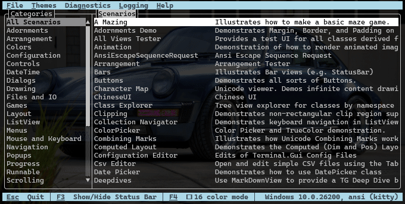

# Terminal.Gui UI Catalog

UI Catalog is a comprehensive sample library for Terminal.Gui. It provides:

1. An easy-to-use, interactive, showcase for Terminal.Gui concepts and features.
2. Sample code that illustrates how to properly implement said concepts & features.
3. A structured way for contributors to add additional samples.



## How To Use

```
dotnet run --project ./Examples/UICatalog/UICatalog.csproj
```

or

```
dotnet build
./Examples/UICatalog/bin/Debug/net10.0/UICatalog.exe
```

## Implementing a Scenario

**Scenarios** are tagged with categories using the `[ScenarioCategory]` attribute. The left pane of the main screen lists the categories. Clicking on a category shows all the scenarios in that category.

To add a new **Scenario**:

1. Create a new `.cs` file in `./Examples/UICatalog/Scenarios` that derives from `Scenario`.
2. Add a `[ScenarioMetaData]` attribute specifying the scenario's name and description.
3. Add one or more `[ScenarioCategory]` attributes specifying which categories the scenario belongs to. If you don't specify a category, the scenario will show up in "All".
4. Implement the `Setup` override which will be called when a user selects the scenario to run.
5. Optionally, implement the `Init` and/or `Run` overrides to provide a custom implementation.

See `./Examples/UICatalog/Scenarios/Generic.cs` for a starting point.

### Contribution Guidelines

- Provide a terse, descriptive `Name` for `Scenarios`. Keep them short.
- Provide a clear `Description`.
- Comment `Scenario` code to describe to others why it's a useful `Scenario`.
- Annotate `Scenarios` with `[ScenarioCategory]` attributes. Minimize the number of new categories created.


## Command Line Arguments

Usage: `UICatalog [<scenario>] [options]`

| Option | Description |
|--------|-------------|
| `<scenario>` | The name of the Scenario to run. If not provided, the interactive UI will be shown. |
| `-dl`, `--debug-log-level` | The log level (`Trace`, `Debug`, `Information`, `Warning`, `Error`, `Critical`, `None`). Default: `Warning`. |
| `-b`, `--benchmark` | Enables benchmarking. If a Scenario is specified, just that Scenario will be benchmarked. |
| `-t`, `--timeout <ms>` | Max time in milliseconds per benchmark. Default: `2500`. |
| `-f`, `--file <path>` | File to save benchmark results to. If omitted, results are displayed in a `TableView`. |
| `-d`, `--driver <name>` | The `IDriver` to use (`ansi`, `dotnet`, `windows`). |
| `-dcm`, `--disable-cm` | Disables Configuration Management. Only `ConfigLocations.HardCoded` settings will be loaded. |
| `-16`, `--force-16-colors` | Forces 16-color mode instead of TrueColor. |
| `--help` | Show help (renders this README as formatted markdown). |
| `--version` | Show version information. |

### Examples

```bash
# Show formatted help
./Examples/UICatalog/bin/Debug/net10.0/UICatalog.exe --help

# Run a specific scenario
./Examples/UICatalog/bin/Debug/net10.0/UICatalog.exe "All Views Tester"

# Benchmark all scenarios
./Examples/UICatalog/bin/Debug/net10.0/UICatalog.exe --benchmark

# Run with a specific driver and debug logging
./Examples/UICatalog/bin/Debug/net10.0/UICatalog.exe -d ansi -dl Debug
```