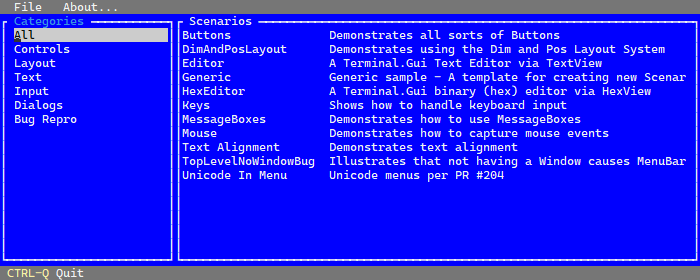

# Gui.cs - Terminal UI toolkit for .NET

This is a simple UI toolkit for .NET.

It is an updated version of
[gui.cs](https://github.com/mono/mono-curses/blob/master/gui.cs) that
I wrote for [mono-curses](https://github.com/mono/mono-curses).

The toolkit contains various controls (labesl, text entry, buttons,
radio buttons, checkboxes, dialog boxes, windows, menus) for building
text user interfaces, a main loop, is designed to work on Curses and
the [Windows
Console](https://github.com/migueldeicaza/gui.cs/issues/27), works
well on both color and monochrome terminals and has mouse support on
terminal emulators that support it.

# API Documentation

Go to the [API documentation](https://migueldeicaza.github.io/gui.cs/api/Terminal.Gui.html) for details.

# Sample Usage

```csharp
using Terminal.Gui;

class Demo {
    static void Main ()
    {
        Application.Init ();
        var top = Application.Top;

	// Creates the top-level window to show
        var win = new Window (new Rect (0, 1, top.Frame.Width, top.Frame.Height-1), "MyApp");
        top.Add (win);

	// Creates a menubar, the item "New" has a help menu.
        var menu = new MenuBar (new MenuBarItem [] {
            new MenuBarItem ("_File", new MenuItem [] {
                new MenuItem ("_New", "Creates new file", NewFile),
                new MenuItem ("_Close", "", () => Close ()),
                new MenuItem ("_Quit", "", () => { if (Quit ()) top.Running = false; })
            }),
            new MenuBarItem ("_Edit", new MenuItem [] {
                new MenuItem ("_Copy", "", null),
                new MenuItem ("C_ut", "", null),
                new MenuItem ("_Paste", "", null)
            })
        });
        top.Add (menu);

	// Add some controls
	win.Add (
            new Label (3, 2, "Login: "),
            new TextField (14, 2, 40, ""),
            new Label (3, 4, "Password: "),
            new TextField (14, 4, 40, "") { Secret = true },
            new CheckBox (3, 6, "Remember me"),
            new RadioGroup (3, 8, new [] { "_Personal", "_Company" }),
            new Button (3, 14, "Ok"),
            new Button (10, 14, "Cancel"),
            new Label (3, 18, "Press ESC and 9 to activate the menubar"));

        ShowEntries (win);

        Application.Run ();
    }
}
```

This shows a UI like this:



# Running and Building

Open the solution and run the sample program.

# Input Handling

The input handling of gui.cs is similar in some ways to Emacs and the
Midnight Commander, so you can expect some of the special key
combinations to be active.

The key ESC can act as an Alt modifier (or Meta in Emacs parlance), to
allow input on terminals that do not have an alt key.  So to produce
the sequence Alt-F, you can press either Alt-F, or ESC folowed by the key F.

To enter the key ESC, you can either press ESC and wait 100
milliseconds, or you can press ESC twice.

ESC-0, and ESC_1 through ESC-9 have a special meaning, they map to
F10, and F1 to F9 respectively.

# Driver model

Currently gui.cs is built on top of curses, but the console driver has
been abstracted, an implementation that uses `System.Console` is
possible, but would have to emulate some of the behavior of curses,
namely that operations are performed on the buffer, and the Refresh
call reflects the contents of an internal buffer into the screen and
position the cursor in the last set position at the end.

# Tasks

There are some tasks in the github issues, and some others are being
tracked in the TODO.md file.

# History

The original gui.cs was a UI toolkit in a single file and tied to
curses.  This version tries to be console-agnostic (but currently only
has a curses backend, go figure) and instead of having a
container/widget model, only uses Views (which can contain subviews)
and changes the rendering model to rely on damage regions instead of 
burderning each view with the details.

