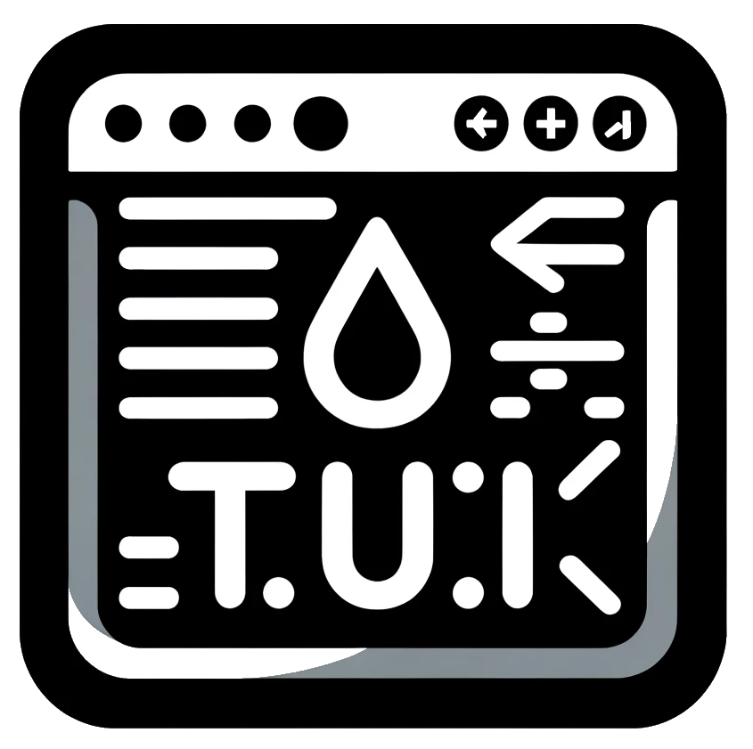
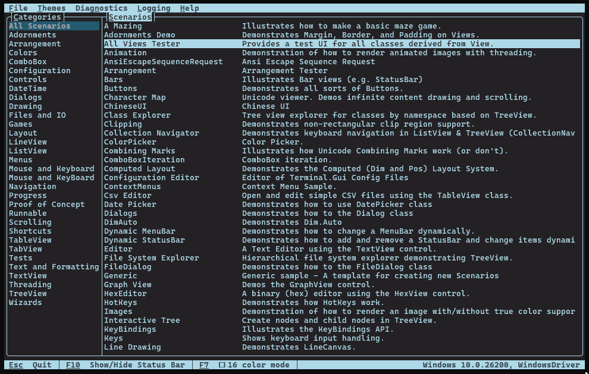

[](https://www.nuget.org/packages/Terminal.Gui)

[](https://www.nuget.org/packages/Terminal.Gui)
[](LICENSE)


# Terminal.Gui v2

The premier toolkit for building rich console apps for Windows, the Mac, and Linux/Unix.



* The current, stable, release of Terminal.Gui v1 is [](https://www.nuget.org/packages/Terminal.Gui).

> :warning: **Note:**  
> `v1` is in maintenance mode and we will only accept PRs for issues impacting existing functionality.

* The current `Alpha` release of Terminal.Gui v2 is 

> :warning: **Note:**  
> Developers starting new TUI projects are encouraged to target `v2 Alpha`. The API is significantly changed, and significantly improved. There will be breaking changes in the API before Beta, but the core API is stable.



# Quick Start

Paste these commands into your favorite terminal on Windows, Mac, or Linux. This will install the [Terminal.Gui.Templates](https://github.com/gui-cs/Terminal.Gui.templates), create a new "Hello World" TUI app, and run it.

(Press `CTRL-Q` to exit the app)

```powershell
dotnet new --install Terminal.Gui.templates
dotnet new tui -n myproj
cd myproj
dotnet run
```

To run the UICatalog demo app that shows all the controls and features of the toolkit, use the following command:

```powershell
dotnet run --project Examples/UICatalog/UICatalog.csproj
```

There is also a [visual designer](https://github.com/gui-cs/TerminalGuiDesigner) (uses Terminal.Gui itself).

# Documentation 

The full developer documentation for Terminal.Gui is available at [gui-cs.github.io/Terminal.Gui](https://gui-cs.github.io/Terminal.Gui).

## Getting Started

- [Getting Started](https://gui-cs.github.io/Terminal.Gui/docs/getting-started) - Quick start guide to create your first Terminal.Gui application
- [Migrating from v1 to v2](https://gui-cs.github.io/Terminal.Gui/docs/migratingfromv1) - Complete guide for upgrading existing applications
- [What's New in v2](https://gui-cs.github.io/Terminal.Gui/docs/newinv2) - Overview of new features and improvements

## API Reference

For detailed API documentation, see the [API Reference](https://gui-cs.github.io/Terminal.Gui/api/Terminal.Gui.App.html).

# Installing

Use NuGet to install the `Terminal.Gui` NuGet package: 

## v2 Alpha 

(Infrequently updated, but stable enough for production use)
```
dotnet add package Terminal.Gui --version "2.0.0-alpha.*"
```

## v2 Develop

(Frequently updated, but may have breaking changes)
```
dotnet add package Terminal.Gui --version "2.0.0-develop.*"
```

## Legacy v1

```
dotnet add package Terminal.Gui --version "1.*
```

Or, you can use the [Terminal.Gui.Templates](https://github.com/gui-cs/Terminal.Gui.templates).

# Contributing

See [CONTRIBUTING.md](./CONTRIBUTING.md).

Debates on architecture and design can be found in Issues tagged with [design](https://github.com/gui-cs/Terminal.Gui/issues?q=is%3Aopen+is%3Aissue+label%3Av2+label%3Adesign).

# History

See [gui-cs](https://github.com/gui-cs/) for how this project came to be.
