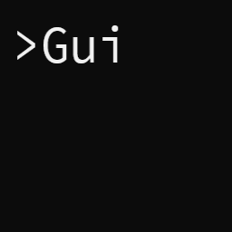
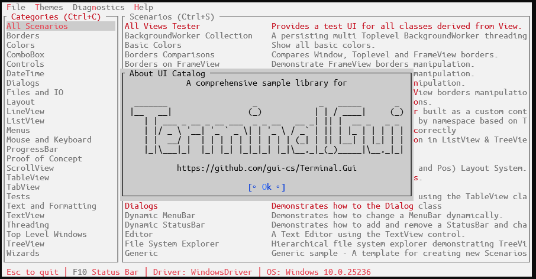

[](https://codecov.io/gh/gui-cs/Terminal.Gui)
[](https://www.nuget.org/packages/Terminal.Gui)
[](LICENSE)

# Terminal.Gui

Cross-platform UI toolkit for building sophisticated terminal UI (TUI) applications on Windows, macOS, and Linux/Unix.




* **v2** (Current):  - Stable release
* **v1 (Legacy)**:  - Maintenance mode only

> **Note:** v1 is in maintenance mode — only critical bug fixes accepted. v2 is recommended for all projects.



# Quick Start

Install the [Terminal.Gui.Templates](https://github.com/gui-cs/Terminal.Gui.templates), create a new TUI app, and run it:

```powershell
dotnet new install Terminal.Gui.Templates
dotnet new tui-simple -n myproj
cd myproj
dotnet run
```

Run the comprehensive [UI Catalog](Examples/UICatalog) demo to explore all controls:

```powershell
dotnet run --project Examples/UICatalog/UICatalog.csproj
```

# Simple Example

```csharp
using Terminal.Gui.App;
using Terminal.Gui.ViewBase;
using Terminal.Gui.Views;

using IApplication app = Application.Create ();
app.Init ();

using Window window = new () { Title = "Hello World (Esc to quit)" };
Label label = new ()
{
    Text = "Hello, Terminal.Gui v2!",
    X = Pos.Center (),
    Y = Pos.Center ()
};
window.Add (label);

app.Run (window);
```

See the [Examples](Examples/) directory for more.

# Build Powerful Terminal Applications

Terminal.Gui enables building sophisticated console applications with modern UIs:

- **Rich Forms and Dialogs** - Text fields, buttons, checkboxes, radio buttons, and data validation
- **Interactive Data Views** - Tables, lists, and trees with sorting, filtering, and in-place editing  
- **Visualizations** - Charts, graphs, progress indicators, and color pickers with TrueColor support
- **Text Editors** - Full-featured text editing with clipboard, undo/redo, and Unicode support
- **File Management** - File and directory browsers with search and filtering
- **Wizards and Multi-Step Processes** - Guided workflows with navigation and validation
- **System Monitoring Tools** - Real-time dashboards with scrollable, resizable views
- **Configuration UIs** - Settings editors with persistent themes and user preferences
- **Cross-Platform CLI Tools** - Consistent experience on Windows, macOS, and Linux
- **Server Management Interfaces** - SSH-compatible UIs for remote administration

See the [Views Overview](https://gui-cs.github.io/Terminal.Gui/docs/views) for available controls and [What's New in v2](https://gui-cs.github.io/Terminal.Gui/docs/newinv2) for architectural improvements.

# Documentation 

Comprehensive documentation is at [gui-cs.github.io/Terminal.Gui](https://gui-cs.github.io/Terminal.Gui).

## Getting Started

- **[Getting Started Guide](https://gui-cs.github.io/Terminal.Gui/docs/getting-started)** - First Terminal.Gui application
- **[API Reference](https://gui-cs.github.io/Terminal.Gui/api/Terminal.Gui.App.html)** - Complete API documentation
- **[What's New in v2](https://gui-cs.github.io/Terminal.Gui/docs/newinv2)** - New features and improvements

## Migration & Deep Dives

- **[Migrating from v1 to v2](https://gui-cs.github.io/Terminal.Gui/docs/migratingfromv1)** - Complete migration guide
- **[Application Architecture](https://gui-cs.github.io/Terminal.Gui/docs/application)** - Instance-based model and IRunnable pattern
- **[Layout System](https://gui-cs.github.io/Terminal.Gui/docs/layout)** - Positioning, sizing, and adornments
- **[Keyboard Handling](https://gui-cs.github.io/Terminal.Gui/docs/keyboard)** - Key bindings and commands
- **[View Documentation](https://gui-cs.github.io/Terminal.Gui/docs/View)** - View hierarchy and lifecycle
- **[Configuration](https://gui-cs.github.io/Terminal.Gui/docs/config)** - Themes and persistent settings

See the [documentation index](https://gui-cs.github.io/Terminal.Gui/docs/index) for all topics.

# Installing

## v2 (Recommended)

```powershell
dotnet add package Terminal.Gui
```

Or use the [Terminal.Gui.Templates](https://github.com/gui-cs/Terminal.Gui.templates):

```powershell
dotnet new install Terminal.Gui.Templates
```

## v1 Legacy

```powershell
dotnet add package Terminal.Gui --version "1.*"
```

# Contributing

Contributions welcome! See [CONTRIBUTING.md](CONTRIBUTING.md).

# History

See [gui-cs](https://github.com/gui-cs/) for project history and origins.
