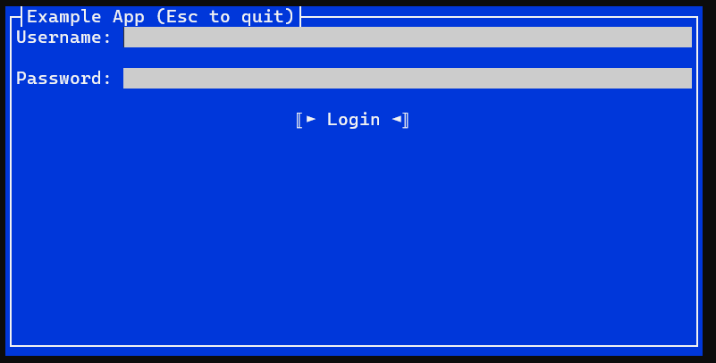

[](https://www.nuget.org/packages/Terminal.Gui)

[](https://www.nuget.org/packages/Terminal.Gui)
[](LICENSE)


***The current, stable, release of Terminal.Gui is [v1.x](https://www.nuget.org/packages/Terminal.Gui). It is stable, rich, and broadly used. The team is now focused on designing and building a significant upgrade we're referring to as `v2`. Therefore:***
 * *`v1` is now in maintenance mode, meaning we will accept PRs for v1.x (the `develop` branch) only for issues impacting existing functionality.*
 * *All new development happens on the `v2_develop` branch. See the V2 discussion [here](https://github.com/gui-cs/Terminal.Gui/discussions/1940).*
 * *Developers are encouraged to continue building on [v1.x](https://www.nuget.org/packages/Terminal.Gui) until we announce `v2` is stable.*

**Terminal.Gui**: A toolkit for building rich console apps for .NET, .NET Core, and Mono that works on Windows, the Mac, and Linux/Unix.


## Quick Start

Paste these commands into your favorite terminal on Windows, Mac, or Linux. This will install the [Terminal.Gui.Templates](https://github.com/gui-cs/Terminal.Gui.templates), create a new "Hello World" TUI app, and run it.

(Press `CTRL-Q` to exit the app)

```powershell
dotnet new --install Terminal.Gui.templates
dotnet new tui -n myproj
cd myproj
dotnet run
```

## Documentation 

* [Documentation Home](https://gui-cs.github.io/Terminal.Gui/index.html)
* [Terminal.Gui Overview](https://gui-cs.github.io/Terminal.Gui/articles/overview.html)
* [List of Views/Controls](https://gui-cs.github.io/Terminal.Gui/articles/views.html)
* [Conceptual Documentation](https://gui-cs.github.io/Terminal.Gui/articles/index.html)
* [API Documentation](https://gui-cs.github.io/Terminal.Gui/api/Terminal.Gui/Terminal.Gui.html)

_The Documentation matches the most recent Nuget release from the `main` branch ([](https://www.nuget.org/packages/Terminal.Gui))_

## Features

* **Cross Platform** - Windows, Mac, and Linux. Terminal drivers for Curses, [Windows Console](https://github.com/gui-cs/Terminal.Gui/issues/27), and the .NET Console mean apps will work well on both color and monochrome terminals. 
* **Keyboard and Mouse Input** - Both keyboard and mouse input are supported, including support for drag & drop.
* **[Flexible Layout](https://gui-cs.github.io/Terminal.Gui/articles/overview.html#layout)** - Supports both *Absolute layout* and an innovative *Computed Layout* system. *Computed Layout* makes it easy to lay out controls relative to each other and enables dynamic terminal UIs.
* **Clipboard support** - Cut, Copy, and Paste of text provided through the [`Clipboard`](https://gui-cs.github.io/Terminal.Gui/api/Terminal.Gui/Terminal.Gui.Clipboard.html) class.
* **[Arbitrary Views](https://gui-cs.github.io/Terminal.Gui/api/Terminal.Gui/Terminal.Gui.View.html)** - All visible UI elements are subclasses of the `View` class, and these in turn can contain an arbitrary number of sub-views.
* **Advanced App Features** - The [Mainloop](https://gui-cs.github.io/Terminal.Gui/api/Terminal.Gui/Terminal.Gui.MainLoop.html) supports processing events, idle handlers, timers, and monitoring file
descriptors. Most classes are safe for threading.
* **Reactive Extensions** - Use [reactive extensions](https://github.com/dotnet/reactive) and benefit from increased code readability, and the ability to apply the MVVM pattern and [ReactiveUI](https://www.reactiveui.net/) data bindings. See the [source code](https://github.com/gui-cs/Terminal.Gui/tree/master/ReactiveExample) of a sample app in order to learn how to achieve this.

## Showcase & Examples

* **[UI Catalog](https://github.com/gui-cs/Terminal.Gui/tree/master/UICatalog)** - The UI Catalog project provides an easy to use and extend sample illustrating the capabilities of **Terminal.Gui**. Run `dotnet run --project UICatalog` to run the UI Catalog.
* **[C# Example](https://github.com/gui-cs/Terminal.Gui/tree/master/Example)** - Run `dotnet run` in the `Example` directory to run the C# Example.
* **[F# Example](https://github.com/gui-cs/Terminal.Gui/tree/master/FSharpExample)** - An example showing how to build a Terminal.Gui app using F#.
* **[Reactive Example](https://github.com/gui-cs/Terminal.Gui/tree/master/ReactiveExample)** - A sample app that shows how to use `System.Reactive` and `ReactiveUI` with `Terminal.Gui`. The app uses the MVVM architecture that may seem familiar to folks coming from WPF, Xamarin Forms, UWP, Avalonia, or Windows Forms. In this app, we implement the data bindings using ReactiveUI `WhenAnyValue` syntax and [Pharmacist](https://github.com/reactiveui/pharmacist) — a tool that converts all events in a NuGet package into observable wrappers.
* **[PowerShell's `Out-ConsoleGridView`](https://github.com/PowerShell/GraphicalTools)** - `OCGV` sends the output from a command to an interactive table. 
* **[F7History](https://github.com/gui-cs/F7History)** - Graphical Command History for PowerShell (built on PowerShell's `Out-ConsoleGridView`).
* **[PoshRedisViewer](https://github.com/En3Tho/PoshRedisViewer)** - A compact Redis viewer module for PowerShell written in F#.
* **[PoshDotnetDumpAnalyzeViewer](https://github.com/En3Tho/PoshDotnetDumpAnalyzeViewer)** - dotnet-dump UI module for PowerShell.
* **[TerminalGuiDesigner](https://github.com/tznind/TerminalGuiDesigner)** - Cross platform view designer for building Terminal.Gui applications.

See the [`Terminal.Gui/` README](https://github.com/gui-cs/Terminal.Gui/tree/master/Terminal.Gui) for an overview of how the library is structured. The [Conceptual Documentation](https://gui-cs.github.io/Terminal.Gui/articles/index.html) provides insight into core concepts.

## Sample Usage in C#

The following example shows a basic Terminal.Gui application in C#:

```csharp
// A simple Terminal.Gui example in C# - using C# 9.0 Top-level statements

using Terminal.Gui;

Application.Run<ExampleWindow> ();

System.Console.WriteLine ($"Username: {((ExampleWindow)Application.Top).usernameText.Text}");

// Before the application exits, reset Terminal.Gui for clean shutdown
Application.Shutdown ();

// Defines a top-level window with border and title
public class ExampleWindow : Window {
	public TextField usernameText;
	
	public ExampleWindow ()
	{
		Title = "Example App (Ctrl+Q to quit)";

		// Create input components and labels
		var usernameLabel = new Label () { 
			Text = "Username:" 
		};

		usernameText = new TextField ("") {
			// Position text field adjacent to the label
			X = Pos.Right (usernameLabel) + 1,

			// Fill remaining horizontal space
			Width = Dim.Fill (),
		};

		var passwordLabel = new Label () {
			Text = "Password:",
			X = Pos.Left (usernameLabel),
			Y = Pos.Bottom (usernameLabel) + 1
		};

		var passwordText = new TextField ("") {
			Secret = true,
			// align with the text box above
			X = Pos.Left (usernameText),
			Y = Pos.Top (passwordLabel),
			Width = Dim.Fill (),
		};

		// Create login button
		var btnLogin = new Button () {
			Text = "Login",
			Y = Pos.Bottom(passwordLabel) + 1,
			// center the login button horizontally
			X = Pos.Center (),
			IsDefault = true,
		};

		// When login button is clicked display a message popup
		btnLogin.Clicked += () => {
			if (usernameText.Text == "admin" && passwordText.Text == "password") {
				MessageBox.Query ("Logging In", "Login Successful", "Ok");
				Application.RequestStop ();
			} else {
				MessageBox.ErrorQuery ("Logging In", "Incorrect username or password", "Ok");
			}
		};

		// Add the views to the Window
		Add (usernameLabel, usernameText, passwordLabel, passwordText, btnLogin);
	}
}
```

When run the application looks as follows:



_Sample application running_

## Installing

Use NuGet to install the `Terminal.Gui` NuGet package: https://www.nuget.org/packages/Terminal.Gui

### Installation in .NET Core Projects

To install Terminal.Gui into a .NET Core project, use the `dotnet` CLI tool with this command.

```
dotnet add package Terminal.Gui
```

Or, you can use the [Terminal.Gui.Templates](https://github.com/gui-cs/Terminal.Gui.templates).

## Building the Library and Running the Examples

* Windows, Mac, and Linux - Build and run using the .NET SDK command line tools (`dotnet build` in the root directory). Run `UICatalog` with `dotnet run --project UICatalog`.
* Windows - Open `Terminal.sln` with Visual Studio 2022.

See [CONTRIBUTING.md](CONTRIBUTING.md) for instructions for downloading and forking the source.

## Contributing

See [CONTRIBUTING.md](https://github.com/gui-cs/Terminal.Gui/blob/master/CONTRIBUTING.md).

Debates on architecture and design can be found in Issues tagged with [design](https://github.com/gui-cs/Terminal.Gui/issues?q=is%3Aopen+is%3Aissue+label%3Adesign).

## History

See [gui-cs](https://github.com/gui-cs/) for how this project came to be.
