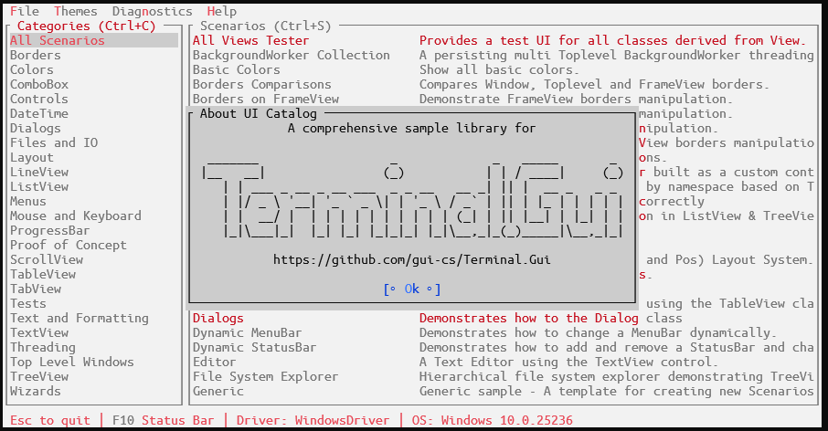

# Showcase #

* **[UI Catalog](https://github.com/gui-cs/Terminal.Gui/tree/master/UICatalog)** - The UI Catalog project provides an easy to use and extend sample illustrating the capabilities of **Terminal.Gui**. Run `dotnet run --project UICatalog` to run the UI Catalog.
    
  ⠀
* **[PowerShell's `Out-ConsoleGridView`](https://github.com/PowerShell/GraphicalTools)** - `OCGV` sends the output from a command to an interactive table.
    
  ⠀
* **[F7History](https://github.com/gui-cs/F7History)** - Graphical Command History for PowerShell (built on PowerShell's `Out-ConsoleGridView`).
    
  ⠀
* **[PoshRedisViewer](https://github.com/En3Tho/PoshRedisViewer)** - A compact Redis viewer module for PowerShell written in F#.
    
  ⠀
* **[PoshDotnetDumpAnalyzeViewer](https://github.com/En3Tho/PoshDotnetDumpAnalyzeViewer)** - dotnet-dump UI module for PowerShell.
    
  ⠀
* **[TerminalGuiDesigner](https://github.com/tznind/TerminalGuiDesigner)** - Cross platform view designer for building Terminal.Gui applications.
  

* **[Capital and Cargo](https://github.com/dhorions/Capital-and-Cargo)** - A retro console game where you buy, sell, produce and transport goods built with Terminal.Gui
 

  
# Examples #

* **[C# Example](https://github.com/gui-cs/Terminal.Gui/tree/master/Example)** - Run `dotnet run` in the `Example` directory to run the C# Example.
* **[F# Example](https://github.com/gui-cs/Terminal.Gui/tree/master/FSharpExample)** - An example showing how to build a Terminal.Gui app using F#.
* **[Reactive Example](https://github.com/gui-cs/Terminal.Gui/tree/master/ReactiveExample)** - A sample app that shows how to use `System.Reactive` and `ReactiveUI` with `Terminal.Gui`. The app uses the MVVM architecture that may seem familiar to folks coming from WPF, Xamarin Forms, UWP, Avalonia, or Windows Forms. In this app, we implement the data bindings using ReactiveUI `WhenAnyValue` syntax and [Pharmacist](https://github.com/reactiveui/pharmacist) — a tool that converts all events in a NuGet package into observable wrappers. 
