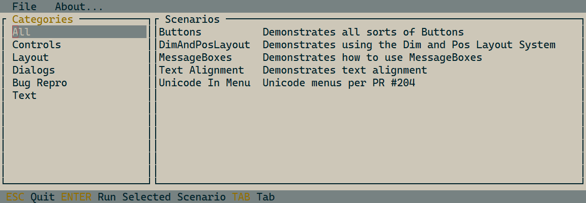
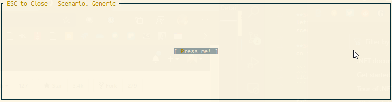

# Terminal.Gui UI Catalog

UI Catalog is a comprehensive sample library for Terminal.Gui. It attempts to satisfy the following goals:

1. Be an easy to use showcase for Terminal.Gui concepts and features.
2. Provide sample code that illustrates how to properly implement said concepts & features.
3. Make it easy for contributors to add additional samples in a structured way.



## Motivation

The original `demo.cs` sample app for Terminal.Gui is neither good to showcase, nor does it explain different concepts. In addition, because it is built on a single source file, it has proven to cause friction when multiple contributors are simultaneously working on different aspects of Terminal.Gui. See [Issue #368](https://github.com/migueldeicaza/Terminal.Gui/issues/368) for more background.

# API Reference

* [UI Catalog API Reference](https://migueldeicaza.github.io/gui.cs/api/UICatalog/UICatalog.html)

## How To Use

Build and run UI Catalog by typing `dotnet run` from the `UI Catalog` folder or by using the `Terminal.Gui` Visual Studio solution.

`Program.cs` is the main **UI Catalog** app and provides a UI for selecting and running **Scenarios**. Each **Scenario* is implemented as a class derived from `Scenario` and `Program.cs` uses reflection to dynamically build the UI.

**Scenarios** are tagged with categories using the `[ScenarioCategory]` attribute. The left pane of the main screen lists the categories. Clicking on a category shows all the scenarios in that category.

**Scenarios** can be run either from the **UICatalog.exe** app UI or by being specified on the command line:

```
UICatalog.exe <Scenario Name>
```

e.g.

```
UICatalog.exe Buttons
```

Hitting ENTER on a selected Scenario or double-clicking on a Scenario runs that scenario as though it were a stand-alone Terminal.Gui app.

When a **Scenario** is run, it runs as though it were a standalone `Terminal.Gui` app. However, scaffolding is provided (in the `Scenario` base class) that (optionally) takes care of `Terminal.Gui` initialization.

## Contributing by Adding Scenarios

To add a new **Scenario** simply:

1. Create a new `.cs` file in the `Scenarios` directory that derives from `Scenario`.
2. Add a `[ScenarioMetaData]` attribute to the class specifying the scenario's name and description.
3. Add one or more `[ScenarioCategory]` attributes to the class specifying which categories the sceanrio belongs to. If you don't specify a category the sceanrio will show up in "All".
4. Implement the `Setup` override which will be called when a user selects the scenario to run.
5. Optionally, implement the `Init` and/or `Run` overrides to provide a custom implementation.

The sample below is provided in the `Scenarios` directory as a generic sample that can be copied and re-named:

```csharp
using Terminal.Gui;

namespace UICatalog {
	[ScenarioMetadata (Name: "Generic", Description: "Generic sample - A template for creating new Scenarios")]
	[ScenarioCategory ("Controls")]
	class MyScenario : Scenario {
		public override void Setup ()
		{
			// Put your scenario code here, e.g.
			Win.Add (new Button ("Press me!") {
				X = Pos.Center (),
				Y = Pos.Center (),
				Clicked = () => MessageBox.Query (20, 7, "Hi", "Neat?", "Yes", "No")
			});
		}
	}
}
```

`Scenario` provides a `Toplevel` and `Window` the provides a canvas for the Scenario to operate. The default `Window` shows the Scenario name and supports exiting the Scenario through the `Esc` key. 



To build a more advanced scenario, where control of the `Toplevel` and `Window` is needed (e.g. for scenarios using `MenuBar` or `StatusBar`), simply set the `Top` and `Window` properties as appropriate, as seen in the `UnicodeInMenu` scenario:

```csharp
using Terminal.Gui;

namespace UICatalog {
	[ScenarioMetadata (Name: "Unicode In Menu", Description: "Unicode menus per PR #204")]
	[ScenarioCategory ("Text")]
	[ScenarioCategory ("Controls")]
	class UnicodeInMenu : Scenario {
		public override void Setup ()
		{
			Top = new Toplevel (new Rect (0, 0, Application.Driver.Cols, Application.Driver.Rows));
			var menu = new MenuBar (new MenuBarItem [] {
				new MenuBarItem ("_Файл", new MenuItem [] {
					new MenuItem ("_Создать", "Creates new file", null),
					new MenuItem ("_Открыть", "", null),
					new MenuItem ("Со_хранить", "", null),
					new MenuItem ("_Выход", "", () => Application.RequestStop() )
				}),
				new MenuBarItem ("_Edit", new MenuItem [] {
					new MenuItem ("_Copy", "", null),
					new MenuItem ("C_ut", "", null),
					new MenuItem ("_Paste", "", null)
				})
			});
			Top.Add (menu);

			Win = new Window ($"Scenario: {GetName ()}") {
				X = 0,
				Y = 1,
				Width = Dim.Fill (),
				Height = Dim.Fill ()
			};
			Top.Add (Win);
		}
	}
}
```

For complete control, the `Init` and `Run` overrides can be implemented. The `base.Init` assigns `Application.Top` to `Top` and creates `Win`. The `base.Run` simply calls `Application.Run(Top)`.

## Contribution Guidelines

- Provide a terse, descriptive name for `Scenarios`. Keep them short; the `ListView` that displays them dynamically sizes the column width and long names will make it hard for people to use.
- Provide a clear description.
- Comment `Scenario` code to describe to others why it's a useful `Scenario`.
- Annotate `Scenarios` with `[ScenarioCategory]` attributes. Try to minimize the number of new categories created.
- Use the `Bug Rero` Category for `Scnarios` that reproduce bugs. 
	- Include the Github Issue # in the Description.
	- Once the bug has been fixed in `master` submit another PR to remove the `Scenario` (or modify it to provide a good regression test).
- Tag bugs or suggestions for `UI Catalog` as [`Terminal.Gui` Github Issues](https://github.com/migueldeicaza/gui.cs/issues) with "UICatalog: ".