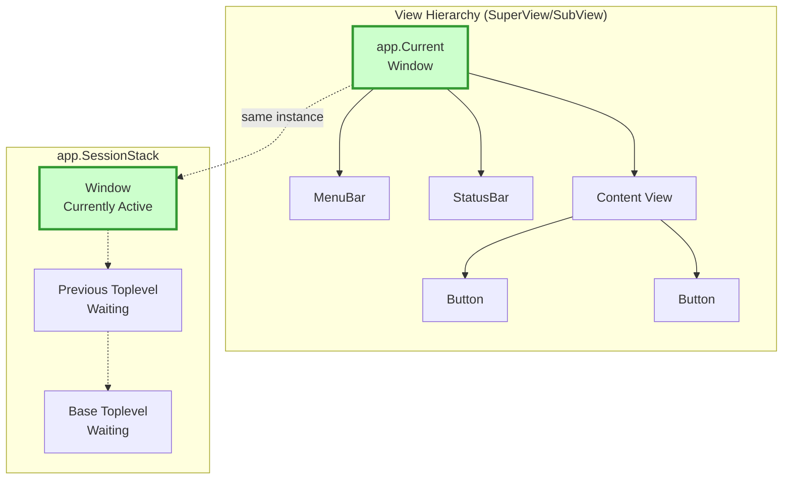
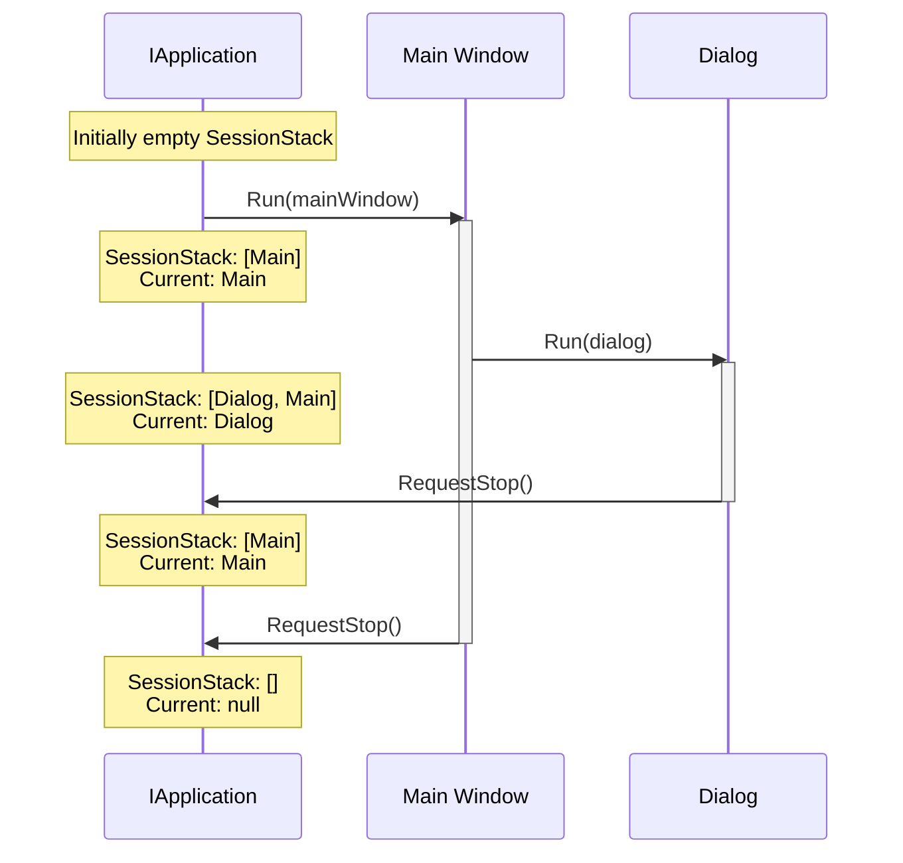

# Application Architecture

Terminal.Gui v2 uses an instance-based application architecture with the **IRunnable** interface pattern that decouples views from the global application state, improving testability, enabling multiple application contexts, and providing type-safe result handling.

## Key Features

- **Instance-Based**: Use `Application.Create()` to get an `IApplication` instance instead of static methods
- **IRunnable Interface**: Views implement `IRunnable<TResult>` to participate in session management without inheriting from `Toplevel`
- **Fluent API**: Chain `Init()`, `Run()`, and `Shutdown()` for elegant, concise code
- **Automatic Disposal**: Framework-created runnables are automatically disposed
- **Type-Safe Results**: Generic `TResult` parameter provides compile-time type safety
- **CWP Compliance**: All lifecycle events follow the Cancellable Work Pattern

## View Hierarchy and Run Stack



## Usage Example Flow



## Key Concepts

### Instance-Based vs Static

**Terminal.Gui v2** supports both static and instance-based patterns. The static `Application` class is marked obsolete but still functional for backward compatibility. The recommended pattern is to use `Application.Create()` to get an `IApplication` instance:

```csharp
// OLD (v1 / early v2 - still works but obsolete):
Application.Init();
var top = new Toplevel();
top.Add(myView);
Application.Run(top);
top.Dispose();
Application.Shutdown();

// NEW (v2 recommended - instance-based):
var app = Application.Create();
app.Init();
var top = new Toplevel();
top.Add(myView);
app.Run(top);
top.Dispose();
app.Shutdown();

// NEWEST (v2 with IRunnable and Fluent API):
Color? result = Application.Create()
                           .Init()
                           .Run<ColorPickerDialog>()
                           .Shutdown() as Color?;
```

**Note:** The static `Application` class delegates to `ApplicationImpl.Instance` (a singleton). `Application.Create()` creates a **new** `ApplicationImpl` instance, enabling multiple application contexts and better testability.

### View.App Property

Every view now has an `App` property that references its application context:

```csharp
public class View
{
    /// <summary>
    /// Gets the application context for this view.
    /// </summary>
    public IApplication? App { get; internal set; }
    
    /// <summary>
    /// Gets the application context, checking parent hierarchy if needed.
    /// Override to customize application resolution.
    /// </summary>
    public virtual IApplication? GetApp() => App ?? SuperView?.GetApp();
}
```

**Benefits:**
- Views can be tested without `Application.Init()`
- Multiple applications can coexist
- Clear ownership: views know their context
- Reduced global state dependencies

### Accessing Application from Views

**Recommended pattern:**

```csharp
public class MyView : View
{
    public override void OnEnter(View view)
    {
        // Use View.App instead of static Application
        App?.Current?.SetNeedsDraw();
        
        // Access SessionStack
        if (App?.SessionStack.Count > 0)
        {
            // Work with sessions
        }
    }
}
```

**Alternative - dependency injection:**

```csharp
public class MyView : View
{
    private readonly IApplication _app;
    
    public MyView(IApplication app)
    {
        _app = app;
        // Now completely decoupled from static Application
    }
    
    public void DoWork()
    {
        _app.Current?.SetNeedsDraw();
    }
}
```

## IRunnable Architecture

Terminal.Gui v2 introduces the **IRunnable** interface pattern that decouples runnable behavior from the `Toplevel` class hierarchy. Views can implement `IRunnable<TResult>` to participate in session management without inheritance constraints.

### Key Benefits

- **Interface-Based**: No forced inheritance from `Toplevel`
- **Type-Safe Results**: Generic `TResult` parameter provides compile-time type safety
- **Fluent API**: Method chaining for elegant, concise code
- **Automatic Disposal**: Framework manages lifecycle of created runnables
- **CWP Compliance**: All lifecycle events follow the Cancellable Work Pattern

### Fluent API Pattern

The fluent API enables elegant method chaining with automatic resource management:

```csharp
// All-in-one: Create, initialize, run, shutdown, and extract result
Color? result = Application.Create()
                           .Init()
                           .Run<ColorPickerDialog>()
                           .Shutdown() as Color?;

if (result is { })
{
    ApplyColor(result);
}
```

**Key Methods:**

- `Init()` - Returns `IApplication` for chaining
- `Run<TRunnable>()` - Creates and runs runnable, returns `IApplication`
- `Shutdown()` - Disposes framework-owned runnables, returns `object?` result

### Disposal Semantics

**"Whoever creates it, owns it":**

| Method | Creator | Owner | Disposal |
|--------|---------|-------|----------|
| `Run<TRunnable>()` | Framework | Framework | Automatic in `Shutdown()` |
| `Run(IRunnable)` | Caller | Caller | Manual by caller |

```csharp
// Framework ownership - automatic disposal
var result = app.Run<MyDialog>().Shutdown();

// Caller ownership - manual disposal
var dialog = new MyDialog();
app.Run(dialog);
var result = dialog.Result;
dialog.Dispose();  // Caller must dispose
```

### Creating Runnable Views

Derive from `Runnable<TResult>` or implement `IRunnable<TResult>`:

```csharp
public class FileDialog : Runnable<string?>
{
    private TextField _pathField;
    
    public FileDialog()
    {
        Title = "Select File";
        
        _pathField = new TextField { X = 1, Y = 1, Width = Dim.Fill(1) };
        
        var okButton = new Button { Text = "OK", IsDefault = true };
        okButton.Accepting += (s, e) => {
            Result = _pathField.Text;
            Application.RequestStop();
        };
        
        Add(_pathField, okButton);
    }
    
    protected override bool OnIsRunningChanging(bool oldValue, bool newValue)
    {
        if (!newValue)  // Stopping - extract result before disposal
        {
            Result = _pathField?.Text;
        }
        return base.OnIsRunningChanging(oldValue, newValue);
    }
}
```

### Lifecycle Properties

- **`IsRunning`** - True when runnable is on `RunnableSessionStack`
- **`IsModal`** - True when runnable is at top of stack (capturing all input)
- **`Result`** - Typed result value set before stopping

### Lifecycle Events (CWP-Compliant)

All events follow Terminal.Gui's Cancellable Work Pattern:

| Event | Cancellable | When | Use Case |
|-------|-------------|------|----------|
| `IsRunningChanging` | ✓ | Before add/remove from stack | Extract result, prevent close |
| `IsRunningChanged` | ✗ | After stack change | Post-start/stop cleanup |
| `IsModalChanging` | ✓ | Before becoming/leaving top | Prevent activation |
| `IsModalChanged` | ✗ | After modal state change | Update UI after focus change |

**Example - Result Extraction:**

```csharp
protected override bool OnIsRunningChanging(bool oldValue, bool newValue)
{
    if (!newValue)  // Stopping
    {
        // Extract result before views are disposed
        Result = _colorPicker.SelectedColor;
        
        // Optionally cancel stop (e.g., unsaved changes)
        if (HasUnsavedChanges())
        {
            int response = MessageBox.Query("Save?", "Save changes?", "Yes", "No", "Cancel");
            if (response == 2) return true;  // Cancel stop
            if (response == 0) Save();
        }
    }
    
    return base.OnIsRunningChanging(oldValue, newValue);
}
```

### RunnableSessionStack

The `RunnableSessionStack` manages all running `IRunnable` sessions:

```csharp
public interface IApplication
{
    /// <summary>
    /// Stack of running IRunnable sessions.
    /// Each entry is a RunnableSessionToken wrapping an IRunnable.
    /// </summary>
    ConcurrentStack<RunnableSessionToken>? RunnableSessionStack { get; }
    
    /// <summary>
    /// The IRunnable at the top of RunnableSessionStack (currently modal).
    /// </summary>
    IRunnable? TopRunnable { get; }
}
```

**Stack Behavior:**

- Push: `Begin(IRunnable)` adds to top of stack
- Pop: `End(RunnableSessionToken)` removes from stack
- Peek: `TopRunnable` returns current modal runnable
- All: `RunnableSessionStack` enumerates all running sessions

## IApplication Interface

The `IApplication` interface defines the application contract with support for both legacy `Toplevel` and modern `IRunnable` patterns:

```csharp
public interface IApplication
{
    // Legacy Toplevel support
    Toplevel? Current { get; }
    ConcurrentStack<Runnable<bool>> SessionStack { get; }
    
    // IRunnable support
    IRunnable? TopRunnable { get; }
    ConcurrentStack<RunnableSessionToken>? RunnableSessionStack { get; }
    IRunnable? FrameworkOwnedRunnable { get; set; }
    
    // Driver and lifecycle
    IDriver? Driver { get; }
    IMainLoopCoordinator? MainLoop { get; }
    
    // Fluent API methods
    IApplication Init(string? driverName = null);
    object? Shutdown();
    
    // Runnable methods
    RunnableSessionToken Begin(IRunnable runnable);
    void Run(IRunnable runnable, Func<Exception, bool>? errorHandler = null);
    IApplication Run<TRunnable>(Func<Exception, bool>? errorHandler = null) where TRunnable : IRunnable, new();
    void RequestStop(IRunnable? runnable);
    void End(RunnableSessionToken sessionToken);
    
    // Legacy Toplevel methods
    SessionToken? Begin(Toplevel toplevel);
    void Run(Toplevel view, Func<Exception, bool>? errorHandler = null);
    void End(SessionToken sessionToken);
    
    // ... other members
}
```

## Terminology Changes

Terminal.Gui v2 modernized its terminology for clarity:

### Application.TopRunnable (formerly "Current", and before that "Top")

The `TopRunnable` property represents the Toplevel on the top of the session stack (the active runnable session):

```csharp
// Access the top runnable session
Toplevel? topRunnable = app.TopRunnable;

// From within a view
Toplevel? topRunnable = App?.TopRunnable;
```

**Why "TopRunnable"?**
- Clearly indicates it's the top of the runnable session stack
- Aligns with the IRunnable architecture proposal
- Distinguishes from other concepts like "Current" which could be ambiguous

### Application.SessionStack (formerly "TopLevels")

The `SessionStack` property is the stack of running sessions:

```csharp
// Access all running sessions
foreach (var toplevel in app.SessionStack)
{
    // Process each session
}

// From within a view
int sessionCount = App?.SessionStack.Count ?? 0;
```

**Why "SessionStack" instead of "TopLevels"?**
- Describes both content (sessions) and structure (stack)
- Aligns with `SessionToken` terminology
- Follows .NET naming patterns (descriptive + collection type)

## Migration from Static Application

The static `Application` class delegates to `ApplicationImpl.Instance` (a singleton) and is marked obsolete. All static methods and properties are marked with `[Obsolete]` but remain functional for backward compatibility:

```csharp
public static partial class Application
{
    [Obsolete("The legacy static Application object is going away.")]
    public static Toplevel? Current => ApplicationImpl.Instance.Current;
    
    [Obsolete("The legacy static Application object is going away.")]
    public static ConcurrentStack<Runnable<bool>> SessionStack => ApplicationImpl.Instance.SessionStack;
    
    // ... other obsolete static members
}
```

**Important:** The static `Application` class uses a singleton (`ApplicationImpl.Instance`), while `Application.Create()` creates new instances. For new code, prefer the instance-based pattern using `Application.Create()`.

### Migration Strategies

**Strategy 1: Use View.App**

```csharp
// OLD:
void MyMethod()
{
    Application.TopRunnable?.SetNeedsDraw();
}

// NEW:
void MyMethod(View view)
{
    view.App?.Current?.SetNeedsDraw();
}
```

**Strategy 2: Pass IApplication**

```csharp
// OLD:
void ProcessSessions()
{
    foreach (var toplevel in Application.SessionStack)
    {
        // Process
    }
}

// NEW:
void ProcessSessions(IApplication app)
{
    foreach (var toplevel in app.SessionStack)
    {
        // Process
    }
}
```

**Strategy 3: Store IApplication Reference**

```csharp
public class MyService
{
    private readonly IApplication _app;
    
    public MyService(IApplication app)
    {
        _app = app;
    }
    
    public void DoWork()
    {
        _app.Current?.Title = "Processing...";
    }
}
```

## Session Management

### Begin and End

Applications manage sessions through `Begin()` and `End()`:

```csharp
var app = Application.Create ();
app.Init();

var toplevel = new Toplevel();

// Begin a new session - pushes to SessionStack
SessionToken? token = app.Begin(toplevel);

// Current now points to this toplevel
Debug.Assert(app.Current == toplevel);

// End the session - pops from SessionStack
if (token != null)
{
    app.End(token);
}

// Current restored to previous toplevel (if any)
```

### Nested Sessions

Multiple sessions can run nested:

```csharp
var app = Application.Create ();
app.Init();

// Session 1
var main = new Toplevel { Title = "Main" };
var token1 = app.Begin(main);
// app.Current == main, SessionStack.Count == 1

// Session 2 (nested)
var dialog = new Dialog { Title = "Dialog" };
var token2 = app.Begin(dialog);
// app.Current == dialog, SessionStack.Count == 2

// End dialog
app.End(token2);
// app.Current == main, SessionStack.Count == 1

// End main
app.End(token1);
// app.Current == null, SessionStack.Count == 0
```

## View.Driver Property

Similar to `View.App`, views now have a `Driver` property:

```csharp
public class View
{
    /// <summary>
    /// Gets the driver for this view.
    /// </summary>
    public IDriver? Driver => GetDriver();
    
    /// <summary>
    /// Gets the driver, checking application context if needed.
    /// Override to customize driver resolution.
    /// </summary>
    public virtual IDriver? GetDriver() => App?.Driver;
}
```

**Usage:**

```csharp
public override void OnDrawContent(Rectangle viewport)
{
    // Use view's driver instead of Application.Driver
    Driver?.Move(0, 0);
    Driver?.AddStr("Hello");
}
```

## Testing with the New Architecture

The instance-based architecture dramatically improves testability:

### Testing Views in Isolation

```csharp
[Fact]
public void MyView_DisplaysCorrectly()
{
    // Create mock application
    var mockApp = new Mock<IApplication>();
    mockApp.Setup(a => a.Current).Returns(new Toplevel());
    
    // Create view with mock app
    var view = new MyView { App = mockApp.Object };
    
    // Test without Application.Init()!
    view.SetNeedsDraw();
    Assert.True(view.NeedsDraw);
    
    // No Application.Shutdown() needed!
}
```

### Testing with Real ApplicationImpl

```csharp
[Fact]
public void MyView_WorksWithRealApplication()
{
    var app = Application.Create ();
    try
    {
        app.Init(new FakeDriver());
        
        var view = new MyView();
        var top = new Toplevel();
        top.Add(view);
        
        app.Begin(top);
        
        // View.App automatically set
        Assert.NotNull(view.App);
        Assert.Same(app, view.App);
        
        // Test view behavior
        view.DoSomething();
        
    }
    finally
    {
        app.Shutdown();
    }
}
```

## Best Practices

### DO: Use View.App

```csharp
✅ GOOD:
public void Refresh()
{
    App?.Current?.SetNeedsDraw();
}
```

### DON'T: Use Static Application

```csharp
❌ AVOID:
public void Refresh()
{
    Application.TopRunnable?.SetNeedsDraw(); // Obsolete!
}
```

### DO: Pass IApplication as Dependency

```csharp
✅ GOOD:
public class Service
{
    public Service(IApplication app) { }
}
```

### DON'T: Use Static Application in New Code

```csharp
❌ AVOID (obsolete pattern):
public void Refresh()
{
    Application.TopRunnable?.SetNeedsDraw(); // Obsolete static access
}

✅ PREFERRED:
public void Refresh()
{
    App?.Current?.SetNeedsDraw(); // Use View.App property
}
```

### DO: Override GetApp() for Custom Resolution

```csharp
✅ GOOD:
public class SpecialView : View
{
    private IApplication? _customApp;
    
    public override IApplication? GetApp()
    {
        return _customApp ?? base.GetApp();
    }
}
```

## Advanced Scenarios

### Multiple Applications

The instance-based architecture enables multiple applications:

```csharp
// Application 1
var app1 = Application.Create ();
app1.Init(new WindowsDriver());
var top1 = new Toplevel { Title = "App 1" };
// ... configure top1

// Application 2 (different driver!)
var app2 = Application.Create ();
app2.Init(new CursesDriver());
var top2 = new Toplevel { Title = "App 2" };
// ... configure top2

// Views in top1 use app1
// Views in top2 use app2
```

### Application-Agnostic Views

Create views that work with any application:

```csharp
public class UniversalView : View
{
    public void ShowMessage(string message)
    {
        // Works regardless of which application context
        var app = GetApp();
        if (app != null)
        {
            var msg = new MessageBox(message);
            app.Begin(msg);
        }
    }
}
```

## See Also

- [Navigation](navigation.md) - Navigation with the instance-based architecture
- [Keyboard](keyboard.md) - Keyboard handling through View.App
- [Mouse](mouse.md) - Mouse handling through View.App  
- [Drivers](drivers.md) - Driver access through View.Driver
- [Multitasking](multitasking.md) - Session management with SessionStack
