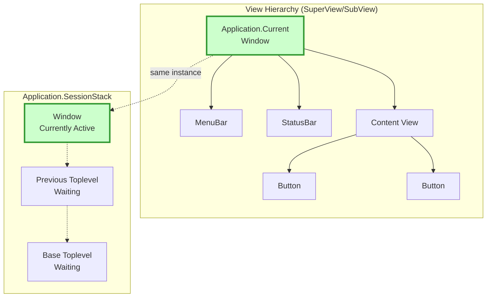

# Application Architecture

Terminal.Gui v2 uses an instance-based application architecture that decouples views from the global application state, improving testability and enabling multiple application contexts.

## View Hierarchy and Run Stack



## Usage Example Flow


## Key Concepts

### Instance-Based vs Static

**Terminal.Gui v2** has transitioned from a static singleton pattern to an instance-based architecture:

```csharp
// OLD (v1 / early v2 - now obsolete):
Application.Init();
Application.Top.Add(myView);
Application.Run();
Application.Shutdown();

// NEW (v2 instance-based):
var app = new ApplicationImpl();
app.Init();
var top = new Toplevel();
top.Add(myView);
app.Run(top);
app.Shutdown();
```

### View.App Property

Every view now has an `App` property that references its application context:

```csharp
public class View
{
    /// <summary>
    /// Gets the application context for this view.
    /// </summary>
    public IApplication? App { get; internal set; }
    
    /// <summary>
    /// Gets the application context, checking parent hierarchy if needed.
    /// Override to customize application resolution.
    /// </summary>
    public virtual IApplication? GetApp() => App ?? SuperView?.GetApp();
}
```

**Benefits:**
- Views can be tested without `Application.Init()`
- Multiple applications can coexist
- Clear ownership: views know their context
- Reduced global state dependencies

### Accessing Application from Views

**Recommended pattern:**

```csharp
public class MyView : View
{
    public override void OnEnter(View view)
    {
        // Use View.App instead of static Application
        App?.Current?.SetNeedsDraw();
        
        // Access SessionStack
        if (App?.SessionStack.Count > 0)
        {
            // Work with sessions
        }
    }
}
```

**Alternative - dependency injection:**

```csharp
public class MyView : View
{
    private readonly IApplication _app;
    
    public MyView(IApplication app)
    {
        _app = app;
        // Now completely decoupled from static Application
    }
    
    public void DoWork()
    {
        _app.Current?.SetNeedsDraw();
    }
}
```

## IApplication Interface

The `IApplication` interface defines the application contract:

```csharp
public interface IApplication
{
    /// <summary>
    /// Gets the currently running Toplevel (the "current session").
    /// Renamed from "Top" for clarity.
    /// </summary>
    Toplevel? Current { get; }
    
    /// <summary>
    /// Gets the stack of running sessions.
    /// Renamed from "TopLevels" to align with SessionToken terminology.
    /// </summary>
    ConcurrentStack<Toplevel> SessionStack { get; }
    
    IDriver? Driver { get; }
    IMainLoopCoordinator? MainLoop { get; }
    
    void Init(IDriver? driver = null);
    void Shutdown();
    SessionToken? Begin(Toplevel toplevel);
    void End(SessionToken sessionToken);
    // ... other members
}
```

## Terminology Changes

Terminal.Gui v2 modernized its terminology for clarity:

### Application.Current (formerly "Top")

The `Current` property represents the currently running Toplevel (the active session):

```csharp
// Access the current session
Toplevel? current = app.Current;

// From within a view
Toplevel? current = App?.Current;
```

**Why "Current" instead of "Top"?**
- Follows .NET patterns (`Thread.CurrentThread`, `HttpContext.Current`)
- Self-documenting: immediately clear it's the "current" active view
- Less confusing than "Top" which could mean "topmost in Z-order"

### Application.SessionStack (formerly "TopLevels")

The `SessionStack` property is the stack of running sessions:

```csharp
// Access all running sessions
foreach (var toplevel in app.SessionStack)
{
    // Process each session
}

// From within a view
int sessionCount = App?.SessionStack.Count ?? 0;
```

**Why "SessionStack" instead of "TopLevels"?**
- Describes both content (sessions) and structure (stack)
- Aligns with `SessionToken` terminology
- Follows .NET naming patterns (descriptive + collection type)

## Migration from Static Application

The static `Application` class now delegates to `ApplicationImpl.Instance` and is marked obsolete:

```csharp
public static class Application
{
    [Obsolete("Use ApplicationImpl.Instance.Current or view.App?.Current")]
    public static Toplevel? Current => Instance?.Current;
    
    [Obsolete("Use ApplicationImpl.Instance.SessionStack or view.App?.SessionStack")]
    public static ConcurrentStack<Toplevel> SessionStack => Instance?.SessionStack ?? new();
}
```

### Migration Strategies

**Strategy 1: Use View.App**

```csharp
// OLD:
void MyMethod()
{
    Application.Current?.SetNeedsDraw();
}

// NEW:
void MyMethod(View view)
{
    view.App?.Current?.SetNeedsDraw();
}
```

**Strategy 2: Pass IApplication**

```csharp
// OLD:
void ProcessSessions()
{
    foreach (var toplevel in Application.SessionStack)
    {
        // Process
    }
}

// NEW:
void ProcessSessions(IApplication app)
{
    foreach (var toplevel in app.SessionStack)
    {
        // Process
    }
}
```

**Strategy 3: Store IApplication Reference**

```csharp
public class MyService
{
    private readonly IApplication _app;
    
    public MyService(IApplication app)
    {
        _app = app;
    }
    
    public void DoWork()
    {
        _app.Current?.Title = "Processing...";
    }
}
```

## Session Management

### Begin and End

Applications manage sessions through `Begin()` and `End()`:

```csharp
var app = new ApplicationImpl();
app.Init();

var toplevel = new Toplevel();

// Begin a new session - pushes to SessionStack
SessionToken? token = app.Begin(toplevel);

// Current now points to this toplevel
Debug.Assert(app.Current == toplevel);

// End the session - pops from SessionStack
if (token != null)
{
    app.End(token);
}

// Current restored to previous toplevel (if any)
```

### Nested Sessions

Multiple sessions can run nested:

```csharp
var app = new ApplicationImpl();
app.Init();

// Session 1
var main = new Toplevel { Title = "Main" };
var token1 = app.Begin(main);
// app.Current == main, SessionStack.Count == 1

// Session 2 (nested)
var dialog = new Dialog { Title = "Dialog" };
var token2 = app.Begin(dialog);
// app.Current == dialog, SessionStack.Count == 2

// End dialog
app.End(token2);
// app.Current == main, SessionStack.Count == 1

// End main
app.End(token1);
// app.Current == null, SessionStack.Count == 0
```

## View.Driver Property

Similar to `View.App`, views now have a `Driver` property:

```csharp
public class View
{
    /// <summary>
    /// Gets the driver for this view.
    /// </summary>
    public IDriver? Driver => GetDriver();
    
    /// <summary>
    /// Gets the driver, checking application context if needed.
    /// Override to customize driver resolution.
    /// </summary>
    public virtual IDriver? GetDriver() => App?.Driver;
}
```

**Usage:**

```csharp
public override void OnDrawContent(Rectangle viewport)
{
    // Use view's driver instead of Application.Driver
    Driver?.Move(0, 0);
    Driver?.AddStr("Hello");
}
```

## Testing with the New Architecture

The instance-based architecture dramatically improves testability:

### Testing Views in Isolation

```csharp
[Fact]
public void MyView_DisplaysCorrectly()
{
    // Create mock application
    var mockApp = new Mock<IApplication>();
    mockApp.Setup(a => a.Current).Returns(new Toplevel());
    
    // Create view with mock app
    var view = new MyView { App = mockApp.Object };
    
    // Test without Application.Init()!
    view.SetNeedsDraw();
    Assert.True(view.NeedsDraw);
    
    // No Application.Shutdown() needed!
}
```

### Testing with Real ApplicationImpl

```csharp
[Fact]
public void MyView_WorksWithRealApplication()
{
    var app = new ApplicationImpl();
    try
    {
        app.Init(new FakeDriver());
        
        var view = new MyView();
        var top = new Toplevel();
        top.Add(view);
        
        app.Begin(top);
        
        // View.App automatically set
        Assert.NotNull(view.App);
        Assert.Same(app, view.App);
        
        // Test view behavior
        view.DoSomething();
        
    }
    finally
    {
        app.Shutdown();
    }
}
```

## Best Practices

### DO: Use View.App

```csharp
✅ GOOD:
public void Refresh()
{
    App?.Current?.SetNeedsDraw();
}
```

### DON'T: Use Static Application

```csharp
❌ AVOID:
public void Refresh()
{
    Application.Current?.SetNeedsDraw(); // Obsolete!
}
```

### DO: Pass IApplication as Dependency

```csharp
✅ GOOD:
public class Service
{
    public Service(IApplication app) { }
}
```

### DON'T: Assume Application.Instance Exists

```csharp
❌ AVOID:
public class Service
{
    public void DoWork()
    {
        var app = Application.Instance; // Might be null!
    }
}
```

### DO: Override GetApp() for Custom Resolution

```csharp
✅ GOOD:
public class SpecialView : View
{
    private IApplication? _customApp;
    
    public override IApplication? GetApp()
    {
        return _customApp ?? base.GetApp();
    }
}
```

## Advanced Scenarios

### Multiple Applications

The instance-based architecture enables multiple applications:

```csharp
// Application 1
var app1 = new ApplicationImpl();
app1.Init(new WindowsDriver());
var top1 = new Toplevel { Title = "App 1" };
// ... configure top1

// Application 2 (different driver!)
var app2 = new ApplicationImpl();
app2.Init(new CursesDriver());
var top2 = new Toplevel { Title = "App 2" };
// ... configure top2

// Views in top1 use app1
// Views in top2 use app2
```

### Application-Agnostic Views

Create views that work with any application:

```csharp
public class UniversalView : View
{
    public void ShowMessage(string message)
    {
        // Works regardless of which application context
        var app = GetApp();
        if (app != null)
        {
            var msg = new MessageBox(message);
            app.Begin(msg);
        }
    }
}
```

## See Also

- [Navigation](navigation.md) - Navigation with the instance-based architecture
- [Keyboard](keyboard.md) - Keyboard handling through View.App
- [Mouse](mouse.md) - Mouse handling through View.App  
- [Drivers](drivers.md) - Driver access through View.Driver
- [Multitasking](multitasking.md) - Session management with SessionStack
