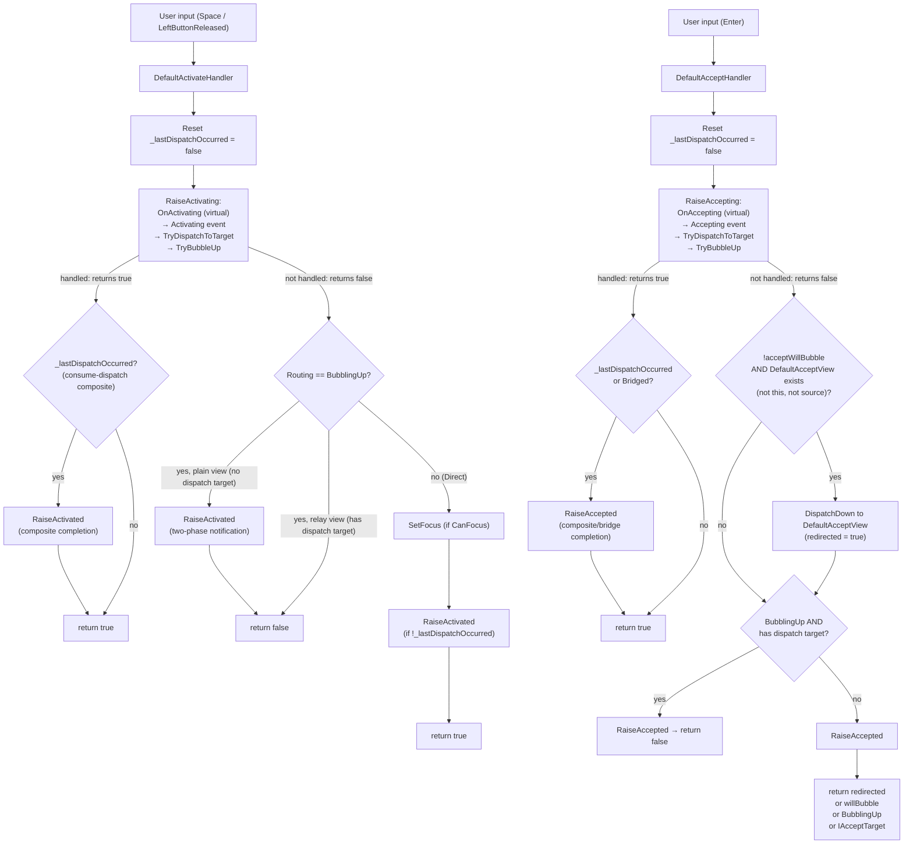
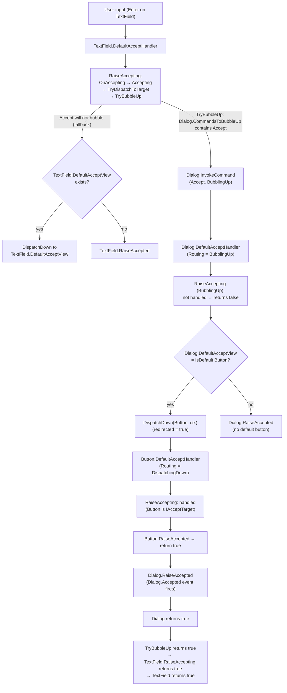

### Level 1: DefaultActivateHandler and DefaultAcceptHandler Flow

This diagram shows the actual implementation of `DefaultActivateHandler` and `DefaultAcceptHandler`. Each handler resets dispatch state, calls <xref:Terminal.Gui.ViewBase.View.RaiseActivating*>/<xref:Terminal.Gui.ViewBase.View.RaiseAccepting*> (which runs the full Cancellable Work Pattern pipeline: `OnXxx` virtual → `Xxx` event → `TryDispatchToTarget` → <xref:Terminal.Gui.ViewBase.View.TryBubbleUp*>), then decides how to complete based on the result and routing mode.

**Key Points:**
- `DefaultActivateHandler` and `DefaultAcceptHandler` are the real entry points from key/mouse bindings. They orchestrate everything.
- <xref:Terminal.Gui.ViewBase.View.RaiseActivating*>/<xref:Terminal.Gui.ViewBase.View.RaiseAccepting*> runs the full CWP pipeline: `OnXxx` virtual → `Xxx` event → `TryDispatchToTarget` → <xref:Terminal.Gui.ViewBase.View.TryBubbleUp*>. There is no separate "execute handler" step after the pre-event.
- <xref:Terminal.Gui.ViewBase.View.OnActivating*>/<xref:Terminal.Gui.ViewBase.View.Activating> (or <xref:Terminal.Gui.ViewBase.View.OnAccepting*>/<xref:Terminal.Gui.ViewBase.View.Accepting>) can cancel by setting `args.Handled = true`, which short-circuits `TryDispatchToTarget` and <xref:Terminal.Gui.ViewBase.View.TryBubbleUp*>.
- <xref:Terminal.Gui.Input.Command.Accept> skips <xref:Terminal.Gui.ViewBase.View.DefaultAcceptView> redirect when `acceptWillBubble = true` — the bubble path handles it, preventing double-accepted events.
- Command handlers return `bool?`: `null` (no implementation), `false` (raised but not handled), `true` (handled/consumed).

### Level 2: Accept Propagation with DefaultAcceptView

This diagram shows how <xref:Terminal.Gui.Input.Command.Accept> propagates through the view hierarchy when a <xref:Terminal.Gui.Views.Dialog> contains an IsDefault <xref:Terminal.Gui.Views.Button>. Accept bubbles from <xref:Terminal.Gui.Views.TextField> to <xref:Terminal.Gui.Views.Dialog> via <xref:Terminal.Gui.ViewBase.View.TryBubbleUp*> (inside <xref:Terminal.Gui.ViewBase.View.RaiseAccepting*>), then `Dialog.DefaultAcceptHandler` redirects to the IsDefault <xref:Terminal.Gui.Views.Button> via `DispatchDown`.

**Key Points:**
- <xref:Terminal.Gui.Input.Command.Accept> bubbles to <xref:Terminal.Gui.Views.Dialog> via <xref:Terminal.Gui.ViewBase.View.TryBubbleUp*> called inside <xref:Terminal.Gui.Views.TextField>'s <xref:Terminal.Gui.ViewBase.View.RaiseAccepting*>, because <xref:Terminal.Gui.Views.Dialog>'s <xref:Terminal.Gui.ViewBase.View.CommandsToBubbleUp> includes <xref:Terminal.Gui.Input.Command.Accept>.
- `Dialog.DefaultAcceptHandler` receives the command with `Routing = BubblingUp` and checks <xref:Terminal.Gui.Views.Dialog>'s <xref:Terminal.Gui.ViewBase.View.DefaultAcceptView> to find and invoke the IsDefault <xref:Terminal.Gui.Views.Button>.
- `DispatchDown` creates a new context with `Routing = DispatchingDown`, suppressing re-bubbling in the target and preventing infinite recursion.
- `TextField.DefaultAcceptHandler` skips its own <xref:Terminal.Gui.ViewBase.View.DefaultAcceptView> redirect because `acceptWillBubble = true` — this prevents double-handling.
- <xref:Terminal.Gui.ViewBase.View.DefaultAcceptView> is a property on each view that returns the first `IAcceptTarget { IsDefault: true }` SubView (typically a <xref:Terminal.Gui.Views.Button>). It is not inherited from the SuperView.
- <xref:Terminal.Gui.Views.Button> returns `true` from `DefaultAcceptHandler` because it implements <xref:Terminal.Gui.IAcceptTarget>.

### Level 3: Complete Flow with MenuBarItem, Menu, and MenuItem

```mermaid
flowchart TD
    sc_header["=== Scenario 1: HotKey Activation (Alt+F) ==="]
    sc_header --> sc_input["Alt+F pressed"]
    sc_input --> sc_hotkey["MenuBarItem.InvokeCommand(HotKey)"]
    sc_hotkey --> sc_pre["RaiseHandlingHotKey:<br/> OnHandlingHotKey<br/> → HandlingHotKey event<br/> → TryBubbleUp"]
    sc_pre --> |"handled: canceled"| sc_cancel["return false<br/>(key not consumed — allows text input)"]
    sc_pre --> |"not handled"| sc_hkcmd["RaiseHotKeyCommand"]
    sc_hkcmd --> sc_activate["InvokeCommand(Activate)<br/>(MenuBarItem override: no SetFocus before this)"]
    sc_activate --> sc_default_act["DefaultActivateHandler:<br/> RaiseActivating → SetFocus → RaiseActivated"]
    sc_default_act --> sc_onactivated["MenuBarItem.OnActivated:<br/> toggles PopoverMenuOpen"]
    sc_onactivated --> sc_show["PopoverMenu shown (PopoverMenuOpen = true)"]

    sc_show --> nav_header["=== Scenario 2: Menu Navigation (Arrow Keys) ==="]
    nav_header --> nav_input["Arrow key pressed inside Menu/PopoverMenu"]
    nav_input --> nav_activate["MenuItem.InvokeCommand(Activate)"]
    nav_activate --> nav_raise["RaiseActivating:<br/> OnActivating → Activating<br/> → TryDispatchToTarget<br/> → TryBubbleUp"]
    nav_raise --> |"not handled (Direct)"| nav_focus["SetFocus (MenuItem gains focus)"]
    nav_focus --> nav_activated["MenuItem.RaiseActivated"]
    nav_activated --> nav_selected["Menu.SelectedMenuItem updated<br/>→ RaiseSelectedMenuItemChanged"]
    nav_selected --> nav_bar["Menu.OnSelectedMenuItemChanged<br/>→ MenuBar.OnSelectedMenuItemChanged"]
    nav_bar --> nav_done["Update popover visibility if needed"]

    nav_done --> acc_header["=== Scenario 3: Accept Menu Item (Enter) ==="]
    acc_header --> acc_input["Enter pressed on focused MenuItem"]
    acc_input --> acc_raise["MenuItem.RaiseAccepting:<br/> OnAccepting → Accepting<br/> → TryDispatchToTarget → TryBubbleUp"]
    acc_raise --> |"handled: action invoked"| acc_exec["MenuItem action executed<br/>(via OnAccepting in MenuItem)"]
    acc_exec --> acc_accepted["MenuItem.RaiseAccepted"]
    acc_accepted --> acc_bubble["Accepted propagates via<br/>CommandBridge or CommandsToBubbleUp"]
    acc_bubble --> acc_bar["MenuBar/Menu.OnAccepted"]
    acc_bar --> acc_close["MenuBar hides popover, deactivates"]

    acc_raise --> |"has SubMenu"| acc_sub["SubMenu shown<br/>(MenuItem.OnAccepting opens SubMenu)"]
```

This diagram illustrates command flow in the menu system. <xref:Terminal.Gui.Views.MenuBarItem> (a top-level "File", "Edit" item in <xref:Terminal.Gui.Views.MenuBar>) extends <xref:Terminal.Gui.Views.MenuItem> : <xref:Terminal.Gui.Views.Shortcut>. <xref:Terminal.Gui.Views.MenuBar> extends <xref:Terminal.Gui.Views.Menu> : <xref:Terminal.Gui.Views.Bar>.

**Key Points:**
- **Scenario 1 (HotKey)**: <xref:Terminal.Gui.Views.MenuBarItem> overrides <xref:Terminal.Gui.Input.Command.HotKey> to skip <xref:Terminal.Gui.ViewBase.View.SetFocus> before `InvokeCommand(Activate)`. This prevents <xref:Terminal.Gui.Views.Menu.OnSelectedMenuItemChanged*> firing prematurely when switching `MenuBarItems` via HotKey. <xref:Terminal.Gui.ViewBase.View.SetFocus> occurs inside `DefaultActivateHandler` as part of Activate processing, not in the HotKey handler directly.
- **Scenario 2 (Activate)**: Arrow keys navigate menu items via <xref:Terminal.Gui.Input.Command.Activate>. `DefaultActivateHandler`'s Direct path calls <xref:Terminal.Gui.ViewBase.View.SetFocus>, which triggers `Menu.RaiseSelectedMenuItemChanged`. <xref:Terminal.Gui.Views.MenuBar.OnSelectedMenuItemChanged*> manages popover visibility during navigation.
- **Scenario 3 (Accept)**: Enter executes the menu item. <xref:Terminal.Gui.Views.MenuItem>'s <xref:Terminal.Gui.ViewBase.View.OnAccepting*> invokes the item's action. <xref:Terminal.Gui.ViewBase.View.Accepted> propagates via <xref:Terminal.Gui.Input.CommandBridge> (for non-containment boundaries) or <xref:Terminal.Gui.ViewBase.View.CommandsToBubbleUp> (for containment), eventually reaching <xref:Terminal.Gui.Views.MenuBar> which closes the popover.
- <xref:Terminal.Gui.Views.MenuBarItem> holds a <xref:Terminal.Gui.Views.PopoverMenu> (not a `SubMenu`). <xref:Terminal.Gui.Views.MenuItem> holds a `SubMenu` (a nested <xref:Terminal.Gui.Views.Menu>).
- <xref:Terminal.Gui.Input.CommandBridge> connects non-containment boundaries (e.g., <xref:Terminal.Gui.Views.PopoverMenu> ↔ <xref:Terminal.Gui.Views.MenuBarItem>) so <xref:Terminal.Gui.ViewBase.View.Accepted>/<xref:Terminal.Gui.ViewBase.View.Activated> from the remote view re-enters the owner's full command pipeline with `Routing = Bridged`.
- <xref:Terminal.Gui.Views.MenuBar> uses consume dispatch (<xref:Terminal.Gui.ViewBase.View.ConsumeDispatch> = true, <xref:Terminal.Gui.ViewBase.View.GetDispatchTarget*> → `Focused`) — inner activations are consumed and do not propagate to <xref:Terminal.Gui.Views.MenuBar>'s SuperView.
