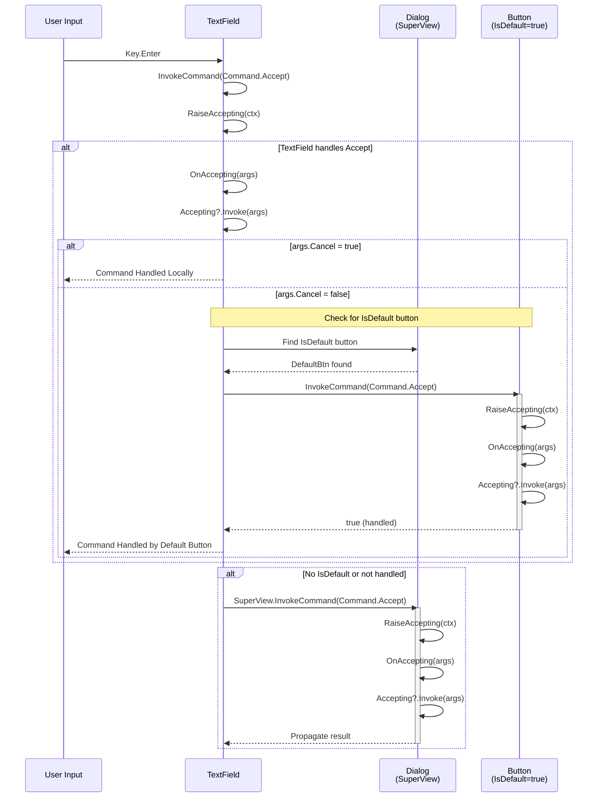

### Level 1: Basic View Command Flow

This diagram shows the fundamental command invocation flow within a single view, demonstrating the Cancellable Work Pattern with pre-events (e.g., `Activating`, `Accepting`) and the command handler execution.

```mermaid
sequenceDiagram
    participant Input as User Input<br/>(Key/Mouse)
    participant View as View
    participant Handler as Command<br/>Handler
    
    Input->>View: Key.Enter or Space
    View->>View: InvokeCommand(Command)
    
    alt Command.Activate
        View->>View: RaiseActivating(ctx)
        activate View
        View->>View: OnActivating(args)
        alt args.Cancel = true
            View-->>Input: Command Canceled
            deactivate View
        else args.Cancel = false
            View->>View: Activating?.Invoke(this, args)
            alt args.Cancel = true
                View-->>Input: Command Canceled by Event
                deactivate View
            else args.Cancel = false
                View->>Handler: Execute Command
                Handler-->>View: bool? (null/false/true)
                View-->>Input: Command Complete
                deactivate View
            end
        end
    else Command.Accept
        View->>View: RaiseAccepting(ctx)
        activate View
        View->>View: OnAccepting(args)
        alt args.Cancel = true
            View-->>Input: Command Canceled
            deactivate View
        else args.Cancel = false
            View->>View: Accepting?.Invoke(this, args)
            alt args.Cancel = true
                View-->>Input: Command Canceled by Event
                deactivate View
            else args.Cancel = false
                View->>Handler: Execute Command
                Handler-->>View: bool? (null/false/true)
                View-->>Input: Command Complete
                deactivate View
            end
        end
    end
```

**Key Points:**
- Commands follow the Cancellable Work Pattern: pre-event → virtual method → event → handler
- `OnActivating`/`OnAccepting` or event handlers can cancel via `args.Cancel = true`
- Command handlers return `bool?`: `null` (no handler), `false` (executed but unhandled), `true` (handled/canceled)
- `Command.Activate` is handled locally (no propagation)
- `Command.Accept` may propagate (see Level 2)

### Level 2: Accept Propagation with Button.IsDefault

This diagram shows how `Command.Accept` propagates through the view hierarchy, including the special case where a default button intercepts the command even when invoked from another view.



**Key Points:**
- `Command.Accept` checks for a sibling `Button` with `IsDefault = true` in the `SuperView`
- If found and not the source view, the default button handles the command first
- If unhandled or no default button, command propagates to `SuperView`
- `SuperView` (e.g., `Dialog`) can handle accept to close or trigger actions
- This enables Enter key to activate default buttons from any focused view

### Level 3: Complete Flow with Shortcut, MenuBar, and Menu

This diagram illustrates the complete command flow in a complex hierarchical scenario involving `Shortcut`, `MenuBar`, `Menu`, and `MenuItem`, showing how commands route through multiple views and how `Accepted` events propagate back up the hierarchy.

```mermaid
sequenceDiagram
    participant Input as User Input<br/>(Key/Mouse)
    participant Shortcut as Shortcut
    participant MenuBar as MenuBar
    participant MenuBarItem as MenuBarItem<br/>(MenuItemv2)
    participant Menu as Menu<br/>(Popover)
    participant MenuItem as MenuItem<br/>(MenuItemv2)
    participant App as Application<br/>TopRunnable
    
    Note over Input,App: Scenario 1: Shortcut Activation (Alt+F)
    Input->>Shortcut: Key.Alt+F
    Shortcut->>MenuBar: Find matching MenuBarItem
    MenuBar-->>Shortcut: MenuBarItem found
    Shortcut->>MenuBarItem: InvokeCommand(Command.HotKey)
    activate MenuBarItem
    MenuBarItem->>MenuBarItem: RaiseHandlingHotKey()
    MenuBarItem->>MenuBarItem: SetFocus()
    MenuBarItem-->>Shortcut: true (handled)
    deactivate MenuBarItem
    
    MenuBar->>MenuBar: OnAccepting(args)
    activate MenuBar
    MenuBar->>MenuBar: ShowItem(MenuBarItem)
    MenuBar->>Menu: Show Popover
    activate Menu
    MenuBar->>MenuBarItem: SetFocus()
    MenuBar-->>Shortcut: true (handled)
    deactivate MenuBar
    
    Note over Input,App: Scenario 2: Menu Navigation (Arrow Keys)
    Input->>Menu: Key.ArrowDown
    Menu->>MenuItem: Navigate to next item
    MenuItem->>MenuItem: InvokeCommand(Command.Activate)
    activate MenuItem
    MenuItem->>MenuItem: RaiseActivating(ctx)
    MenuItem->>MenuItem: OnActivating(args)
    MenuItem->>MenuItem: Activating?.Invoke(args)
    MenuItem->>MenuItem: SetFocus()
    MenuItem-->>Menu: true (handled)
    deactivate MenuItem
    
    Menu->>Menu: OnFocusedChanged(focused)
    Menu->>Menu: SelectedMenuItem = focused
    Menu->>Menu: RaiseSelectedMenuItemChanged()
    
    Note over Input,App: Scenario 3: Menu Item Accept (Enter)
    Input->>MenuItem: Key.Enter
    MenuItem->>MenuItem: InvokeCommand(Command.Accept)
    activate MenuItem
    MenuItem->>MenuItem: RaiseAccepting(ctx)
    MenuItem->>MenuItem: OnActivating(args)
    MenuItem->>MenuItem: Accepting?.Invoke(args)
    
    alt MenuItem has action
        MenuItem->>MenuItem: Execute action
        MenuItem->>MenuItem: RaiseAccepted(ctx)
        MenuItem->>MenuItem: OnAccepted(args)
        MenuItem->>MenuItem: Accepted?.Invoke(args)
        MenuItem-->>Menu: Accepted event bubbles
        deactivate MenuItem
        
        Menu->>Menu: OnAccepted(args)
        Menu->>Menu: RaiseAccepted(ctx)
        activate Menu
        Menu->>Menu: Accepted?.Invoke(args)
        Menu-->>MenuBar: Accepted event bubbles
        deactivate Menu
        
        MenuBar->>MenuBar: OnAccepted(args)
        activate MenuBar
        MenuBar->>MenuBar: Active = false
        MenuBar->>Menu: Hide Popover
        deactivate Menu
        MenuBar->>App: Return focus to TopRunnable
        deactivate MenuBar
        
    else MenuItem has submenu
        MenuItem->>MenuItem: OnAccepting(args)
        Note over MenuItem,Menu: SuperView is null (Popover)
        MenuItem->>Menu: SuperMenuItem.InvokeCommand(Accept)
        Menu->>Menu: Show submenu popover
        Menu-->>MenuItem: true (handled)
        deactivate MenuItem
    end
```

**Key Points:**
- **Shortcut (`HotKey`)**: Routes to `MenuBarItem`, sets focus, triggers `MenuBar` to show popover
- **Menu Navigation (`Activate`)**: Handled locally by `MenuItem`, updates `Menu.SelectedMenuItem` via `OnFocusedChanged`
- **Menu Accept (`Accept`)**: 
  - `MenuItem` with action: Executes action, raises `Accepted` → propagates to `Menu` → propagates to `MenuBar` → hides menu
  - `MenuItem` with submenu: Propagates to `SuperMenuItem` (parent `Menu`) to show submenu popover
- **Event Propagation**: `Accepted` events bubble up from `MenuItem` → `Menu` → `MenuBar` for hierarchical coordination
- **Focus Management**: `MenuBar.Active = false` returns focus to `Application.TopRunnable` after menu closes

**Hierarchical Coordination:**
- `Activating`: Local to view, uses `SelectedMenuItemChanged` for menu-specific coordination
- `Accepting`: Propagates to default button, superview, or `SuperMenuItem` (menus)
- `Accepted`: Post-event that bubbles up hierarchy to trigger cleanup (hide menus, deactivate menu bar)

## Overview of the Command System

[Rest of document continues unchanged...]
