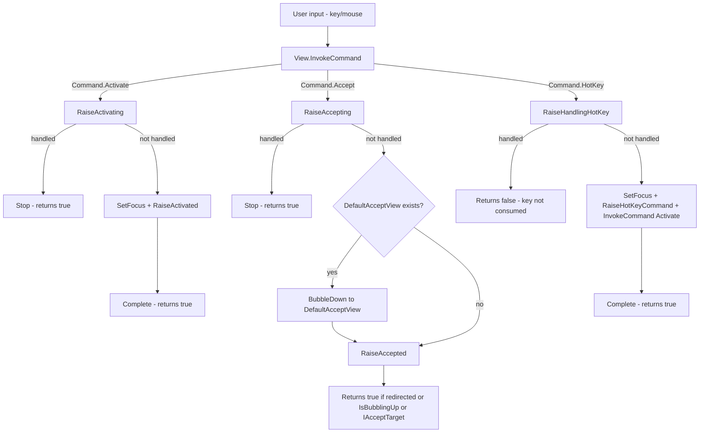
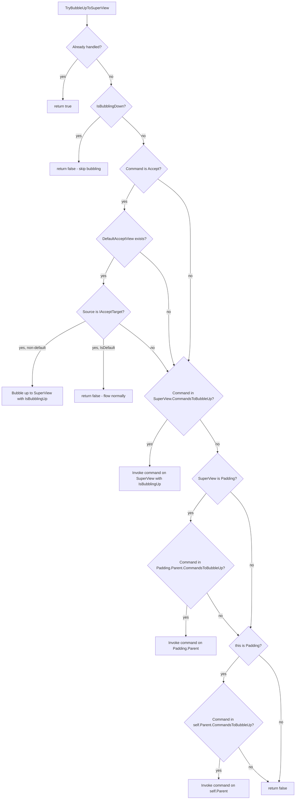
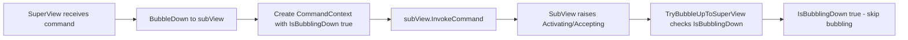
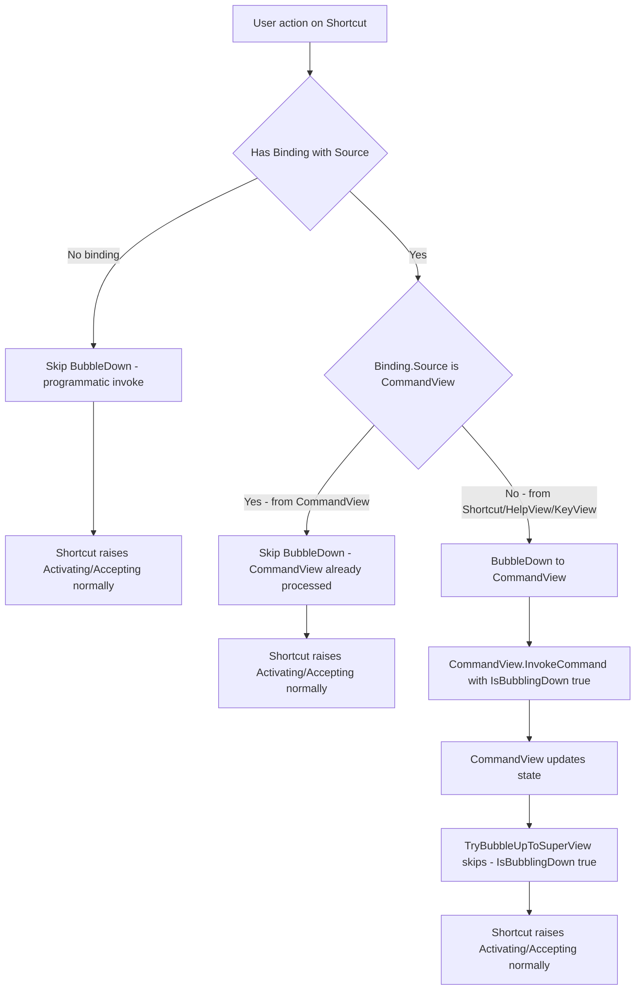

# Deep Dive into Command and View.Command in Terminal.Gui

## See Also

* [Lexicon & Taxonomy](lexicon.md)
* [Cancellable Work Pattern](cancellable-work-pattern.md)
* [Events](events.md)

## Overview

The `Command` system in Terminal.Gui provides a standardized framework for defining and executing actions that views can perform, such as selecting items, accepting input, or navigating content. Implemented primarily through the `View.Command` APIs, this system integrates tightly with input handling (e.g., keyboard and mouse events) and leverages the *Cancellable Work Pattern* to ensure extensibility, cancellation, and decoupling. Central to this system are the `Activating/Activated` and `Accepting/Accepted` events, which encapsulate common user interactions: `Activated` for changing a view's state or preparing it for interaction (e.g., toggling a checkbox, focusing a menu item), and `Accepted` for confirming an action or state (e.g., executing a menu command, accepting a ListView, submitting a dialog).

This deep dive explores the `Command` and `View.Command` APIs and the default implementations of standardized commands including `Command.Activate`, `Command.Accept`, and `Command.HotKey`.

This diagram shows the fundamental command invocation flow within a single view, demonstrating the Cancellable Work Pattern with pre-events (e.g., `Activating`, `Accepting`) and opt-in bubbling via `CommandsToBubbleUp`.



## Activate/Accept/HotKey System Summary

| Aspect | `Command.Activate` | `Command.Accept` | `Command.HotKey` |
|--------|-------------------|------------------|-------------------|
| **Semantic Meaning** | "Interact with this view / select an item" - changes view state or prepares for interaction | "Perform the view's primary action" - confirms action or accepts current state | "The view's HotKey was pressed" - sets focus and activates |
| **Typical Triggers** | Spacebar, single mouse click, navigation keys (arrows), mouse enter (menus) | Enter key, double-click | HotKey letter (e.g., Alt+F), `Shortcut.Key` |
| **Pre-Virtual Method** | `OnActivating` | `OnAccepting` | `OnHandlingHotKey` |
| **Pre-Event Name** | `Activating` | `Accepting` | `HandlingHotKey` |
| **Post-Virtual Method** | `OnActivated` | `OnAccepted` | `OnHotKeyCommand` |
| **Post-Event Name** | `Activated` | `Accepted` | `HotKeyCommand` |
| **Bubbling** | Opt-in via `CommandsToBubbleUp` | Opt-in via `CommandsToBubbleUp` + `DefaultAcceptView` | Opt-in via `CommandsToBubbleUp` |

## View Command Behaviors

The following table documents how `View` and each View subclass binds or handles keyboard and mouse events. This provides a comprehensive reference for understanding which commands are bound to specific inputs or whether views handle events directly through method overrides.

| View | Space | Enter | HotKey | Pressed | Released | Clicked | DoubleClicked |
|------|-------|-------|--------|---------|----------|---------|---------------|
| **View** (base) | `Command.Activate` | `Command.Accept` | `Command.HotKey` | Not bound | `Command.Activate` | Not bound | Not bound |
| **Button** | `Command.Accept` | `Command.Accept` | `Command.HotKey` → `Command.Accept` | Configurable via `MouseHoldRepeat` | Configurable via `MouseHoldRepeat` | `Command.Accept` | `Command.Accept` |
| **CheckBox** | `Command.Activate` (advances state) | `Command.Accept` | `Command.HotKey` | Not bound | Not bound (removed) | `Command.Activate` | `Command.Accept` |
| **ListView** | `Command.Activate` (marks item) | `Command.Accept` | `Command.HotKey` | Not bound | Not bound | `Command.Activate` | `Command.Accept` |
| **TableView** | Not bound | `Command.Accept` (CellActivationKey) | `Command.HotKey` | Not bound | Not bound | `Command.Activate` | Not bound |
| **TreeView** | Not bound | `Command.Activate` (ObjectActivationKey) | `Command.HotKey` | Not bound | Not bound | OnMouseEvent (node selection) | OnMouseEvent (ObjectActivationButton) |
| **TextField** | Removed (text input) | `Command.Accept` | `Command.HotKey` (cancels if focused) | OnMouseEvent (set cursor) | OnMouseEvent (end drag) | Not bound | OnMouseEvent (select word) |
| **TextView** | Removed (text input) | `Command.NewLine` or `Command.Accept` | `Command.HotKey` | Not bound | Not bound | Not bound | Not bound |
| **OptionSelector** | Forwards to CheckBox SubView | `Command.Accept` | Restores focus, advances Active | Handled by SubViews | Handled by SubViews | Handled by SubViews | Handled by SubViews |
| **FlagSelector** | Removed (forwards to SubView) | Removed (forwards to SubView) | Restores focus (no-op if focused) | Not bound (cleared) | Not bound (cleared) | Not bound (cleared) | Not bound (cleared) |
| **HexView** | Removed | Removed | Not bound | Not bound | Not bound | `Command.Activate` | `Command.Activate` |
| **ColorPicker** | Not bound | Not bound | Not bound | Not bound | Not bound | Not bound (removed) | `Command.Accept` |
| **Label** | Not bound | Not bound | Forwards to next focusable peer | Not bound | Not bound | Not bound | Not bound |
| **TabView** | Not bound | Not bound | `Command.HotKey` | Handled by SubViews | Handled by SubViews | Handled by SubViews | Not bound |
| **NumericUpDown** | Handled by SubViews | Handled by SubViews | `Command.HotKey` | Handled by SubViews | Handled by SubViews | Handled by SubViews | Handled by SubViews |
| **Dialog** | Handled by SubViews | Handled by SubViews | Handled by SubViews | Handled by SubViews | Handled by SubViews | Handled by SubViews | Handled by SubViews |
| **Wizard** | Handled by SubViews | Handled by SubViews | Handled by SubViews | Handled by SubViews | Handled by SubViews | Handled by SubViews | Handled by SubViews |
| **FileDialog** | Handled by SubViews | Handled by SubViews | Handled by SubViews | Handled by SubViews | Handled by SubViews | Handled by SubViews | Handled by SubViews |
| **DatePicker** | Handled by SubViews | Handled by SubViews | Handled by SubViews | Handled by SubViews | Handled by SubViews | Handled by SubViews | Handled by SubViews |
| **ComboBox** | Handled by SubViews | Handled by SubViews | `Command.HotKey` | OnMouseEvent (toggle) | Handled by SubViews | Handled by SubViews | Handled by SubViews |
| **Shortcut** | `Command.Activate` (BubbleDown to CommandView) | `Command.Accept` (BubbleDown to CommandView) | `Command.HotKey` → `Command.Activate` | Not bound | `Command.Activate` | Not bound | Not bound |
| **MenuItem** | `Command.Activate` (inherited from Shortcut) | `Command.Accept` (invokes TargetView.Command) | `Command.HotKey` → `Command.Activate` | Not bound | `Command.Activate` | Not bound | Not bound |
| **Menu** | Handled by MenuItems | Handled by MenuItems | Handled by MenuItems | Handled by MenuItems | Handled by MenuItems | Handled by MenuItems | Handled by MenuItems |
| **Bar** | Handled by Shortcuts | Handled by Shortcuts | Handled by Shortcuts | Handled by Shortcuts | Handled by Shortcuts | Handled by Shortcuts | Handled by Shortcuts |
| **ScrollBar** | Not bound | Not bound | Not bound | OnMouseEvent | OnMouseEvent | OnMouseEvent | Not bound |
| **ProgressBar** | N/A | N/A | N/A | N/A | N/A | N/A | N/A |
| **SpinnerView** | N/A | N/A | N/A | N/A | N/A | N/A | N/A |

### Notes on Command Behaviors

#### Table Notation

The table shows how each view handles keyboard and mouse input using one of these approaches:

- **`Command.X`** - Input is bound to a command via KeyBinding or MouseBinding (e.g., `Command.HotKey`, `Command.Activate`, `Command.Accept`)
- **OnKeyDown (custom)** - Input is handled directly by overriding `OnKeyDown` with view-specific logic
- **OnMouseEvent (description)** - Input is handled directly by overriding `OnMouseEvent` with view-specific behavior
- **Base OnMouseEvent** - Input uses the base `View.OnMouseEvent` implementation (updates MouseState)
- **Custom handler** - Input uses a view-specific handler method (not a command)
- **Handled by SubViews** - Composite views delegate input handling to their contained SubViews
- **Forwards to SubView** - Input is forwarded to a specific SubView (e.g., OptionSelector -> CheckBox)
- **Not bound** - Input is not handled or bound by this view

#### Key Points

1. **View Base Class**: The first row shows the default behavior provided by the base `View` class. Space and Enter are bound to `Command.Activate` and `Command.Accept` respectively in `SetupCommands ()`. `MouseFlags.LeftButtonReleased` is bound to `Command.Activate` by default. Subclasses typically override these bindings or add MouseBindings for Clicked/DoubleClicked events.

2. **Composite Views** (Dialog, Wizard, FileDialog, DatePicker, NumericUpDown, ComboBox): These views delegate input handling to their SubViews. The SuperView may intercept commands to coordinate actions (e.g., Dialog intercepting `Accept` to set `Result`).

3. **Display-Only Views** (ProgressBar, SpinnerView, Label): These views typically have `CanFocus = false` and do not handle keyboard or mouse input directly. `Label` forwards its HotKey to the next focusable peer view.

4. **Command Bindings vs. Event Handlers**: Views with simple, standardized behaviors use **command bindings** (KeyBinding/MouseBinding -> Command). Views requiring custom logic (e.g., text editing, cursor positioning, drag selection) override **OnKeyDown** or **OnMouseEvent** directly.

5. **Button**: Implements `IAcceptTarget`. Space, Enter, Clicked, and DoubleClicked all map to `Command.Accept`. Mouse bindings are managed dynamically by the `MouseHoldRepeat` property.

6. **Selector Views** (OptionSelector, FlagSelector): These inherit from `SelectorBase` which sets `CommandsToBubbleUp = [Command.Activate, Command.Accept]`. Space/Enter are forwarded to the focused CheckBox via `BubbleDown`. HotKey behavior differs: OptionSelector restores focus and advances the active selection; FlagSelector restores focus (when not focused) but does not change active flags (no-op when focused).

7. **Text Input Views** (TextField, TextView): These remove the `Key.Space` binding so space characters can be typed as text. TextField cancels HotKey processing when already focused (via `OnHandlingHotKey`) so the HotKey character can be typed as text. Enter maps to `Command.Accept` in TextField (submit), and to `Command.NewLine` in multi-line TextView (or `Command.Accept` in single-line mode).

8. **Mouse Event Columns**:
   - **Pressed**: `MouseFlags.LeftButtonPressed` - button initially pressed down
   - **Released**: `MouseFlags.LeftButtonReleased` - button released after press
   - **Clicked**: `MouseFlags.LeftButtonClicked` - synthesized from press+release in same location
   - **DoubleClicked**: `MouseFlags.LeftButtonDoubleClicked` - synthesized from timing of two clicks
   - For detailed information about the mouse event pipeline and how events are synthesized, see the [Mouse Deep Dive](mouse.md).

9. **Shortcut**: Uses `CommandsToBubbleUp = [Command.Activate, Command.Accept]` and `BubbleDown` to coordinate commands between its SubViews (CommandView, HelpView, KeyView). See the [Shortcut Deep Dive](shortcut.md) for details. **MenuItem** extends Shortcut with `TargetView` and `Command` properties for invoking commands on target views. **Menu** is a vertical `Bar` container for MenuItems. **MenuBar** is being redesigned; see source code for current behavior.

10. **Implementation Patterns**: To understand how bindings work, see:
    - `Terminal.Gui/ViewBase/Mouse/View.Mouse.cs` - Base mouse handling and MouseBindings
    - `Terminal.Gui/ViewBase/Keyboard/View.Keyboard.cs` - Base keyboard handling and KeyBindings
    - Individual view source files for view-specific overrides and custom handlers

### Key Takeaways

1. **`Activate` = Interaction/Selection** (immediate, local by default)
   - Changes view state or sets focus
   - Views that implement `IValue` will emit `ValueChanging`/`ValueChanged` events.
   - Views can emit view-specific events for notification (e.g., `CheckedStateChanged`, `SelectedMenuItemChanged`)
   - Bubbles to SuperView only if `SuperView.CommandsToBubbleUp` includes `Command.Activate`

2. **`Accept` = Confirmation/Action** (final, hierarchical)
   - Confirms current state or executes primary action
   - `View.DefaultAcceptView` is the SubView that has `Command.Accept` invoked on it if no other SubView handles `Accept`.
   - Bubbles to SuperView if `SuperView.CommandsToBubbleUp` includes `Command.Accept`
   - Enables dialog/menu close scenarios

3. **`HotKey` = Focus + Activate** (delegated)
   - Sets focus to the view and then invokes `Command.Activate`
   - Bubbles to SuperView only if `SuperView.CommandsToBubbleUp` includes `Command.HotKey`

## Overview of the Command System

The `Command` system in Terminal.Gui defines a set of standard actions via the `Command` enum (e.g., `Command.Activate`, `Command.Accept`, `Command.HotKey`, `Command.StartOfPage`). These actions are triggered by user inputs (e.g., key presses, mouse clicks) or programmatically, enabling consistent view interactions.

### Key Components
- **Command Enum**: Defines actions like `Activate` (state change or interaction preparation), `Accept` (action confirmation), `HotKey` (hotkey activation), and others (e.g., `StartOfPage` for navigation).
- **Command Handlers**: Views register handlers using `View.AddCommand`, specifying a `CommandImplementation` delegate that returns `bool?` (`null`: no command executed; `false`: executed but not handled; `true`: handled or canceled).
- **Command Routing**: Commands are invoked via `View.InvokeCommand`, executing the handler or raising `CommandNotBound` if no handler exists.
- **Cancellable Work Pattern**: Command execution uses events (e.g., `Activating`, `Accepting`) and virtual methods (e.g., `OnActivating`, `OnAccepting`) for modification or cancellation, with `Handled` indicating processing should stop.

### Role in Terminal.Gui
The `Command` system bridges user input and view behavior, enabling:
- **Consistency**: Standard commands ensure predictable interactions (e.g., `Enter` and `Double-click` trigger `Accept` in buttons, menus, checkboxes).
- **Extensibility**: Custom handlers and events allow behavior customization.
- **Decoupling**: Events reduce reliance on sub-classing, and `CommandsToBubbleUp` provides structured command propagation up the view hierarchy.

## Implementation in View.Command

The `View.Command` APIs in the `View` class provide infrastructure for registering, invoking, and routing commands, adhering to the *Cancellable Work Pattern*. `View` provides default implementations of four commands:

* `Command.Activate` - Bound to `Key.Space` and `MouseFlags.LeftButtonReleased`. The default handler (`DefaultActivateHandler`) calls `RaiseActivating`; if not handled, sets focus, calls `RaiseActivated`, and returns `true`.
* `Command.Accept` - Bound to `Key.Enter`. The default handler (`DefaultAcceptHandler`) calls `RaiseAccepting`; if not handled, redirects to `DefaultAcceptView` via `BubbleDown` (if available), calls `RaiseAccepted`, and returns `true` if redirected, bubbling up, or the view is an `IAcceptTarget`.
* `Command.HotKey` - Bound to `View.HotKey`. The default handler (`DefaultHotKeyHandler`) calls `RaiseHandlingHotKey`; if handled, returns `false` (allowing the key through as text input); if not handled, sets focus, calls `RaiseHotKeyCommand`, invokes `Command.Activate`, and returns `true`.
* `Command.NotBound` - Invoked when an unregistered command is triggered. Raises the `CommandNotBound` event.

### Command Registration
Views register commands using `View.AddCommand`, associating a `Command` with a `CommandImplementation` delegate. The delegate's `bool?` return controls processing flow.

### Command Invocation
Commands are invoked via `View.InvokeCommand` or `View.InvokeCommands`, passing an `ICommandContext` for context (e.g., source view, binding details). Unhandled commands trigger `CommandNotBound`.

**Example**:
```csharp
public bool? InvokeCommand (Command command, ICommandContext? ctx)
{
    if (!_commandImplementations.TryGetValue (command, out CommandImplementation? implementation))
    {
        _commandImplementations.TryGetValue (Command.NotBound, out implementation);
    }

    return implementation! (ctx);
}
```

### Command Routing and Bubbling

By default, commands route directly to the target view and processing stops after the view's handler returns. Command **bubbling** - where an unhandled command propagates up to the SuperView - is **opt-in** and controlled by `View.CommandsToBubbleUp`.

#### `CommandsToBubbleUp`

`CommandsToBubbleUp` is a property on `View` that specifies which commands should bubble up from unhandled SubViews to the SuperView. When a SubView raises a command that is not handled, and that command is in the SuperView's `CommandsToBubbleUp` list, the command will be invoked on the SuperView.

```csharp
public IReadOnlyList<Command> CommandsToBubbleUp { get; set; } = [];
```

By default, `CommandsToBubbleUp` is empty (no bubbling). Views that need hierarchical command propagation opt in explicitly:

| View | `CommandsToBubbleUp` |
|------|---------------------|
| **Shortcut** | `[Command.Activate, Command.Accept]` |
| **Dialog** | `[Command.Accept]` |
| **Menu** | `[Command.Accept, Command.Activate]` |
| **SelectorBase** (OptionSelector, FlagSelector) | `[Command.Activate, Command.Accept]` |

#### `TryBubbleUpToSuperView`

All three `Raise` methods (`RaiseAccepting`, `RaiseActivating`, `RaiseHandlingHotKey`) call the unified `TryBubbleUpToSuperView` helper when the command is not handled. This method:

1. **Checks `IsBubblingDown`**: If the context has `IsBubblingDown = true` (set by `BubbleDown`), returns `false` immediately to prevent infinite recursion.
2. **Handles `Command.Accept` with `IAcceptTarget`** (only for `Command.Accept`): If a `DefaultAcceptView` exists and the source is a non-default `IAcceptTarget`, bubbles up to the SuperView with `IsBubblingUp = true`. If the source is the default `IAcceptTarget`, flows normally without redirect.
3. **Checks `SuperView.CommandsToBubbleUp`**: If the current command is in the SuperView's `CommandsToBubbleUp` list, the command is invoked on the SuperView with `IsBubblingUp = true`.
4. **Handles the Padding edge cases**: If the SuperView is a `Padding` adornment, checks the Padding's parent View's `CommandsToBubbleUp` instead. Also handles the case where `this` is a `Padding`.



#### `BubbleDown`

`BubbleDown` is the inverse of `TryBubbleUpToSuperView`. Where bubbling up propagates an unhandled command from a SubView to its SuperView, `BubbleDown` dispatches a command from a SuperView down to a specific SubView with bubbling suppressed.

```csharp
protected bool? BubbleDown (View target, ICommandContext? ctx)
```

This method:
1. Creates a new `CommandContext` with `IsBubblingDown = true` and no binding
2. Invokes the command on the target
3. Because `IsBubblingDown` is true, `TryBubbleUpToSuperView` in the target's Raise method skips bubbling, preventing infinite recursion

`BubbleDown` is used by composite views (like `Shortcut` and `SelectorBase`) that need to forward a command to a SubView without the SubView's command bubbling back up to the SuperView that dispatched it.



#### `DefaultAcceptView`

`DefaultAcceptView` is a special property on `View` that identifies the SubView that should receive `Command.Accept` when no other SubView handles it. By default, it returns the first SubView implementing `IAcceptTarget` with `IsDefault = true` (e.g., a `Button`), but can be set explicitly.

```csharp
public View? DefaultAcceptView
{
    get
    {
        if (field is null)
        {
            return GetSubViews (includePadding: true)
                .FirstOrDefault (v => v is IAcceptTarget { IsDefault: true });
        }

        return field;
    }
    set;
}
```

This enables the common pattern where pressing Enter in a `TextField` within a `Dialog` activates the default "OK" button.

#### `IAcceptTarget`

`IAcceptTarget` is an interface implemented by views that serve as terminal destinations for `Command.Accept` (e.g., `Button`). It has a single property:

```csharp
public interface IAcceptTarget
{
    bool IsDefault { get; set; }
}
```

The `IAcceptTarget` interface affects command flow in three ways:

1. **`DefaultAcceptView` resolution**: When a view looks for a default accept target, it searches for SubViews implementing `IAcceptTarget { IsDefault: true }`.
2. **`DefaultAcceptHandler` return value**: The handler returns `true` (indicating the command was handled) when the view implements `IAcceptTarget`, signaling that Accept has reached its terminal destination.
3. **`TryBubbleUpToSuperView` behavior**: When a non-default `IAcceptTarget` source raises Accept and a `DefaultAcceptView` exists, the command bubbles up to the SuperView with `IsBubblingUp = true` so the SuperView can determine which accept target was activated. A default `IAcceptTarget` source flows normally without redirect.

## The Activating and Accepting Concepts

The `Activating` and `Accepting` events, along with their corresponding commands (`Command.Activate`, `Command.Accept`), are designed to handle the most common user interactions with views:
- **Activating**: Changing a view's state or preparing it for further interaction, such as highlighting an item in a list, toggling a checkbox, or focusing a menu item.
- **Accepting**: Confirming an action or state, such as submitting a form, activating a button, or finalizing a selection.

These concepts are opinionated, reflecting Terminal.Gui's view that most UI interactions can be modeled as either state changes/preparation (selecting) or action confirmations (accepting). Below, we explore each concept, their implementation, use cases, and propagation behavior, using `Handled` to reflect the current implementation.

### Activating

- **Definition**: `Activating` represents a user action that changes a view's state or prepares it for further interaction, such as selecting an item in a `ListView`, toggling a `CheckBox`, or focusing a `MenuItem`. It is associated with `Command.Activate`, typically triggered by a spacebar press, single mouse click, navigation keys (e.g., arrow keys), or mouse enter (e.g., in menus).
- **Event**: The `Activating` event is raised by `RaiseActivating`, allowing external code to modify or cancel the state change.
- **Virtual Method**: `OnActivating` enables subclasses to preprocess or cancel the action.
- **Flow**: `RaiseActivating` follows the Cancellable Work Pattern:
  1. Calls `OnActivating (args)` - subclasses can handle/cancel
  2. Raises `Activating` event - subscribers can handle/cancel
  3. If not handled, calls `TryBubbleUpToSuperView` - bubbles if SuperView's `CommandsToBubbleUp` includes `Command.Activate`
  - **Default Behavior**: If not handled, the default handler (`DefaultActivateHandler`) sets focus (if `CanFocus` is true), raises `Activated`, and returns `true`.
  - **Cancellation**: `args.Handled` or `OnActivating` returning `true` halts the command.
  - **Context**: `ICommandContext` provides invocation details (source view, binding).

- **Use Cases**:
  - **ListView**: Activating an item (e.g., via arrow keys or mouse click) raises `Activating` to update the highlighted item.
  - **CheckBox**: Toggling the checked state (e.g., via spacebar) triggers `Command.Activate`, which raises `Activating`/`Activated`. The `OnActivated` override calls `AdvanceCheckState ()` to cycle the checkbox value.
  - **OptionSelector**: Activating an OptionSelector option raises `Activating` to update the selected option.
  - **Menu** and **MenuBar**: Activating a `MenuItem` (e.g., via mouse enter or arrow keys) sets focus, tracked by `SelectedMenuItem` and raising `SelectedMenuItemChanged`.
  - **Views without State**: For views like `Button`, `Activating` typically sets focus but does not change state, making it less relevant.

- **Propagation**: `Command.Activate` bubbling is opt-in. If the command is unhandled and the SuperView's `CommandsToBubbleUp` includes `Command.Activate`, the command is invoked on the SuperView. Views that enable this include `Shortcut`, `Menu`, and `SelectorBase`.

### Accepting

- **Definition**: `Accepting` represents a user action that confirms or finalizes a view's state or triggers an action, such as submitting a dialog, activating a button, or confirming a selection in a list. It is associated with `Command.Accept`, typically triggered by the Enter key or double-click.
- **Event**: The `Accepting` event is raised by `RaiseAccepting`, allowing external code to modify or cancel the action.
- **Virtual Method**: `OnAccepting` enables subclasses to preprocess or cancel the action.
- **Flow**: `RaiseAccepting` follows the Cancellable Work Pattern:
  1. Calls `OnAccepting (args)` - subclasses can handle/cancel
  2. Raises `Accepting` event - subscribers can handle/cancel
  3. If not handled, calls `TryBubbleUpToSuperView` - handles `DefaultAcceptView` redirection and `CommandsToBubbleUp` bubbling
  - **Default Behavior**: If `RaiseAccepting` is not handled, `DefaultAcceptHandler` performs additional steps:
    1. Checks for `DefaultAcceptView` and calls `BubbleDown` to it (if it exists and is not the source)
    2. Calls `RaiseAccepted`
    3. Returns `true` if: Accept was redirected to `DefaultAcceptView`, the command is bubbling up (`IsBubblingUp`), or the view implements `IAcceptTarget`
  - **Cancellation**: `args.Handled` or `OnAccepting` returning `true` halts the command.
  - **Context**: `ICommandContext` provides invocation details.

- **Use Cases**:
  - **Button**: Pressing Enter raises `Accepting` to activate the button (e.g., submit a dialog).
  - **ListView**: Double-clicking or pressing Enter raises `Accepting` to confirm the selected item(s).
  - **TextField**: Pressing Enter raises `Accepting` to submit the input.
  - **Menu** and **MenuBar**: Pressing Enter on a `MenuItem` raises `Accepting` to execute a command or open a submenu, followed by the `Accepted` event to hide the menu or deactivate the menu bar.
  - **CheckBox**: Pressing Enter raises `Accepting` to confirm the current `CheckedState` without modifying it.
  - **Dialog**: `Accepting` on a default button closes the dialog or triggers an action.

- **Propagation**: `Command.Accept` bubbling is opt-in via `CommandsToBubbleUp`, with the added special case that `DefaultAcceptView` is checked first. This enables the pattern where pressing Enter in a `TextField` activates the dialog's default button. Views that enable Accept bubbling include `Dialog` (`[Command.Accept]`), `Shortcut` (`[Command.Activate, Command.Accept]`), and `Menu` (`[Command.Accept, Command.Activate]`).

### HotKey

- **Definition**: `HotKey` represents the user pressing a view's designated hot key. It is associated with `Command.HotKey`, typically triggered by the view's `HotKey` property or a `Shortcut.Key`.
- **Event**: The `HandlingHotKey` event is raised by `RaiseHandlingHotKey`, allowing external code to cancel the hot key handling.
- **Virtual Method**: `OnHandlingHotKey` enables subclasses to preprocess or cancel the action.
- **Implementation**:
  The default handler (`DefaultHotKeyHandler`) follows this sequence:
  1. Calls `RaiseHandlingHotKey` (which calls `OnHandlingHotKey`, raises `HandlingHotKey`, and attempts bubbling if unhandled)
  2. If not handled, calls `SetFocus ()` (if `CanFocus`)
  3. Calls `RaiseHotKeyCommand` (calls `OnHotKeyCommand` and raises `HotKeyCommand`)
  4. Invokes `Command.Activate` on the view

  ```csharp
  internal bool? DefaultHotKeyHandler (ICommandContext? ctx)
  {
      if (RaiseHandlingHotKey (ctx) is true)
      {
          // Return false so the key is not consumed and can be processed
          // as normal input (e.g. text input in a TextField whose HotKey
          // matches the character being typed).
          return false;
      }

      if (CanFocus)
      {
          SetFocus ();
      }

      RaiseHotKeyCommand (ctx);

      // Pass the original binding so downstream handlers can distinguish
      // a user-initiated HotKey activation from a programmatic one.
      InvokeCommand (Command.Activate, ctx?.Binding);

      return true;
  }
  ```

  > **Important**: When `RaiseHandlingHotKey` returns `true` (indicating the hotkey was handled/cancelled), `DefaultHotKeyHandler` returns `false`. This is intentional: it allows the key character to pass through to text input processing. For example, a `TextField` with HotKey `_E` that already has focus will cancel the hotkey in `OnHandlingHotKey` so the 'E' character can be typed as text input.

- **Propagation**: Like `Activate` and `Accept`, `HotKey` bubbling is opt-in via `CommandsToBubbleUp`. `RaiseHandlingHotKey` calls `TryBubbleUpToSuperView` when unhandled.

## Shortcut Command Dispatching

`Shortcut` is a composite view that contains three SubViews: `CommandView`, `HelpView`, and `KeyView`. It uses `CommandsToBubbleUp = [Command.Activate, Command.Accept]` to receive commands from its SubViews.

### The BubbleDown Pattern

Because `Shortcut` is a composite view, commands can originate from different SubViews (e.g., clicking on the `CommandView`, clicking on the `KeyView`, or pressing a hotkey on the `Shortcut` itself). The `Shortcut` uses `BubbleDown` to coordinate command flow.

When a command arrives at `Shortcut` via `OnActivating` or `OnAccepting`, the Shortcut checks the command's binding source:

- **From `CommandView`** (binding source is the `CommandView`): The `CommandView` already processed the command (e.g., a `CheckBox` toggled itself). The Shortcut skips `BubbleDown` to avoid double-processing.
- **From Shortcut itself, `HelpView`, or `KeyView`** (binding source exists but is not `CommandView`): The Shortcut calls `BubbleDown (CommandView, args.Context)` to forward the command to `CommandView` with bubbling suppressed, allowing `CommandView` to update its state.
- **No binding** (programmatic `InvokeCommand`): The Shortcut skips `BubbleDown` since there is no user interaction to forward.

```csharp
protected override bool OnActivating (CommandEventArgs args)
{
    if (base.OnActivating (args))
    {
        return true;
    }

    // Only bubble down when binding exists and source is not CommandView
    if (args.Context?.Binding is { Source: { } source } && source != CommandView)
    {
        BubbleDown (CommandView, args.Context);
    }

    return false;
}
```

#### Flow Diagram



### SelectorBase Command Dispatching

`SelectorBase` (used by `OptionSelector` and `FlagSelector`) follows a similar `BubbleDown` pattern. `SelectorBase` sets `CommandsToBubbleUp = [Command.Activate, Command.Accept]` so that commands from CheckBox SubViews bubble up to the selector. In their `OnActivating` overrides, `FlagSelector` and `OptionSelector` use `BubbleDown` to forward programmatic activations to the focused `CheckBox` SubView:

```csharp
// Simplified from FlagSelector.OnActivating
protected override bool OnActivating (CommandEventArgs args)
{
    if (base.OnActivating (args))
    {
        return true;
    }

    // Skip BubbleDown when re-entering, no focused view, or source is a SubView
    if (args.Context?.IsBubblingDown == true
        || Focused is null
        || (args.Context?.TryGetSource (out View? ctxSource) is true && ctxSource != this))
    {
        return false;
    }

    BubbleDown (Focused, args.Context);

    return false;
}
```

### Shortcut's `Action` Property

`Shortcut` has an `Action` property that is invoked in `OnActivated` and `OnAccepted`. This provides a simple callback mechanism for handling shortcut activation:

```csharp
protected override void OnActivated (ICommandContext? ctx)
{
    base.OnActivated (ctx);
    Action?.Invoke ();
}

protected override void OnAccepted (CommandEventArgs args) => Action?.Invoke ();
```
