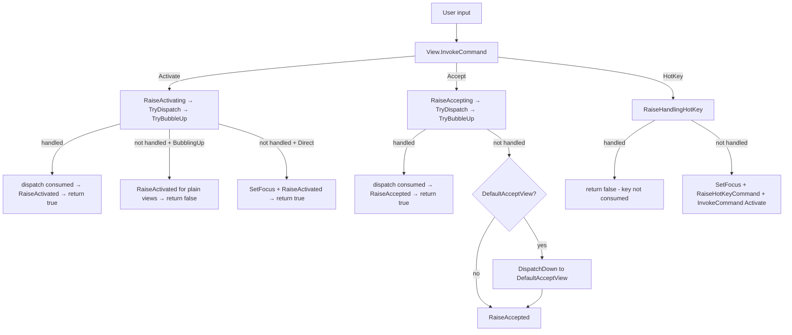

# Command Deep Dive

## See Also

* [Lexicon & Taxonomy](lexicon.md)
* [Cancellable Work Pattern](cancellable-work-pattern.md)
* [Events](events.md)

## Overview

The <xref:Terminal.Gui.Input.Command> system provides a standardized framework for view actions (selecting, accepting, activating). It integrates with keyboard/mouse input handling and uses the *Cancellable Work Pattern* for extensibility and cancellation.

Central concepts:

- **<xref:Terminal.Gui.Input.Command.Activate>** — Change view state or prepare for interaction (toggle checkbox, focus menu item)
- **<xref:Terminal.Gui.Input.Command.Accept>** — Confirm an action or state (submit dialog, execute menu command)
- **<xref:Terminal.Gui.Input.Command.HotKey>** — Set focus and activate (Alt+F, Shortcut.Key)

| Aspect | <xref:Terminal.Gui.Input.Command.Activate> | <xref:Terminal.Gui.Input.Command.Accept> | <xref:Terminal.Gui.Input.Command.HotKey> |
|--------|-------------------|------------------|-------------------|
| **Triggers** | Space, mouse click, arrow keys | Enter, double-click | HotKey letter, `Shortcut.Key` |
| **Pre-event** | <xref:Terminal.Gui.ViewBase.View.OnActivating*> / <xref:Terminal.Gui.ViewBase.View.Activating> | <xref:Terminal.Gui.ViewBase.View.OnAccepting*> / <xref:Terminal.Gui.ViewBase.View.Accepting> | <xref:Terminal.Gui.ViewBase.View.OnHandlingHotKey*> / <xref:Terminal.Gui.ViewBase.View.HandlingHotKey> |
| **Post-event** | <xref:Terminal.Gui.ViewBase.View.OnActivated*> / <xref:Terminal.Gui.ViewBase.View.Activated> | <xref:Terminal.Gui.ViewBase.View.OnAccepted*> / <xref:Terminal.Gui.ViewBase.View.Accepted> | <xref:Terminal.Gui.ViewBase.View.OnHotKeyCommand*> / <xref:Terminal.Gui.ViewBase.View.HotKeyCommand> |
| **Bubbling** | Opt-in via <xref:Terminal.Gui.ViewBase.View.CommandsToBubbleUp> | Opt-in via <xref:Terminal.Gui.ViewBase.View.CommandsToBubbleUp> + <xref:Terminal.Gui.ViewBase.View.DefaultAcceptView> | Opt-in via <xref:Terminal.Gui.ViewBase.View.CommandsToBubbleUp> |



## Command Routing

Commands propagate through the view hierarchy via <xref:Terminal.Gui.Input.CommandRouting>, which describes the current routing phase:

```csharp
public enum CommandRouting
{
    Direct,          // Programmatic or from this view's own bindings
    BubblingUp,      // Propagating upward through SuperView chain
    DispatchingDown, // SuperView dispatching downward to a SubView
    Bridged,         // Crossing a non-containment boundary via CommandBridge
}
```

<xref:Terminal.Gui.Input.ICommandContext> carries the routing mode, source view (weak reference), and binding:

```csharp
public interface ICommandContext
{
    Command Command { get; }
    WeakReference<View>? Source { get; }
    ICommandBinding? Binding { get; }
    CommandRouting Routing { get; }
}
```

<xref:Terminal.Gui.Input.CommandContext> is an immutable record struct. Use `WithCommand()` or `WithRouting()` to create modified copies.

## Default Handlers

<xref:Terminal.Gui.ViewBase.View> registers four default command handlers in `SetupCommands()`:

### `DefaultActivateHandler` (<xref:Terminal.Gui.Input.Command.Activate>)

Bound to `Key.Space` and `MouseFlags.LeftButtonReleased`.

1. Resets `_lastDispatchOccurred` to prevent stale state from prior invocations
2. Calls <xref:Terminal.Gui.ViewBase.View.RaiseActivating*> (<xref:Terminal.Gui.ViewBase.View.OnActivating*> → <xref:Terminal.Gui.ViewBase.View.Activating> event → `TryDispatchToTarget` → <xref:Terminal.Gui.ViewBase.View.TryBubbleUp*>)
3. If <xref:Terminal.Gui.ViewBase.View.RaiseActivating*> returns `true` (handled/consumed):
   - If dispatch occurred (`_lastDispatchOccurred`), calls <xref:Terminal.Gui.ViewBase.View.RaiseActivated*> for composite view completion
   - Returns `true`
4. If routing is `BubblingUp`:
   - Plain views (no dispatch target): fires <xref:Terminal.Gui.ViewBase.View.RaiseActivated*> to complete two-phase notification
   - Relay-dispatch views (e.g., <xref:Terminal.Gui.Views.Shortcut>): skips — deferred completion fires <xref:Terminal.Gui.ViewBase.View.RaiseActivated*> later
   - Consume-dispatch views: already completed in step 3
   - Returns `false` (notification, not consumption)
5. Otherwise (Direct invocation): calls `SetFocus()`, <xref:Terminal.Gui.ViewBase.View.RaiseActivated*>, returns `true`

### `DefaultAcceptHandler` (<xref:Terminal.Gui.Input.Command.Accept>)

Bound to `Key.Enter`.

1. Resets `_lastDispatchOccurred`
2. Calls <xref:Terminal.Gui.ViewBase.View.RaiseAccepting*> (<xref:Terminal.Gui.ViewBase.View.OnAccepting*> → <xref:Terminal.Gui.ViewBase.View.Accepting> event → `TryDispatchToTarget` → <xref:Terminal.Gui.ViewBase.View.TryBubbleUp*>)
3. If handled and (dispatch occurred OR routing is `Bridged`), calls <xref:Terminal.Gui.ViewBase.View.RaiseAccepted*>
4. If not handled, redirects to <xref:Terminal.Gui.ViewBase.View.DefaultAcceptView> via `DispatchDown` (unless Accept will also bubble to an ancestor — prevents double-path)
5. For `BubblingUp` with a dispatch target, calls <xref:Terminal.Gui.ViewBase.View.RaiseAccepted*>
6. Calls <xref:Terminal.Gui.ViewBase.View.RaiseAccepted*>
7. Returns `true` if: redirected, will bubble to ancestor, routing is `BubblingUp`, or view is <xref:Terminal.Gui.IAcceptTarget>

### `DefaultHotKeyHandler` (<xref:Terminal.Gui.Input.Command.HotKey>)

Bound to <xref:Terminal.Gui.ViewBase.View.HotKey>.

1. Calls <xref:Terminal.Gui.ViewBase.View.RaiseHandlingHotKey*>
2. If handled, returns `false` (allows key through as text input — e.g., <xref:Terminal.Gui.Views.TextField> with HotKey `_E`)
3. Calls `SetFocus()`, <xref:Terminal.Gui.ViewBase.View.RaiseHotKeyCommand*>, then `InvokeCommand(Command.Activate, ctx?.Binding)`
4. Returns `true`

### `DefaultCommandNotBoundHandler` (<xref:Terminal.Gui.Input.Command.NotBound>)

Invoked when an unregistered command is triggered. Raises <xref:Terminal.Gui.ViewBase.View.CommandNotBound> event.

## Dispatch (Composite Pattern)

Composite views (<xref:Terminal.Gui.Views.Shortcut>, Selectors, <xref:Terminal.Gui.Views.MenuBar>) delegate commands to a primary SubView. The framework provides this via three virtual members:

### <xref:Terminal.Gui.ViewBase.View.GetDispatchTarget*>

```csharp
protected virtual View? GetDispatchTarget (ICommandContext? ctx) => null;
```

Override to return the SubView that should receive dispatched commands. Returns `null` to skip dispatch.

| View | Target |
|------|--------|
| **<xref:Terminal.Gui.Views.Shortcut>** | `CommandView` |
| **<xref:Terminal.Gui.Views.OptionSelector>** / **<xref:Terminal.Gui.Views.FlagSelector>** | `Focused` (inner CheckBox) |
| **<xref:Terminal.Gui.Views.MenuBar>** | `Focused` |

### <xref:Terminal.Gui.ViewBase.View.ConsumeDispatch>

```csharp
protected virtual bool ConsumeDispatch => false;
```

Controls whether dispatch consumes the command:

- **`false` (relay)** — <xref:Terminal.Gui.Views.Shortcut>: dispatches to CommandView via `DispatchDown`, but the originator continues its own activation. <xref:Terminal.Gui.Views.Shortcut> uses deferred completion (fires <xref:Terminal.Gui.ViewBase.View.RaiseActivated*> after CommandView.Activated).
- **`true` (consume)** — Selectors, <xref:Terminal.Gui.Views.MenuBar>: marks the command as handled after dispatch. The composite view fires <xref:Terminal.Gui.ViewBase.View.RaiseActivated*>/<xref:Terminal.Gui.ViewBase.View.RaiseAccepted*> itself. Inner SubView activations are implementation details that don't propagate.

### `TryDispatchToTarget`

Called by <xref:Terminal.Gui.ViewBase.View.RaiseActivating*> and <xref:Terminal.Gui.ViewBase.View.RaiseAccepting*> after the <xref:Terminal.Gui.ViewBase.View.OnActivating*>/<xref:Terminal.Gui.ViewBase.View.Activating> (or <xref:Terminal.Gui.ViewBase.View.OnAccepting*>/<xref:Terminal.Gui.ViewBase.View.Accepting>) have had a chance to cancel. Guards:

- **Routing is `DispatchingDown`** → skip (prevents re-entry when command is already dispatching down)
- **Routing is `Bridged`** → skip (bridge brings commands *up* from a non-containment boundary; dispatching down into the owner's CommandView would be incorrect)
- **Relay + no binding** → skip (programmatic invocation — no user interaction to forward)
- **Source is within target** → skip (prevents loops)

For consume dispatch: on `BubblingUp`, consumes without dispatching (the composite handles state). On direct invocation, forwards via <xref:Terminal.Gui.ViewBase.View.DispatchDown*>.

For relay dispatch: dispatches via <xref:Terminal.Gui.ViewBase.View.DispatchDown*> if source is not within the target.

## Command Bubbling

### <xref:Terminal.Gui.ViewBase.View.CommandsToBubbleUp>

Opt-in property specifying which commands bubble from SubViews to this view:

```csharp
public IReadOnlyList<Command> CommandsToBubbleUp { get; set; } = [];
```

| View | `CommandsToBubbleUp` |
|------|---------------------|
| **<xref:Terminal.Gui.Views.Shortcut>** | `[Command.Activate, Command.Accept]` |
| **<xref:Terminal.Gui.Views.Bar>** / **<xref:Terminal.Gui.Views.Menu>** | `[Command.Accept, Command.Activate]` |
| **<xref:Terminal.Gui.Views.Dialog>** | `[Command.Accept]` |
| **<xref:Terminal.Gui.Views.SelectorBase>** | `[Command.Activate, Command.Accept]` |

### <xref:Terminal.Gui.ViewBase.View.TryBubbleUp*>

Called by <xref:Terminal.Gui.ViewBase.View.RaiseActivating*>, <xref:Terminal.Gui.ViewBase.View.RaiseAccepting*>, and <xref:Terminal.Gui.ViewBase.View.RaiseHandlingHotKey*> when the command is not handled. Steps:

1. If already handled → return `true`
2. If routing is `DispatchingDown` → return `false` (prevents re-entry)
3. For <xref:Terminal.Gui.Input.Command.Accept>: handles <xref:Terminal.Gui.ViewBase.View.DefaultAcceptView> + <xref:Terminal.Gui.IAcceptTarget> redirect logic
4. If command is in `SuperView.CommandsToBubbleUp` → invoke on SuperView with `Routing = BubblingUp`
5. Handles `Padding` edge cases (checks Padding's parent)

Bubbling is a **notification**, not consumption. The SuperView's return value is propagated, but relay views continue their own processing regardless.

### <xref:Terminal.Gui.ViewBase.View.DispatchDown*>

Dispatches a command downward to a SubView with bubbling suppressed:

```csharp
protected bool? DispatchDown (View target, ICommandContext? ctx)
```

Creates a <xref:Terminal.Gui.Input.CommandContext> with `Routing = CommandRouting.DispatchingDown` and invokes on the target. <xref:Terminal.Gui.ViewBase.View.TryBubbleUp*> checks for `DispatchingDown` and skips bubbling, preventing infinite recursion.

### <xref:Terminal.Gui.ViewBase.View.DefaultAcceptView> and <xref:Terminal.Gui.IAcceptTarget>

<xref:Terminal.Gui.ViewBase.View.DefaultAcceptView> identifies the SubView that receives <xref:Terminal.Gui.Input.Command.Accept> when no other handles it. Defaults to the first `IAcceptTarget { IsDefault: true }` SubView (typically a <xref:Terminal.Gui.Views.Button>).

<xref:Terminal.Gui.IAcceptTarget> affects flow in three ways:
1. **Resolution**: <xref:Terminal.Gui.ViewBase.View.DefaultAcceptView> searches for `IAcceptTarget { IsDefault: true }`
2. **Return value**: `DefaultAcceptHandler` returns `true` for <xref:Terminal.Gui.IAcceptTarget> views
3. **Redirect**: Non-default <xref:Terminal.Gui.IAcceptTarget> sources bubble up when a <xref:Terminal.Gui.ViewBase.View.DefaultAcceptView> exists

## <xref:Terminal.Gui.Input.CommandBridge>

<xref:Terminal.Gui.Input.CommandBridge> routes commands across non-containment boundaries (e.g., MenuItem.SubMenu ↔ parentMenuItem, MenuBarItem ↔ PopoverMenu). The bridge subscribes to the remote view's <xref:Terminal.Gui.ViewBase.View.Accepted>/<xref:Terminal.Gui.ViewBase.View.Activated> events and re-enters the full command pipeline on the owner via <xref:Terminal.Gui.ViewBase.View.InvokeCommand*>:

```csharp
CommandBridge bridge = CommandBridge.Connect (owner, remote, Command.Accept, Command.Activate);
// remote.Accepted → owner.InvokeCommand (Accept, Routing = Bridged)
// remote.Activated → owner.InvokeCommand (Activate, Routing = Bridged)
bridge.Dispose (); // tears down subscriptions
```

Because the bridge calls <xref:Terminal.Gui.ViewBase.View.InvokeCommand*> (not <xref:Terminal.Gui.ViewBase.View.RaiseAccepted*>/<xref:Terminal.Gui.ViewBase.View.RaiseActivated*>), bridged commands flow through the full pipeline: <xref:Terminal.Gui.ViewBase.View.RaiseActivating*>/<xref:Terminal.Gui.ViewBase.View.RaiseAccepting*> → `TryDispatchToTarget` → <xref:Terminal.Gui.ViewBase.View.TryBubbleUp*> → <xref:Terminal.Gui.ViewBase.View.RaiseActivated*>/<xref:Terminal.Gui.ViewBase.View.RaiseAccepted*>. This enables bridged commands to propagate through the owner's SuperView hierarchy.

`TryDispatchToTarget` has a `Bridged` routing guard to prevent the bridged command from dispatching down into the owner's CommandView — the bridge brings commands *up*, not *down*.

Both references are weak — the bridge does not prevent GC. The bridge is one-way; create two bridges for bidirectional routing.

## Shortcut Dispatch

<xref:Terminal.Gui.Views.Shortcut> is a composite view with three SubViews: `CommandView`, `HelpView`, `KeyView`. It overrides:

- <xref:Terminal.Gui.ViewBase.View.GetDispatchTarget*> → returns `CommandView`
- <xref:Terminal.Gui.ViewBase.View.ConsumeDispatch> → `false` (relay pattern)

The framework handles dispatch automatically via `TryDispatchToTarget`:
- Commands from `CommandView` → source is within target → dispatch skipped (CommandView already processed)
- Commands from Shortcut/HelpView/KeyView → <xref:Terminal.Gui.ViewBase.View.DispatchDown*> to CommandView
- Programmatic invocation (no binding) → relay guard skips dispatch

**Deferred completion**: <xref:Terminal.Gui.Views.Shortcut> subscribes to `CommandView.Activated`. When CommandView completes (e.g., <xref:Terminal.Gui.Views.CheckBox> toggles), <xref:Terminal.Gui.Views.Shortcut>'s callback fires <xref:Terminal.Gui.ViewBase.View.RaiseActivated*>. This ensures `Action` sees the updated CommandView state.

<xref:Terminal.Gui.ViewBase.View.OnActivated*> invokes `Action`, then dispatches to `TargetView` (or falls back to application-bound key commands):

```csharp
protected override void OnActivated (ICommandContext? ctx)
{
    base.OnActivated (ctx);
    Action?.Invoke ();

    ICommandContext? targetCtx = ctx;

    if (Command != Command.NotBound && ctx is CommandContext cc)
    {
        targetCtx = cc.WithCommand (Command);
    }

    InvokeOnTargetOrApp (targetCtx);
}
```

## Selector Dispatch

<xref:Terminal.Gui.Views.OptionSelector> and <xref:Terminal.Gui.Views.FlagSelector> override:

- <xref:Terminal.Gui.ViewBase.View.GetDispatchTarget*> → returns `Focused` (the active inner CheckBox)
- <xref:Terminal.Gui.ViewBase.View.ConsumeDispatch> → `true` (consume pattern)

When an inner <xref:Terminal.Gui.Views.CheckBox> activates (via click/space), the command bubbles up to the selector. `TryDispatchToTarget` consumes it (`BubblingUp` + `ConsumeDispatch=true`). The selector fires <xref:Terminal.Gui.ViewBase.View.RaiseActivated*> to perform state mutation. The inner <xref:Terminal.Gui.Views.CheckBox> activation does **not** propagate to the selector's SuperView.

## View Command Behaviors

| View | Space | Enter | HotKey | Pressed | Released | Clicked | DoubleClicked |
|------|-------|-------|--------|---------|----------|---------|---------------|
| **<xref:Terminal.Gui.ViewBase.View>** (base) | <xref:Terminal.Gui.Input.Command.Activate> | <xref:Terminal.Gui.Input.Command.Accept> | <xref:Terminal.Gui.Input.Command.HotKey> | Not bound | <xref:Terminal.Gui.Input.Command.Activate> | Not bound | Not bound |
| **<xref:Terminal.Gui.Views.Button>** | <xref:Terminal.Gui.Input.Command.Accept> | <xref:Terminal.Gui.Input.Command.Accept> | <xref:Terminal.Gui.Input.Command.HotKey> → <xref:Terminal.Gui.Input.Command.Accept> | Configurable via `MouseHoldRepeat` | Configurable via `MouseHoldRepeat` | <xref:Terminal.Gui.Input.Command.Accept> | <xref:Terminal.Gui.Input.Command.Accept> |
| **<xref:Terminal.Gui.Views.CheckBox>** | <xref:Terminal.Gui.Input.Command.Activate> (advances state) | <xref:Terminal.Gui.Input.Command.Accept> | <xref:Terminal.Gui.Input.Command.HotKey> | Not bound | Not bound (removed) | <xref:Terminal.Gui.Input.Command.Activate> | <xref:Terminal.Gui.Input.Command.Accept> |
| **<xref:Terminal.Gui.Views.ListView>** | <xref:Terminal.Gui.Input.Command.Activate> (marks item) | <xref:Terminal.Gui.Input.Command.Accept> | <xref:Terminal.Gui.Input.Command.HotKey> | Not bound | Not bound | <xref:Terminal.Gui.Input.Command.Activate> | <xref:Terminal.Gui.Input.Command.Accept> |
| **<xref:Terminal.Gui.Views.TableView>** | Not bound | <xref:Terminal.Gui.Input.Command.Accept> (CellActivationKey) | <xref:Terminal.Gui.Input.Command.HotKey> | Not bound | Not bound | <xref:Terminal.Gui.Input.Command.Activate> | Not bound |
| **<xref:Terminal.Gui.Views.TreeView>** | Not bound | <xref:Terminal.Gui.Input.Command.Activate> (ObjectActivationKey) | <xref:Terminal.Gui.Input.Command.HotKey> | Not bound | Not bound | OnMouseEvent (node selection) | OnMouseEvent (ObjectActivationButton) |
| **<xref:Terminal.Gui.Views.TextField>** | Removed (text input) | <xref:Terminal.Gui.Input.Command.Accept> | <xref:Terminal.Gui.Input.Command.HotKey> (cancels if focused) | OnMouseEvent (set cursor) | OnMouseEvent (end drag) | Not bound | OnMouseEvent (select word) |
| **<xref:Terminal.Gui.Views.TextView>** | Removed (text input) | <xref:Terminal.Gui.Input.Command.NewLine> or <xref:Terminal.Gui.Input.Command.Accept> | <xref:Terminal.Gui.Input.Command.HotKey> | Not bound | Not bound | Not bound | Not bound |
| **<xref:Terminal.Gui.Views.OptionSelector>** | Forwards to CheckBox SubView | <xref:Terminal.Gui.Input.Command.Accept> | Restores focus, advances Active | Handled by SubViews | Handled by SubViews | Handled by SubViews | Handled by SubViews |
| **<xref:Terminal.Gui.Views.FlagSelector>** | Removed (forwards to SubView) | Removed (forwards to SubView) | Restores focus (no-op if focused) | Not bound (cleared) | Not bound (cleared) | Not bound (cleared) | Not bound (cleared) |
| **<xref:Terminal.Gui.Views.HexView>** | Removed | Removed | Not bound | Not bound | Not bound | <xref:Terminal.Gui.Input.Command.Activate> | <xref:Terminal.Gui.Input.Command.Activate> |
| **<xref:Terminal.Gui.Views.ColorPicker>** | Not bound | Not bound | Not bound | Not bound | Not bound | Not bound (removed) | <xref:Terminal.Gui.Input.Command.Accept> |
| **<xref:Terminal.Gui.Views.Label>** | Not bound | Not bound | Forwards to next focusable peer | Not bound | Not bound | Not bound | Not bound |
| **<xref:Terminal.Gui.Views.TabView>** | Not bound | Not bound | <xref:Terminal.Gui.Input.Command.HotKey> | Handled by SubViews | Handled by SubViews | Handled by SubViews | Not bound |
| **<xref:Terminal.Gui.Views.NumericUpDown>** | Handled by SubViews | Handled by SubViews | <xref:Terminal.Gui.Input.Command.HotKey> | Handled by SubViews | Handled by SubViews | Handled by SubViews | Handled by SubViews |
| **<xref:Terminal.Gui.Views.Dialog>** | Handled by SubViews | Handled by SubViews | Handled by SubViews | Handled by SubViews | Handled by SubViews | Handled by SubViews | Handled by SubViews |
| **<xref:Terminal.Gui.Views.Wizard>** | Handled by SubViews | Handled by SubViews | Handled by SubViews | Handled by SubViews | Handled by SubViews | Handled by SubViews | Handled by SubViews |
| **<xref:Terminal.Gui.Views.FileDialog>** | Handled by SubViews | Handled by SubViews | Handled by SubViews | Handled by SubViews | Handled by SubViews | Handled by SubViews | Handled by SubViews |
| **<xref:Terminal.Gui.Views.DatePicker>** | Handled by SubViews | Handled by SubViews | Handled by SubViews | Handled by SubViews | Handled by SubViews | Handled by SubViews | Handled by SubViews |
| **<xref:Terminal.Gui.Views.ComboBox>** | Handled by SubViews | Handled by SubViews | <xref:Terminal.Gui.Input.Command.HotKey> | OnMouseEvent (toggle) | Handled by SubViews | Handled by SubViews | Handled by SubViews |
| **<xref:Terminal.Gui.Views.Shortcut>** | <xref:Terminal.Gui.Input.Command.Activate> (dispatch to CommandView) | <xref:Terminal.Gui.Input.Command.Accept> (dispatch to CommandView) | <xref:Terminal.Gui.Input.Command.HotKey> → <xref:Terminal.Gui.Input.Command.Activate> | Not bound | <xref:Terminal.Gui.Input.Command.Activate> | Not bound | Not bound |
| **<xref:Terminal.Gui.Views.MenuItem>** | Inherited from Shortcut | Inherited from Shortcut | <xref:Terminal.Gui.Input.Command.HotKey> → <xref:Terminal.Gui.Input.Command.Activate> | Not bound | <xref:Terminal.Gui.Input.Command.Activate> | Not bound | Not bound |
| **<xref:Terminal.Gui.Views.Menu>** / **<xref:Terminal.Gui.Views.Bar>** | <xref:Terminal.Gui.Input.Command.Activate> (dispatches to focused MenuItem) | Handled by MenuItems/Shortcuts | Handled by MenuItems/Shortcuts | Handled by MenuItems/Shortcuts | Handled by MenuItems/Shortcuts | Handled by MenuItems/Shortcuts | Handled by MenuItems/Shortcuts |
| **<xref:Terminal.Gui.Views.MenuBar>** | Handled by SubViews (ConsumeDispatch) | Handled by SubViews (ConsumeDispatch) | Handled by SubViews | Handled by SubViews | Handled by SubViews | Handled by SubViews | Handled by SubViews |
| **<xref:Terminal.Gui.Views.ScrollBar>** | Not bound | Not bound | Not bound | OnMouseEvent | OnMouseEvent | OnMouseEvent | Not bound |
| **<xref:Terminal.Gui.Views.ProgressBar>** / **<xref:Terminal.Gui.Views.SpinnerView>** | N/A | N/A | N/A | N/A | N/A | N/A | N/A |

### Table Notation

- **`Command.X`** — Bound via KeyBinding or MouseBinding
- **OnMouseEvent (desc)** — Handled via `OnMouseEvent` override
- **Handled by SubViews** — Composite view delegates to SubViews
- **Not bound** — Not handled by this view
- **N/A** — Display-only view (`CanFocus = false`)

### Key Points

1. **<xref:Terminal.Gui.ViewBase.View> base**: Space → <xref:Terminal.Gui.Input.Command.Activate>, Enter → <xref:Terminal.Gui.Input.Command.Accept>, `LeftButtonReleased` → <xref:Terminal.Gui.Input.Command.Activate>. Subclasses override or extend.

2. **<xref:Terminal.Gui.Views.Button>**: Implements <xref:Terminal.Gui.IAcceptTarget>. All interactions map to <xref:Terminal.Gui.Input.Command.Accept>.

3. **Selector views**: Use `ConsumeDispatch=true`. Inner <xref:Terminal.Gui.Views.CheckBox> commands are consumed; don't propagate to SuperView.

4. **Text input views**: Remove `Key.Space` binding for text entry. <xref:Terminal.Gui.Views.TextField> cancels HotKey when focused (allows typing the HotKey character).

5. **Mouse columns**: Pressed → `LeftButtonPressed`, Released → `LeftButtonReleased`, Clicked → synthesized press+release, DoubleClicked → timing-based. See [Mouse Deep Dive](mouse.md).

6. **<xref:Terminal.Gui.Views.Shortcut>/<xref:Terminal.Gui.Views.MenuItem>**: Use relay dispatch (`ConsumeDispatch=false`). Commands propagate through <xref:Terminal.Gui.ViewBase.View.GetDispatchTarget*> → `CommandView`. <xref:Terminal.Gui.Views.MenuItem> inherits from <xref:Terminal.Gui.Views.Shortcut>.

7. **<xref:Terminal.Gui.Views.MenuBar>**: Uses consume dispatch (`ConsumeDispatch=true`, <xref:Terminal.Gui.ViewBase.View.GetDispatchTarget*> → `Focused`). Being redesigned — see source for current behavior.

## Command Route Tracing

For debugging command routing issues, Terminal.Gui provides a tracing system via `Tracing.Trace`. Command tracing captures detailed information about command flow through the view hierarchy.

> [!TIP]
> `Trace` also supports Mouse and Keyboard tracing. See [Logging - View Event Tracing](logging.md#view-event-tracing) for the full tracing API.

### Enabling Tracing

```csharp
using Terminal.Gui.Tracing;

// Enable command tracing (thread-safe, per async context)
Trace.CommandEnabled = true;

// Or use flags-based API
Trace.EnabledCategories = TraceCategory.Command | TraceCategory.Mouse;

// For testing, use scoped tracing
using (Trace.PushScope (TraceCategory.Command))
{
    view.InvokeCommand (Command.Activate);
    // Tracing enabled only in this scope
}
```

Tracing is **thread-safe** and isolated per async execution context, making it safe to use in parallel tests.

When enabled, output automatically goes to `Logging.Trace` via the `LoggingBackend`.

Tracing can also be enabled via configuration:

```json
{
  "Trace.CommandEnabled": true
}
```

In **UICatalog**, use the **Logging** menu → **Command Trace** checkbox to toggle tracing at runtime.

### Trace Output

When enabled, trace entries are logged via `Logging.Trace` with the format:

```
[Phase] Arrow Command @ ViewId (Method) - Message
```

- **Phase**: `Entry`, `Exit`, `Routing`, `Event`, or `Handler`
- **Arrow**: `↑` (BubblingUp), `↓` (DispatchingDown), `↔` (Bridged), `•` (Direct)
- **Command**: The command being routed (e.g., `Activate`, `Accept`)
- **ViewId**: The view's identifying string
- **Method**: The method where the trace occurred

Example output:

```
[Entry] • Activate @ Button("OK"){X=10,Y=5} (DefaultActivateHandler)
[Entry] • Activate @ Button("OK"){X=10,Y=5} (RaiseActivating)
[Event] • Activate @ Button("OK"){X=10,Y=5} (RaiseActivating) - Invoking Activating event
[Routing] ↑ Activate @ Button("OK"){X=10,Y=5} (TryBubbleUp) - BubblingUp to Dialog("Confirm")
[Event] • Activate @ Button("OK"){X=10,Y=5} (RaiseActivated)
```

### Custom Backends

Implement `ITraceBackend` for custom trace handling:

```csharp
using Terminal.Gui.Tracing;

public class MyTraceBackend : ITraceBackend
{
    public void Log (TraceEntry entry)
    {
        // Custom handling - write to file, send to debugger, etc.
    }

    public void Clear () { }
}

Trace.Backend = new MyTraceBackend ();
```

### Testing with ListBackend

Use `ListBackend` to capture traces for test assertions. Use `Trace.PushScope` for thread-safe test isolation:

```csharp
using Terminal.Gui.Tracing;

ListBackend backend = new ();

// Scoped tracing - automatically restored on dispose
using (Trace.PushScope (TraceCategory.Command, backend))
{
    view.InvokeCommand (Command.Activate);

    Assert.Contains (backend.Entries, e => e.Phase == "Entry");
    Assert.Contains (backend.Entries, e => e.Category == TraceCategory.Command);
}
```

For xUnit tests, use `TestLogging.Verbose` with trace categories:

```csharp
[Fact]
public void MyTest ()
{
    using (TestLogging.Verbose (_output, TraceCategory.Command))
    {
        // Tracing enabled, output goes to xUnit test output
        checkbox.InvokeCommand (Command.Activate);
    }
}
```

### Performance

- All `Trace.Command` calls are marked with `[Conditional("DEBUG")]` — **zero overhead in Release builds**
- Tracing uses `AsyncLocal<T>` for thread safety — each async context has isolated trace settings
- Safe for parallel test execution — tests won't interfere with each other
- When tracing is disabled, all methods early-return with minimal overhead
