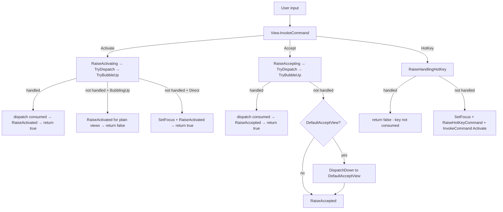

# Command Deep Dive

## Table of Contents

- [See Also](#see-also)
- [Getting Started](#getting-started)
  - [Declarative Command Binding](#declarative-command-binding)
  - [Responding to Button Clicks](#responding-to-button-clicks)
  - [Responding to State Changes](#responding-to-state-changes)
  - [Cancelling an Action](#cancelling-an-action)
  - [Listening to Events from SubViews](#listening-to-events-from-subviews)
  - [The Two-Phase Pattern](#the-two-phase-pattern)
- [Architecture Overview](#architecture-overview)
- [Command Routing](#command-routing)
- [Value Propagation](#value-propagation)
- [Default Handlers](#default-handlers)
- [Dispatch (Composite Pattern)](#dispatch-composite-pattern)
- [Command Bubbling](#command-bubbling)
- [CommandBridge](#commandbridge)
- [How To](#how-to)
  - [Subscribe to Activated Events](#subscribe-to-activated-events)
  - [Build a Composite View (Consume Dispatch)](#build-a-composite-view-consume-dispatch)
  - [Build a Relay View](#build-a-relay-view)
  - [Bridge Commands Across Non-Containment Boundaries](#bridge-commands-across-non-containment-boundaries)
- [Shortcut Dispatch](#shortcut-dispatch)
- [Selector Dispatch](#selector-dispatch)
- [View Command Behaviors](#view-command-behaviors)
- [Command Route Tracing](#command-route-tracing)

## See Also

* [Lexicon & Taxonomy](lexicon.md)
* [Cancellable Work Pattern](cancellable-work-pattern.md)
* [Events](events.md)

## Getting Started

Terminal.Gui uses the <xref:Terminal.Gui.Input.Command> enum as a **standardized vocabulary** for user actions. Views declare what they do using Commands rather than ad-hoc event names — this enables a consistent, localizable, and composable command system across the entire toolkit.

The enum defines over 50 commands spanning several categories:

| Category | Examples | Purpose |
|----------|----------|---------|
| **Lifecycle** | `Activate`, `Accept`, `HotKey` | Core view interaction (toggle, confirm, focus) |
| **Editing** | `Cut`, `Copy`, `Paste`, `Undo`, `Redo` | Clipboard and text editing |
| **Movement** | `Up`, `Down`, `PageUp`, `WordRight` | Cursor and selection navigation |
| **Selection** | `SelectAll`, `UpExtend`, `ToggleExtend` | Extending selection ranges |
| **Semantic** | `Save`, `Open`, `New`, `Context`, `Refresh` | Application-level actions |
| **Navigation** | `NextTabStop`, `PreviousTabGroup` | Focus movement between views |

The three **lifecycle commands** — `Activate`, `Accept`, and `HotKey` — drive the event system that most application code interacts with:

| Command | What It Means | Common Triggers |
|---------|---------------|-----------------|
| **Activate** | Change state or toggle (e.g., check a checkbox, select a list item) | Space, mouse click |
| **Accept** | Confirm or submit (e.g., press a button, submit a dialog) | Enter, double-click |
| **HotKey** | Focus and activate via keyboard shortcut | Alt+letter, Shortcut.Key |

### Declarative Command Binding

The real power of `Command` is **declarative binding**. <xref:Terminal.Gui.Views.Shortcut> and <xref:Terminal.Gui.Views.MenuItem> can be constructed with just a target view and a command — the framework automatically resolves the key binding, display text, and help text from localized resources:

```csharp
// Declarative: "this menu item invokes Cut on the editor"
MenuItem cutItem = new (editor, Command.Cut);
// Automatically:
//   Key      = Ctrl+X        (from editor's key bindings)
//   Title    = "Cu_t"        (from GlobalResources "cmdCut")
//   HelpText = "Cut to clipboard" (from GlobalResources "cmdCut_Help")

MenuItem saveItem = new (editor, Command.Save);
//   Key      = Ctrl+S
//   Title    = "_Save"
//   HelpText = "Save file"
```

This means views can advertise their capabilities via `AddCommand`, and menus/shortcuts can bind to them without hardcoding strings or key bindings. Localization comes for free — translating the resource strings is all that's needed.

Views register their command handlers declaratively too:

```csharp
// Inside a custom View's constructor
AddCommand (Command.Copy, () => Copy ());
AddCommand (Command.Cut, () => Cut ());
AddCommand (Command.Context, () => ShowContextMenu ());
```

### Responding to Button Clicks

The most common pattern is subscribing to a view's **Accepted** event to react when the user confirms an action:

```csharp
Button okButton = new () { Text = "OK" };
okButton.Accepted += (_, args) =>
{
    MessageBox.Query ("Result", "You clicked OK!", "Close");
};
```

### Responding to State Changes

Use the **Activated** event to react when a view's state changes (e.g., a checkbox is toggled):

```csharp
CheckBox darkMode = new () { Text = "Dark Mode" };
darkMode.Activated += (_, args) =>
{
    // args.Value?.Value contains the view's current value
    bool isChecked = args.Value?.Value is CheckState.Checked;
    ApplyTheme (isChecked);
};
```

### Cancelling an Action

Use the **Activating** or **Accepting** event to prevent an action before it happens. Set `args.Cancel = true` to cancel:

```csharp
TextField nameField = new ();
nameField.Accepting += (_, args) =>
{
    if (string.IsNullOrEmpty (nameField.Text))
    {
        args.Cancel = true;  // Prevent Accept — name is required
        MessageBox.ErrorQuery ("Error", "Name cannot be empty.", "OK");
    }
};
```

### Listening to Events from SubViews

By default, events don't propagate up the view hierarchy. To receive events from SubViews, set `CommandsToBubbleUp` on the ancestor:

```csharp
Window myWindow = new () { Title = "My App" };
myWindow.CommandsToBubbleUp = [Command.Activate, Command.Accept];

// Now myWindow.Activated fires when ANY SubView activates
myWindow.Activated += (_, args) =>
{
    // Identify which SubView fired via TryGetSource
    if (args.Value?.TryGetSource (out View? source) is true)
    {
        // source is the originating view
    }

    // Or find a specific value type in the chain
    if (args.Value?.Value is CheckState state)
    {
        // A CheckBox (or a view containing one) was toggled
    }
};
```

### The Two-Phase Pattern

Every command follows a two-phase pattern:

1. **Pre-event** (`Activating` / `Accepting`) — Fires *before* the action. Handlers can cancel by setting `args.Cancel = true`.
2. **Post-event** (`Activated` / `Accepted`) — Fires *after* the action completes. The view's state has already changed.

```
User presses Space on CheckBox
  → Activating fires (cancellable)
  → CheckBox toggles its state
  → Activated fires (state already changed, ctx.Value available)
```

> The rest of this document covers the internal architecture. For common recipes, skip to [How To](#how-to).

## Architecture Overview

The <xref:Terminal.Gui.Input.Command> system provides a standardized framework for view actions (selecting, accepting, activating). It integrates with keyboard/mouse input handling and uses the *Cancellable Work Pattern* for extensibility and cancellation. As commands propagate through the view hierarchy, each <xref:Terminal.Gui.IValue>-implementing view appends its value to the <xref:Terminal.Gui.Input.ICommandContext.Values> chain, enabling ancestors to inspect the full value history (see [Value Propagation](#value-propagation)).

Central concepts:

- **<xref:Terminal.Gui.Input.Command.Activate>** — Change view state or prepare for interaction (toggle checkbox, focus menu item)
- **<xref:Terminal.Gui.Input.Command.Accept>** — Confirm an action or state (submit dialog, execute menu command)
- **<xref:Terminal.Gui.Input.Command.HotKey>** — Set focus and activate (Alt+F, Shortcut.Key)

| Aspect | <xref:Terminal.Gui.Input.Command.Activate> | <xref:Terminal.Gui.Input.Command.Accept> | <xref:Terminal.Gui.Input.Command.HotKey> |
|--------|-------------------|------------------|-------------------|
| **Triggers** | Space, mouse click, arrow keys | Enter, double-click | HotKey letter, `Shortcut.Key` |
| **Pre-event** | <xref:Terminal.Gui.ViewBase.View.OnActivating*> / <xref:Terminal.Gui.ViewBase.View.Activating> | <xref:Terminal.Gui.ViewBase.View.OnAccepting*> / <xref:Terminal.Gui.ViewBase.View.Accepting> | <xref:Terminal.Gui.ViewBase.View.OnHandlingHotKey*> / <xref:Terminal.Gui.ViewBase.View.HandlingHotKey> |
| **Post-event** | <xref:Terminal.Gui.ViewBase.View.OnActivated*> / <xref:Terminal.Gui.ViewBase.View.Activated> | <xref:Terminal.Gui.ViewBase.View.OnAccepted*> / <xref:Terminal.Gui.ViewBase.View.Accepted> | <xref:Terminal.Gui.ViewBase.View.OnHotKeyCommand*> / <xref:Terminal.Gui.ViewBase.View.HotKeyCommand> |
| **Bubbling** | Opt-in via <xref:Terminal.Gui.ViewBase.View.CommandsToBubbleUp> | Opt-in via <xref:Terminal.Gui.ViewBase.View.CommandsToBubbleUp> + <xref:Terminal.Gui.ViewBase.View.DefaultAcceptView> | Opt-in via <xref:Terminal.Gui.ViewBase.View.CommandsToBubbleUp> |



## Command Routing

Commands propagate through the view hierarchy via <xref:Terminal.Gui.Input.CommandRouting>, which describes the current routing phase:

```csharp
public enum CommandRouting
{
    Direct,          // Programmatic or from this view's own bindings
    BubblingUp,      // Propagating upward through SuperView chain
    DispatchingDown, // SuperView dispatching downward to a SubView
    Bridged,         // Crossing a non-containment boundary via CommandBridge
}
```

<xref:Terminal.Gui.Input.ICommandContext> carries the routing mode, source view (weak reference), binding, and accumulated values:

```csharp
public interface ICommandContext
{
    Command Command { get; }
    WeakReference<View>? Source { get; }
    ICommandBinding? Binding { get; }
    CommandRouting Routing { get; }
    IReadOnlyList<object?> Values { get; }
    object? Value { get; }
}
```

- **`Values`** — Append-only chain of values accumulated as the command propagates. Each <xref:Terminal.Gui.ViewBase.IValue>-implementing view appends its value via `WithValue()`. Ordered innermost (originator) to outermost.
- **`Value`** — Convenience accessor returning `Values[^1]` (the most recently appended value), or `null` if empty.

<xref:Terminal.Gui.Input.CommandContext> is an immutable record struct. Use `WithCommand()`, `WithRouting()`, or `WithValue()` to create modified copies.

## Value Propagation

As a command flows through the view hierarchy, <xref:Terminal.Gui.Input.ICommandContext.Values> accumulates a chain of values from each <xref:Terminal.Gui.IValue>-implementing view that participates. This enables ancestors to inspect values from any layer — not just the outermost composite.

### How Values Accumulate

1. **Origin** — The originating view (e.g., <xref:Terminal.Gui.Views.CheckBox>) processes the command. If the originating view implements <xref:Terminal.Gui.IValue>, its value is captured at the start of command invocation and placed in the initial `Values` chain.
2. **Dispatch target refresh** — When a composite view dispatches to an inner target, `RefreshValue()` re-reads the target's `IValue.GetValue()` and appends it via `WithValue()`.
3. **Composite post-mutation** — After `RaiseActivated`, a `ConsumeDispatch` composite (e.g., <xref:Terminal.Gui.Views.OptionSelector>) may have updated its own value. The framework appends the composite's post-mutation value so `ctx.Value` reflects the composite's semantic value.
4. **Ancestor notification** — `BubbleActivatedUp` walks the SuperView chain, preserving `Values` at each hop. If an ancestor has a dispatch target that is the command source, its refreshed value is also appended.

### Value vs Values

| Accessor | Returns | Use When |
|----------|---------|----------|
| `Value` | `Values[^1]` (last appended) | You only need the outermost composite's value |
| `Values` | Full ordered chain | You need to find a specific inner value by type or position |

### Example Chain

Consider a <xref:Terminal.Gui.Views.CheckBox> inside an <xref:Terminal.Gui.Views.OptionSelector> inside a <xref:Terminal.Gui.Views.MenuItem>:

```
CheckBox (CheckState.Checked)
  → OptionSelector (int? selectedIndex)
    → MenuItem (Title string)
```

When the `Activated` event reaches an ancestor:

- `ctx.Values[0]` = `CheckState.Checked` (dispatch target refresh)
- `ctx.Values[1]` = `2` (OptionSelector's post-mutation index)
- `ctx.Values[2]` = `"Dark"` (MenuItem's value via bridge)
- `ctx.Value` = `"Dark"` (last appended = outermost)

Use LINQ to find a specific type anywhere in the chain:

```csharp
if (ctx.Values?.FirstOrDefault (v => v is Schemes) is Schemes scheme)
{
    // Found the Schemes value regardless of its position
}
```

### Struct Value Semantics

<xref:Terminal.Gui.Input.CommandContext> is a `readonly record struct`. Each call to `WithValue()` creates a **new copy** — it does not mutate the original. This means:

- A caller's local variable is unaffected by `WithValue()` calls inside `RaiseActivated` or other methods that receive a copy.
- `BubbleActivatedUp` receives exactly the values the caller appended — no double-counting from inner `WithValue()` calls on separate copies.

### Performance

`WithValue()` uses `[..Values, value]`, which copies the entire list on each call — O(N²) total for N appends. This is acceptable for typical UI hierarchies (3–5 levels). If extreme depths are ever needed, consider an immutable linked list or builder.

## Default Handlers

<xref:Terminal.Gui.ViewBase.View> registers four default command handlers in `SetupCommands()`:

### `DefaultActivateHandler` (<xref:Terminal.Gui.Input.Command.Activate>)

Bound to `Key.Space` and `MouseFlags.LeftButtonReleased`.

1. Resets `_lastDispatchOccurred` to prevent stale state from prior invocations
2. Calls <xref:Terminal.Gui.ViewBase.View.RaiseActivating*> (<xref:Terminal.Gui.ViewBase.View.OnActivating*> → <xref:Terminal.Gui.ViewBase.View.Activating> event → `TryDispatchToTarget` → <xref:Terminal.Gui.ViewBase.View.TryBubbleUp*>)
3. If <xref:Terminal.Gui.ViewBase.View.RaiseActivating*> returns `true` (handled/consumed):
   - If dispatch occurred (`_lastDispatchOccurred`), calls <xref:Terminal.Gui.ViewBase.View.RaiseActivated*> for composite view completion
   - Returns `true`
4. If routing is `BubblingUp`:
   - Plain views (no dispatch target): fires <xref:Terminal.Gui.ViewBase.View.RaiseActivated*> to complete two-phase notification
   - Relay-dispatch views (e.g., <xref:Terminal.Gui.Views.Shortcut>): skips — deferred completion fires <xref:Terminal.Gui.ViewBase.View.RaiseActivated*> later
   - Consume-dispatch views: already completed in step 3
   - Returns `false` (notification, not consumption)
5. Otherwise (Direct invocation): calls `SetFocus()`, <xref:Terminal.Gui.ViewBase.View.RaiseActivated*>, returns `true`

### `DefaultAcceptHandler` (<xref:Terminal.Gui.Input.Command.Accept>)

Bound to `Key.Enter`.

1. Resets `_lastDispatchOccurred`
2. Calls <xref:Terminal.Gui.ViewBase.View.RaiseAccepting*> (<xref:Terminal.Gui.ViewBase.View.OnAccepting*> → <xref:Terminal.Gui.ViewBase.View.Accepting> event → `TryDispatchToTarget` → <xref:Terminal.Gui.ViewBase.View.TryBubbleUp*>)
3. If handled and (dispatch occurred OR routing is `Bridged`), calls <xref:Terminal.Gui.ViewBase.View.RaiseAccepted*>
4. If not handled, redirects to <xref:Terminal.Gui.ViewBase.View.DefaultAcceptView> via `DispatchDown` (unless Accept will also bubble to an ancestor — prevents double-path)
5. For `BubblingUp` with a dispatch target, calls <xref:Terminal.Gui.ViewBase.View.RaiseAccepted*>
6. Calls <xref:Terminal.Gui.ViewBase.View.RaiseAccepted*>
7. Returns `true` if: redirected, will bubble to ancestor, routing is `BubblingUp`, or view is <xref:Terminal.Gui.IAcceptTarget>

### `DefaultHotKeyHandler` (<xref:Terminal.Gui.Input.Command.HotKey>)

Bound to <xref:Terminal.Gui.ViewBase.View.HotKey>.

1. Calls <xref:Terminal.Gui.ViewBase.View.RaiseHandlingHotKey*>
2. If handled, returns `false` (allows key through as text input — e.g., <xref:Terminal.Gui.Views.TextField> with HotKey `_E`)
3. Calls `SetFocus()`, <xref:Terminal.Gui.ViewBase.View.RaiseHotKeyCommand*>, then `InvokeCommand(Command.Activate, ctx?.Binding)`
4. Returns `true`

### `DefaultCommandNotBoundHandler` (<xref:Terminal.Gui.Input.Command.NotBound>)

Invoked when an unregistered command is triggered. Raises <xref:Terminal.Gui.ViewBase.View.CommandNotBound> event.

## Dispatch (Composite Pattern)

Composite views (<xref:Terminal.Gui.Views.Shortcut>, Selectors, <xref:Terminal.Gui.Views.MenuBar>) delegate commands to a primary SubView. The framework provides this via three virtual members:

### <xref:Terminal.Gui.ViewBase.View.GetDispatchTarget*>

```csharp
protected virtual View? GetDispatchTarget (ICommandContext? ctx) => null;
```

Override to return the SubView that should receive dispatched commands. Returns `null` to skip dispatch.

| View | Target |
|------|--------|
| **<xref:Terminal.Gui.Views.Shortcut>** | `CommandView` |
| **<xref:Terminal.Gui.Views.OptionSelector>** / **<xref:Terminal.Gui.Views.FlagSelector>** | `Focused` (inner CheckBox) |
| **<xref:Terminal.Gui.Views.MenuBar>** | `Focused` |

### <xref:Terminal.Gui.ViewBase.View.ConsumeDispatch>

```csharp
protected virtual bool ConsumeDispatch => false;
```

Controls whether dispatch consumes the command:

- **`false` (relay)** — <xref:Terminal.Gui.Views.Shortcut>: dispatches to CommandView via `DispatchDown`, but the originator continues its own activation. <xref:Terminal.Gui.Views.Shortcut> uses deferred completion (fires <xref:Terminal.Gui.ViewBase.View.RaiseActivated*> after CommandView.Activated).
- **`true` (consume)** — Selectors, <xref:Terminal.Gui.Views.MenuBar>: marks the command as handled after dispatch. The composite view fires <xref:Terminal.Gui.ViewBase.View.RaiseActivated*>/<xref:Terminal.Gui.ViewBase.View.RaiseAccepted*> itself. Inner SubView activations are implementation details that don't propagate.

### `TryDispatchToTarget`

Called by <xref:Terminal.Gui.ViewBase.View.RaiseActivating*> and <xref:Terminal.Gui.ViewBase.View.RaiseAccepting*> after the <xref:Terminal.Gui.ViewBase.View.OnActivating*>/<xref:Terminal.Gui.ViewBase.View.Activating> (or <xref:Terminal.Gui.ViewBase.View.OnAccepting*>/<xref:Terminal.Gui.ViewBase.View.Accepting>) have had a chance to cancel. Guards:

- **Routing is `DispatchingDown`** → skip (prevents re-entry when command is already dispatching down)
- **Routing is `Bridged`** → skip (bridge brings commands *up* from a non-containment boundary; dispatching down into the owner's CommandView would be incorrect)
- **Relay + no binding** → skip (programmatic invocation — no user interaction to forward)
- **Source is within target** → skip (prevents loops)

For consume dispatch: on `BubblingUp`, consumes without dispatching (the composite handles state). On direct invocation, forwards via <xref:Terminal.Gui.ViewBase.View.DispatchDown*>.

For relay dispatch: dispatches via <xref:Terminal.Gui.ViewBase.View.DispatchDown*> if source is not within the target.

## Command Bubbling

### <xref:Terminal.Gui.ViewBase.View.CommandsToBubbleUp>

Opt-in property specifying which commands bubble from SubViews to this view:

```csharp
public IReadOnlyList<Command> CommandsToBubbleUp { get; set; } = [];
```

| View | `CommandsToBubbleUp` |
|------|---------------------|
| **<xref:Terminal.Gui.Views.Shortcut>** | `[Command.Activate, Command.Accept]` |
| **<xref:Terminal.Gui.Views.Bar>** / **<xref:Terminal.Gui.Views.Menu>** | `[Command.Accept, Command.Activate]` |
| **<xref:Terminal.Gui.Views.Dialog>** | `[Command.Accept]` |
| **<xref:Terminal.Gui.Views.SelectorBase>** | `[Command.Activate, Command.Accept]` |

### <xref:Terminal.Gui.ViewBase.View.TryBubbleUp*>

Called by <xref:Terminal.Gui.ViewBase.View.RaiseActivating*>, <xref:Terminal.Gui.ViewBase.View.RaiseAccepting*>, and <xref:Terminal.Gui.ViewBase.View.RaiseHandlingHotKey*> when the command is not handled. Steps:

1. If already handled → return `true`
2. If routing is `DispatchingDown` → return `false` (prevents re-entry)
3. For <xref:Terminal.Gui.Input.Command.Accept>: handles <xref:Terminal.Gui.ViewBase.View.DefaultAcceptView> + <xref:Terminal.Gui.IAcceptTarget> redirect logic
4. If command is in `SuperView.CommandsToBubbleUp` → invoke on SuperView with `Routing = BubblingUp`
5. Handles `Padding` edge cases (checks Padding's parent)

Bubbling is a **notification**, not consumption. The SuperView's return value is propagated, but relay views continue their own processing regardless.

### <xref:Terminal.Gui.ViewBase.View.DispatchDown*>

Dispatches a command downward to a SubView with bubbling suppressed:

```csharp
protected bool? DispatchDown (View target, ICommandContext? ctx)
```

Creates a <xref:Terminal.Gui.Input.CommandContext> with `Routing = CommandRouting.DispatchingDown` and invokes on the target. <xref:Terminal.Gui.ViewBase.View.TryBubbleUp*> checks for `DispatchingDown` and skips bubbling, preventing infinite recursion.

### <xref:Terminal.Gui.ViewBase.View.DefaultAcceptView> and <xref:Terminal.Gui.IAcceptTarget>

<xref:Terminal.Gui.ViewBase.View.DefaultAcceptView> identifies the SubView that receives <xref:Terminal.Gui.Input.Command.Accept> when no other handles it. Defaults to the first `IAcceptTarget { IsDefault: true }` SubView (typically a <xref:Terminal.Gui.Views.Button>).

<xref:Terminal.Gui.IAcceptTarget> affects flow in three ways:
1. **Resolution**: <xref:Terminal.Gui.ViewBase.View.DefaultAcceptView> searches for `IAcceptTarget { IsDefault: true }`
2. **Return value**: `DefaultAcceptHandler` returns `true` for <xref:Terminal.Gui.IAcceptTarget> views
3. **Redirect**: Non-default <xref:Terminal.Gui.IAcceptTarget> sources bubble up when a <xref:Terminal.Gui.ViewBase.View.DefaultAcceptView> exists

## CommandBridge

<xref:Terminal.Gui.Input.CommandBridge> routes commands across non-containment boundaries (e.g., MenuItem.SubMenu ↔ parentMenuItem, MenuBarItem ↔ PopoverMenu). The bridge subscribes to the remote view's <xref:Terminal.Gui.ViewBase.View.Accepted>/<xref:Terminal.Gui.ViewBase.View.Activated> events and re-enters the full command pipeline on the owner via <xref:Terminal.Gui.ViewBase.View.InvokeCommand*>:

```csharp
CommandBridge bridge = CommandBridge.Connect (owner, remote, Command.Accept, Command.Activate);
// remote.Accepted → owner.InvokeCommand (Accept, Routing = Bridged)
// remote.Activated → owner.InvokeCommand (Activate, Routing = Bridged)
bridge.Dispose (); // tears down subscriptions
```

Because the bridge calls <xref:Terminal.Gui.ViewBase.View.InvokeCommand*> (not <xref:Terminal.Gui.ViewBase.View.RaiseAccepted*>/<xref:Terminal.Gui.ViewBase.View.RaiseActivated*>), bridged commands flow through the full pipeline: <xref:Terminal.Gui.ViewBase.View.RaiseActivating*>/<xref:Terminal.Gui.ViewBase.View.RaiseAccepting*> → `TryDispatchToTarget` → <xref:Terminal.Gui.ViewBase.View.TryBubbleUp*> → <xref:Terminal.Gui.ViewBase.View.RaiseActivated*>/<xref:Terminal.Gui.ViewBase.View.RaiseAccepted*>. This enables bridged commands to propagate through the owner's SuperView hierarchy.

`TryDispatchToTarget` has a `Bridged` routing guard to prevent the bridged command from dispatching down into the owner's CommandView — the bridge brings commands *up*, not *down*.

The bridge preserves the <xref:Terminal.Gui.Input.ICommandContext.Values> chain across the boundary: `Values = e.Context?.Values ?? []`. This ensures that values accumulated in the remote view's hierarchy are visible to the owner's `Activated`/`Accepted` subscribers and to any further bubbling.

Both references are weak — the bridge does not prevent GC. The bridge is one-way; create two bridges for bidirectional routing.

> [!IMPORTANT]
> **Cancellation does not work across a bridge.** Because the bridge subscribes to the remote view's post-events (`Activated`/`Accepted`), the remote view's `OnActivated`/`OnAccepted` has already fired — and any state change has already occurred — before the bridge relays the command to the owner. If the owner (or an ancestor) sets `args.Handled = true` in `Activating`/`Accepting`, it will stop further propagation on the owner's side, but it **cannot undo or prevent** the state change that already happened on the remote side.
>
> The framework detects this situation and emits a `BridgedCancellation` trace warning (visible when `Trace.EnabledCategories` includes `TraceCategory.Command`). If you need cancellation semantics, use direct containment (`SuperView`/SubView with `CommandsToBubbleUp`) instead of a bridge.

## How To

### Subscribe to Activated Events

To react when a view (or any of its descendants) completes an activation, subscribe to the <xref:Terminal.Gui.ViewBase.View.Activated> event. To receive bubbled events from SubViews, set <xref:Terminal.Gui.ViewBase.View.CommandsToBubbleUp>:

```csharp
// Opt in to receive Activate commands bubbled from SubViews
myWindow.CommandsToBubbleUp = [Command.Activate];

myWindow.Activated += (_, args) =>
{
    // Pattern 1: Identify the originator by type or Id using TryGetSource
    if (args.Value?.TryGetSource (out View? source) is true
        && source is CheckBox { Id: "bordersCheckbox" } bordersCheckbox)
    {
        // Handle the specific originator
        myWindow.BorderStyle = args.Value?.Value as CheckState? == CheckState.Checked
            ? LineStyle.Double
            : LineStyle.None;

        return;
    }

    // Pattern 2: Search the Values chain by type — finds a value
    // regardless of its position in the hierarchy
    if (args.Value?.Values?.FirstOrDefault (v => v is Schemes) is Schemes scheme)
    {
        myWindow.SchemeName = scheme.ToString ();
    }
};
```

**Pattern 1** uses `TryGetSource()` to identify *which* view originated the command. This is useful when multiple SubViews bubble the same command and you need to distinguish them.

**Pattern 2** searches `Values` by type using LINQ. This is the idiomatic way to find a specific value in a deep hierarchy without caring about its position in the chain. For example, an `OptionSelector` inside a `MenuItem` inside a `PopoverMenu` produces a chain with multiple values — searching by type avoids fragile index-based access.

> [!TIP]
> See the `PopoverMenus` scenario in UICatalog for a working example of both patterns. See also `Menus.cs` for Menu-specific event handling.

### Build a Composite View (Consume Dispatch)

To build a composite view that owns its SubViews' state (like <xref:Terminal.Gui.Views.OptionSelector>):

1. Override <xref:Terminal.Gui.ViewBase.View.GetDispatchTarget*> to return the SubView that should receive commands.
2. Override <xref:Terminal.Gui.ViewBase.View.ConsumeDispatch> to return `true` — the composite handles the command; inner activations don't propagate.
3. Implement <xref:Terminal.Gui.ViewBase.IValue`1> (or <xref:Terminal.Gui.ViewBase.IValue`1>) to expose the composite's semantic value.
4. Apply state changes in <xref:Terminal.Gui.ViewBase.View.OnActivated*>.

```csharp
public class MySelector : View, IValue<int?>
{
    protected override View? GetDispatchTarget (ICommandContext? ctx) => Focused;
    protected override bool ConsumeDispatch => true;

    protected override void OnActivated (ICommandContext? ctx)
    {
        base.OnActivated (ctx);
        // Apply state changes here — the framework appends
        // GetValue() to ctx.Values after this method returns.
    }

    public int? GetTypedValue () => _selectedIndex;
    public object? GetValue () => GetTypedValue ();
}
```

> [!TIP]
> See <xref:Terminal.Gui.Views.OptionSelector> and <xref:Terminal.Gui.Views.FlagSelector> for complete implementations.

### Build a Relay View

To build a relay view that forwards commands to an inner target without consuming them (like <xref:Terminal.Gui.Views.Shortcut>):

1. Override <xref:Terminal.Gui.ViewBase.View.GetDispatchTarget*> to return the target SubView (e.g., `CommandView`).
2. Leave <xref:Terminal.Gui.ViewBase.View.ConsumeDispatch> as `false` (default).
3. Use deferred completion: subscribe to the target's `Activated` event and call <xref:Terminal.Gui.ViewBase.View.RaiseActivated*> from the callback.

```csharp
public class MyRelay : View
{
    protected override View? GetDispatchTarget (ICommandContext? ctx) => _commandView;

    // ConsumeDispatch defaults to false — relay pattern.
    // The framework dispatches via DispatchDown, then the
    // originator continues its own activation.
}
```

> [!TIP]
> See <xref:Terminal.Gui.Views.Shortcut> for the complete relay pattern with deferred completion.

### Bridge Commands Across Non-Containment Boundaries

When a view references another view that is **not** a SubView (e.g., a <xref:Terminal.Gui.Views.MenuItem> that owns a `SubMenu`), use <xref:Terminal.Gui.Input.CommandBridge> to relay commands across the boundary:

```csharp
// Bridge Activate and Accept from SubMenu → this MenuItem
_subMenuBridge = CommandBridge.Connect (this, subMenu, Command.Activate, Command.Accept);

// Tear down when no longer needed
_subMenuBridge.Dispose ();
```

The bridge preserves the `Values` chain, so values accumulated in the remote view's hierarchy are visible to the owner's subscribers. The bridge uses weak references — it does not prevent GC.

> [!WARNING]
> Cancellation (`Activating`/`Accepting` with `args.Handled = true`) does not propagate back across a bridge — the remote view's state has already changed. See the [CommandBridge section](#commandbridge) for details.

> [!TIP]
> See `MenuItem.SubMenu` in `MenuItem.cs` for a working example of bridging across non-containment boundaries.

## Shortcut Dispatch

<xref:Terminal.Gui.Views.Shortcut> is a composite view with three SubViews: `CommandView`, `HelpView`, `KeyView`. It overrides:

- <xref:Terminal.Gui.ViewBase.View.GetDispatchTarget*> → returns `CommandView`
- <xref:Terminal.Gui.ViewBase.View.ConsumeDispatch> → `false` (relay pattern)

The framework handles dispatch automatically via `TryDispatchToTarget`:
- Commands from `CommandView` → source is within target → dispatch skipped (CommandView already processed)
- Commands from Shortcut/HelpView/KeyView → <xref:Terminal.Gui.ViewBase.View.DispatchDown*> to CommandView
- Programmatic invocation (no binding) → relay guard skips dispatch

**Deferred completion**: <xref:Terminal.Gui.Views.Shortcut> subscribes to `CommandView.Activated`. When CommandView completes (e.g., <xref:Terminal.Gui.Views.CheckBox> toggles), <xref:Terminal.Gui.Views.Shortcut>'s callback fires <xref:Terminal.Gui.ViewBase.View.RaiseActivated*>. This ensures `Action` sees the updated CommandView state.

<xref:Terminal.Gui.ViewBase.View.OnActivated*> invokes `Action`, then dispatches to `TargetView` (or falls back to application-bound key commands):

```csharp
protected override void OnActivated (ICommandContext? ctx)
{
    base.OnActivated (ctx);
    Action?.Invoke ();

    ICommandContext? targetCtx = ctx;

    if (Command != Command.NotBound && ctx is CommandContext cc)
    {
        targetCtx = cc.WithCommand (Command);
    }

    InvokeOnTargetOrApp (targetCtx);
}
```

## Selector Dispatch

<xref:Terminal.Gui.Views.OptionSelector> and <xref:Terminal.Gui.Views.FlagSelector> override:

- <xref:Terminal.Gui.ViewBase.View.GetDispatchTarget*> → returns `Focused` (the active inner CheckBox)
- <xref:Terminal.Gui.ViewBase.View.ConsumeDispatch> → `true` (consume pattern)

When an inner <xref:Terminal.Gui.Views.CheckBox> activates (via click/space), the command bubbles up to the selector. `TryDispatchToTarget` consumes it (`BubblingUp` + `ConsumeDispatch=true`). The selector fires <xref:Terminal.Gui.ViewBase.View.RaiseActivated*> to perform state mutation. The inner <xref:Terminal.Gui.Views.CheckBox> activation does **not** propagate to the selector's SuperView.

## View Command Behaviors

| View | Space | Enter | HotKey | Pressed | Released | Clicked | DoubleClicked |
|------|-------|-------|--------|---------|----------|---------|---------------|
| **<xref:Terminal.Gui.ViewBase.View>** (base) | <xref:Terminal.Gui.Input.Command.Activate> | <xref:Terminal.Gui.Input.Command.Accept> | <xref:Terminal.Gui.Input.Command.HotKey> | Not bound | <xref:Terminal.Gui.Input.Command.Activate> | Not bound | Not bound |
| **<xref:Terminal.Gui.Views.Button>** | <xref:Terminal.Gui.Input.Command.Accept> | <xref:Terminal.Gui.Input.Command.Accept> | <xref:Terminal.Gui.Input.Command.HotKey> → <xref:Terminal.Gui.Input.Command.Accept> | Configurable via `MouseHoldRepeat` | Configurable via `MouseHoldRepeat` | <xref:Terminal.Gui.Input.Command.Accept> | <xref:Terminal.Gui.Input.Command.Accept> |
| **<xref:Terminal.Gui.Views.CheckBox>** | <xref:Terminal.Gui.Input.Command.Activate> (advances state) | <xref:Terminal.Gui.Input.Command.Accept> | <xref:Terminal.Gui.Input.Command.HotKey> | Not bound | Not bound (removed) | <xref:Terminal.Gui.Input.Command.Activate> | <xref:Terminal.Gui.Input.Command.Accept> |
| **<xref:Terminal.Gui.Views.ListView>** | <xref:Terminal.Gui.Input.Command.Activate> (marks item) | <xref:Terminal.Gui.Input.Command.Accept> | <xref:Terminal.Gui.Input.Command.HotKey> | Not bound | Not bound | <xref:Terminal.Gui.Input.Command.Activate> | <xref:Terminal.Gui.Input.Command.Accept> |
| **<xref:Terminal.Gui.Views.TableView>** | Not bound | <xref:Terminal.Gui.Input.Command.Accept> (CellActivationKey) | <xref:Terminal.Gui.Input.Command.HotKey> | Not bound | Not bound | <xref:Terminal.Gui.Input.Command.Activate> | Not bound |
| **<xref:Terminal.Gui.Views.TreeView>** | Not bound | <xref:Terminal.Gui.Input.Command.Activate> (ObjectActivationKey) | <xref:Terminal.Gui.Input.Command.HotKey> | Not bound | Not bound | OnMouseEvent (node selection) | OnMouseEvent (ObjectActivationButton) |
| **<xref:Terminal.Gui.Views.TextField>** | Removed (text input) | <xref:Terminal.Gui.Input.Command.Accept> | <xref:Terminal.Gui.Input.Command.HotKey> (cancels if focused) | OnMouseEvent (set cursor) | OnMouseEvent (end drag) | Not bound | OnMouseEvent (select word) |
| **<xref:Terminal.Gui.Views.TextView>** | Removed (text input) | <xref:Terminal.Gui.Input.Command.NewLine> or <xref:Terminal.Gui.Input.Command.Accept> | <xref:Terminal.Gui.Input.Command.HotKey> | Not bound | Not bound | Not bound | Not bound |
| **<xref:Terminal.Gui.Views.OptionSelector>** | Forwards to CheckBox SubView | <xref:Terminal.Gui.Input.Command.Accept> | Restores focus, advances Active | Handled by SubViews | Handled by SubViews | Handled by SubViews | Handled by SubViews |
| **<xref:Terminal.Gui.Views.FlagSelector>** | Removed (forwards to SubView) | Removed (forwards to SubView) | Restores focus (no-op if focused) | Not bound (cleared) | Not bound (cleared) | Not bound (cleared) | Not bound (cleared) |
| **<xref:Terminal.Gui.Views.HexView>** | Removed | Removed | Not bound | Not bound | Not bound | <xref:Terminal.Gui.Input.Command.Activate> | <xref:Terminal.Gui.Input.Command.Activate> |
| **<xref:Terminal.Gui.Views.ColorPicker>** | Not bound | Not bound | Not bound | Not bound | Not bound | Not bound (removed) | <xref:Terminal.Gui.Input.Command.Accept> |
| **<xref:Terminal.Gui.Views.Label>** | Not bound | Not bound | Forwards to next focusable peer | Not bound | Not bound | Not bound | Not bound |
| **<xref:Terminal.Gui.Views.Tabs>** | Not bound | Not bound | <xref:Terminal.Gui.Input.Command.HotKey> | Handled by SubViews | Handled by SubViews | Handled by SubViews | Not bound |
| **<xref:Terminal.Gui.Views.NumericUpDown>** | Handled by SubViews | Handled by SubViews | <xref:Terminal.Gui.Input.Command.HotKey> | Handled by SubViews | Handled by SubViews | Handled by SubViews | Handled by SubViews |
| **<xref:Terminal.Gui.Views.Dialog>** | Handled by SubViews | Handled by SubViews | Handled by SubViews | Handled by SubViews | Handled by SubViews | Handled by SubViews | Handled by SubViews |
| **<xref:Terminal.Gui.Views.Wizard>** | Handled by SubViews | Handled by SubViews | Handled by SubViews | Handled by SubViews | Handled by SubViews | Handled by SubViews | Handled by SubViews |
| **<xref:Terminal.Gui.Views.FileDialog>** | Handled by SubViews | Handled by SubViews | Handled by SubViews | Handled by SubViews | Handled by SubViews | Handled by SubViews | Handled by SubViews |
| **<xref:Terminal.Gui.Views.DatePicker>** | Handled by SubViews | Handled by SubViews | Handled by SubViews | Handled by SubViews | Handled by SubViews | Handled by SubViews | Handled by SubViews |
| **<xref:Terminal.Gui.Views.DropDownList>** | Handled by SubViews | Handled by SubViews | <xref:Terminal.Gui.Input.Command.HotKey> | OnMouseEvent (toggle) | Handled by SubViews | Handled by SubViews | Handled by SubViews |
| **<xref:Terminal.Gui.Views.Shortcut>** | <xref:Terminal.Gui.Input.Command.Activate> (dispatch to CommandView) | <xref:Terminal.Gui.Input.Command.Accept> (dispatch to CommandView) | <xref:Terminal.Gui.Input.Command.HotKey> → <xref:Terminal.Gui.Input.Command.Activate> | Not bound | <xref:Terminal.Gui.Input.Command.Activate> | Not bound | Not bound |
| **<xref:Terminal.Gui.Views.MenuItem>** | Inherited from Shortcut | Inherited from Shortcut | <xref:Terminal.Gui.Input.Command.HotKey> → <xref:Terminal.Gui.Input.Command.Activate> | Not bound | <xref:Terminal.Gui.Input.Command.Activate> | Not bound | Not bound |
| **<xref:Terminal.Gui.Views.Menu>** / **<xref:Terminal.Gui.Views.Bar>** | <xref:Terminal.Gui.Input.Command.Activate> (dispatches to focused MenuItem) | Handled by MenuItems/Shortcuts | Handled by MenuItems/Shortcuts | Handled by MenuItems/Shortcuts | Handled by MenuItems/Shortcuts | Handled by MenuItems/Shortcuts | Handled by MenuItems/Shortcuts |
| **<xref:Terminal.Gui.Views.MenuBar>** | Handled by SubViews (ConsumeDispatch) | Handled by SubViews (ConsumeDispatch) | Handled by SubViews | Handled by SubViews | Handled by SubViews | Handled by SubViews | Handled by SubViews |
| **<xref:Terminal.Gui.Views.ScrollBar>** | Not bound | Not bound | Not bound | OnMouseEvent | OnMouseEvent | OnMouseEvent | Not bound |
| **<xref:Terminal.Gui.Views.ProgressBar>** / **<xref:Terminal.Gui.Views.SpinnerView>** | N/A | N/A | N/A | N/A | N/A | N/A | N/A |

### Table Notation

- **`Command.X`** — Bound via KeyBinding or MouseBinding
- **OnMouseEvent (desc)** — Handled via `OnMouseEvent` override
- **Handled by SubViews** — Composite view delegates to SubViews
- **Not bound** — Not handled by this view
- **N/A** — Display-only view (`CanFocus = false`)

### Key Points

1. **<xref:Terminal.Gui.ViewBase.View> base**: Space → <xref:Terminal.Gui.Input.Command.Activate>, Enter → <xref:Terminal.Gui.Input.Command.Accept>, `LeftButtonReleased` → <xref:Terminal.Gui.Input.Command.Activate>. Subclasses override or extend.

2. **<xref:Terminal.Gui.Views.Button>**: Implements <xref:Terminal.Gui.IAcceptTarget>. All interactions map to <xref:Terminal.Gui.Input.Command.Accept>.

3. **Selector views**: Use `ConsumeDispatch=true`. Inner <xref:Terminal.Gui.Views.CheckBox> commands are consumed; don't propagate to SuperView.

4. **Text input views**: Remove `Key.Space` binding for text entry. <xref:Terminal.Gui.Views.TextField> cancels HotKey when focused (allows typing the HotKey character).

5. **Mouse columns**: Pressed → `LeftButtonPressed`, Released → `LeftButtonReleased`, Clicked → synthesized press+release, DoubleClicked → timing-based. See [Mouse Deep Dive](mouse.md).

6. **<xref:Terminal.Gui.Views.Shortcut>/<xref:Terminal.Gui.Views.MenuItem>**: Use relay dispatch (`ConsumeDispatch=false`). Commands propagate through <xref:Terminal.Gui.ViewBase.View.GetDispatchTarget*> → `CommandView`. <xref:Terminal.Gui.Views.MenuItem> inherits from <xref:Terminal.Gui.Views.Shortcut>.

7. **<xref:Terminal.Gui.Views.MenuBar>**: Uses consume dispatch (`ConsumeDispatch=true`, <xref:Terminal.Gui.ViewBase.View.GetDispatchTarget*> → `Focused`). Being redesigned — see source for current behavior.

## Command Route Tracing

For debugging command routing issues, Terminal.Gui provides a tracing system via `Tracing.Trace`. Command tracing captures detailed information about command flow through the view hierarchy.

### Enabling Tracing

```csharp
using Terminal.Gui.Tracing;

// Enable tracing via flags-based API
Trace.EnabledCategories = TraceCategory.Command | TraceCategory.Mouse;

// For testing, use scoped tracing (thread-safe, per async context)
using (Trace.PushScope (TraceCategory.Command))
{
    view.InvokeCommand (Command.Activate);
    // Tracing enabled only in this scope
}
```

In **UICatalog**, use the **Logging** menu → **Command Trace** checkbox to toggle tracing at runtime.

### Trace Output

When enabled, trace entries are logged via `Logging.Trace` with the format:

```
[Phase] Arrow Command @ ViewId (Method) - Message
```

- **Phase**: `Entry`, `Exit`, `Routing`, `Event`, or `Handler`
- **Arrow**: `↑` (BubblingUp), `↓` (DispatchingDown), `↔` (Bridged), `•` (Direct)

Example output:

```
[Entry] • Activate @ Button("OK"){X=10,Y=5} (DefaultActivateHandler)
[Routing] ↑ Activate @ Button("OK"){X=10,Y=5} (TryBubbleUp) - BubblingUp to Dialog("Confirm")
[Event] • Activate @ Button("OK"){X=10,Y=5} (RaiseActivated)
```

> See [Logging - View Event Tracing](logging.md#view-event-tracing) for custom backends, testing patterns, and performance details.
