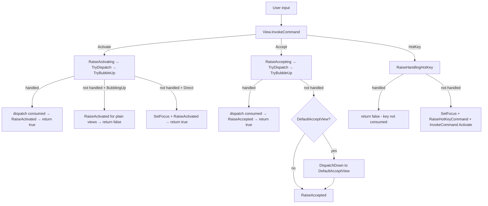

# Command Deep Dive

## See Also

* [Lexicon & Taxonomy](lexicon.md)
* [Cancellable Work Pattern](cancellable-work-pattern.md)
* [Events](events.md)

## Overview

The `Command` system provides a standardized framework for view actions (selecting, accepting, activating). It integrates with keyboard/mouse input handling and uses the *Cancellable Work Pattern* for extensibility and cancellation.

Central concepts:

- **`Activate`** — Change view state or prepare for interaction (toggle checkbox, focus menu item)
- **`Accept`** — Confirm an action or state (submit dialog, execute menu command)
- **`HotKey`** — Set focus and activate (Alt+F, Shortcut.Key)

| Aspect | `Command.Activate` | `Command.Accept` | `Command.HotKey` |
|--------|-------------------|------------------|-------------------|
| **Triggers** | Space, mouse click, arrow keys | Enter, double-click | HotKey letter, `Shortcut.Key` |
| **Pre-event** | `OnActivating` / `Activating` | `OnAccepting` / `Accepting` | `OnHandlingHotKey` / `HandlingHotKey` |
| **Post-event** | `OnActivated` / `Activated` | `OnAccepted` / `Accepted` | `OnHotKeyCommand` / `HotKeyCommand` |
| **Bubbling** | Opt-in via `CommandsToBubbleUp` | Opt-in via `CommandsToBubbleUp` + `DefaultAcceptView` | Opt-in via `CommandsToBubbleUp` |



## Command Routing

Commands propagate through the view hierarchy via `CommandRouting`, which describes the current routing phase:

```csharp
public enum CommandRouting
{
    Direct,          // Programmatic or from this view's own bindings
    BubblingUp,      // Propagating upward through SuperView chain
    DispatchingDown, // SuperView dispatching downward to a SubView
    Bridged,         // Crossing a non-containment boundary via CommandBridge
}
```

`ICommandContext` carries the routing mode, source view (weak reference), and binding:

```csharp
public interface ICommandContext
{
    Command Command { get; }
    WeakReference<View>? Source { get; }
    ICommandBinding? Binding { get; }
    CommandRouting Routing { get; }
}
```

`CommandContext` is an immutable record struct. Use `WithCommand()` or `WithRouting()` to create modified copies.

## Default Handlers

`View` registers four default command handlers in `SetupCommands()`:

### `DefaultActivateHandler` (Command.Activate)

Bound to `Key.Space` and `MouseFlags.LeftButtonReleased`.

1. Resets `_lastDispatchOccurred` to prevent stale state from prior invocations
2. Calls `RaiseActivating` (OnActivating → Activating event → TryDispatchToTarget → TryBubbleUp)
3. If `RaiseActivating` returns `true` (handled/consumed):
   - If dispatch occurred (`_lastDispatchOccurred`), calls `RaiseActivated` for composite view completion
   - Returns `true`
4. If routing is `BubblingUp`:
   - Plain views (no dispatch target): fires `RaiseActivated` to complete two-phase notification
   - Relay-dispatch views (e.g., Shortcut): skips — deferred completion fires `RaiseActivated` later
   - Consume-dispatch views: already completed in step 3
   - Returns `false` (notification, not consumption)
5. Otherwise (Direct invocation): calls `SetFocus()`, `RaiseActivated`, returns `true`

### `DefaultAcceptHandler` (Command.Accept)

Bound to `Key.Enter`.

1. Resets `_lastDispatchOccurred`
2. Calls `RaiseAccepting` (OnAccepting → Accepting event → TryDispatchToTarget → TryBubbleUp)
3. If handled and dispatch occurred, calls `RaiseAccepted`
4. If not handled, redirects to `DefaultAcceptView` via `DispatchDown` (unless Accept will also bubble to an ancestor — prevents double-path)
5. For `BubblingUp` with a dispatch target, calls `RaiseAccepted`
6. Calls `RaiseAccepted`
7. Returns `true` if: redirected, will bubble to ancestor, routing is `BubblingUp`, or view is `IAcceptTarget`

### `DefaultHotKeyHandler` (Command.HotKey)

Bound to `View.HotKey`.

1. Calls `RaiseHandlingHotKey`
2. If handled, returns `false` (allows key through as text input — e.g., TextField with HotKey `_E`)
3. Calls `SetFocus()`, `RaiseHotKeyCommand`, then `InvokeCommand(Command.Activate, ctx?.Binding)`
4. Returns `true`

### `DefaultCommandNotBoundHandler` (Command.NotBound)

Invoked when an unregistered command is triggered. Raises `CommandNotBound` event.

## Dispatch (Composite Pattern)

Composite views (Shortcut, Selectors, MenuBar) delegate commands to a primary SubView. The framework provides this via three virtual members:

### `GetDispatchTarget`

```csharp
protected virtual View? GetDispatchTarget (ICommandContext? ctx) => null;
```

Override to return the SubView that should receive dispatched commands. Returns `null` to skip dispatch.

| View | Target |
|------|--------|
| **Shortcut** | `CommandView` |
| **OptionSelector** / **FlagSelector** | `Focused` (inner CheckBox) |
| **MenuBar** | `Focused` |

### `ConsumeDispatch`

```csharp
protected virtual bool ConsumeDispatch => false;
```

Controls whether dispatch consumes the command:

- **`false` (relay)** — Shortcut: dispatches to CommandView via `DispatchDown`, but the originator continues its own activation. Shortcut uses deferred completion (fires `RaiseActivated` after CommandView.Activated).
- **`true` (consume)** — Selectors, MenuBar: marks the command as handled after dispatch. The composite view fires `RaiseActivated`/`RaiseAccepted` itself. Inner SubView activations are implementation details that don't propagate.

### `TryDispatchToTarget`

Called by `RaiseActivating` and `RaiseAccepting` after the `OnActivating`/`Activating` (or `OnAccepting`/`Accepting`) have had a chance to cancel. Guards:

- **Routing is `DispatchingDown`** → skip (prevents re-entry)
- **Relay + no binding** → skip (programmatic invocation — no user interaction to forward)
- **Source is within target** → skip (prevents loops)

For consume dispatch: on `BubblingUp`, consumes without dispatching (the composite handles state). On direct invocation, forwards via `DispatchDown`.

For relay dispatch: dispatches via `DispatchDown` if source is not within the target.

## Command Bubbling

### `CommandsToBubbleUp`

Opt-in property specifying which commands bubble from SubViews to this view:

```csharp
public IReadOnlyList<Command> CommandsToBubbleUp { get; set; } = [];
```

| View | `CommandsToBubbleUp` |
|------|---------------------|
| **Shortcut** | `[Command.Activate, Command.Accept]` |
| **Bar** / **Menu** | `[Command.Accept, Command.Activate]` |
| **Dialog** | `[Command.Accept]` |
| **SelectorBase** | `[Command.Activate, Command.Accept]` |

### `TryBubbleUp`

Called by `RaiseActivating`, `RaiseAccepting`, and `RaiseHandlingHotKey` when the command is not handled. Steps:

1. If already handled → return `true`
2. If routing is `DispatchingDown` → return `false` (prevents re-entry)
3. For `Command.Accept`: handles `DefaultAcceptView` + `IAcceptTarget` redirect logic
4. If command is in `SuperView.CommandsToBubbleUp` → invoke on SuperView with `Routing = BubblingUp`
5. Handles `Padding` edge cases (checks Padding's parent)

Bubbling is a **notification**, not consumption. The SuperView's return value is propagated, but relay views continue their own processing regardless.

### `DispatchDown`

Dispatches a command downward to a SubView with bubbling suppressed:

```csharp
protected bool? DispatchDown (View target, ICommandContext? ctx)
```

Creates a `CommandContext` with `Routing = CommandRouting.DispatchingDown` and invokes on the target. `TryBubbleUp` checks for `DispatchingDown` and skips bubbling, preventing infinite recursion.

### `DefaultAcceptView` and `IAcceptTarget`

`DefaultAcceptView` identifies the SubView that receives `Command.Accept` when no other handles it. Defaults to the first `IAcceptTarget { IsDefault: true }` SubView (typically a Button).

`IAcceptTarget` affects flow in three ways:
1. **Resolution**: `DefaultAcceptView` searches for `IAcceptTarget { IsDefault: true }`
2. **Return value**: `DefaultAcceptHandler` returns `true` for `IAcceptTarget` views
3. **Redirect**: Non-default `IAcceptTarget` sources bubble up when a `DefaultAcceptView` exists

## CommandBridge

`CommandBridge` routes commands across non-containment boundaries (e.g., MenuBarItem ↔ PopoverMenu, which is registered with `Application.Popover` rather than the SuperView hierarchy).

```csharp
CommandBridge bridge = CommandBridge.Connect (owner, remote, Command.Accept, Command.Activate);
// remote.Accepted → owner.RaiseAccepted (Routing = Bridged)
// remote.Activated → owner.RaiseActivated (Routing = Bridged)
bridge.Dispose (); // tears down subscriptions
```

Both references are weak — the bridge does not prevent GC. The bridge is one-way; create two bridges for bidirectional routing.

## Shortcut Dispatch

`Shortcut` is a composite view with three SubViews: `CommandView`, `HelpView`, `KeyView`. It overrides:

- `GetDispatchTarget` → returns `CommandView`
- `ConsumeDispatch` → `false` (relay pattern)

The framework handles dispatch automatically via `TryDispatchToTarget`:
- Commands from `CommandView` → source is within target → dispatch skipped (CommandView already processed)
- Commands from Shortcut/HelpView/KeyView → `DispatchDown` to CommandView
- Programmatic invocation (no binding) → relay guard skips dispatch

**Deferred completion**: Shortcut subscribes to `CommandView.Activated`. When CommandView completes (e.g., CheckBox toggles), Shortcut's callback fires `RaiseActivated`. This ensures `Action` sees the updated CommandView state.

`OnActivated` invokes `Action`, then dispatches to `TargetView` (or falls back to application-bound key commands):

```csharp
protected override void OnActivated (ICommandContext? ctx)
{
    base.OnActivated (ctx);
    Action?.Invoke ();

    ICommandContext? targetCtx = ctx;

    if (Command != Command.NotBound && ctx is CommandContext cc)
    {
        targetCtx = cc.WithCommand (Command);
    }

    InvokeOnTargetOrApp (targetCtx);
}
```

## Selector Dispatch

`OptionSelector` and `FlagSelector` override:

- `GetDispatchTarget` → returns `Focused` (the active inner CheckBox)
- `ConsumeDispatch` → `true` (consume pattern)

When an inner CheckBox activates (via click/space), the command bubbles up to the selector. `TryDispatchToTarget` consumes it (`BubblingUp` + `ConsumeDispatch=true`). The selector fires `RaiseActivated` to perform state mutation. The inner CheckBox activation does **not** propagate to the selector's SuperView.

## View Command Behaviors

| View | Space | Enter | HotKey | Pressed | Released | Clicked | DoubleClicked |
|------|-------|-------|--------|---------|----------|---------|---------------|
| **View** (base) | `Command.Activate` | `Command.Accept` | `Command.HotKey` | Not bound | `Command.Activate` | Not bound | Not bound |
| **Button** | `Command.Accept` | `Command.Accept` | `Command.HotKey` → `Command.Accept` | Configurable via `MouseHoldRepeat` | Configurable via `MouseHoldRepeat` | `Command.Accept` | `Command.Accept` |
| **CheckBox** | `Command.Activate` (advances state) | `Command.Accept` | `Command.HotKey` | Not bound | Not bound (removed) | `Command.Activate` | `Command.Accept` |
| **ListView** | `Command.Activate` (marks item) | `Command.Accept` | `Command.HotKey` | Not bound | Not bound | `Command.Activate` | `Command.Accept` |
| **TableView** | Not bound | `Command.Accept` (CellActivationKey) | `Command.HotKey` | Not bound | Not bound | `Command.Activate` | Not bound |
| **TreeView** | Not bound | `Command.Activate` (ObjectActivationKey) | `Command.HotKey` | Not bound | Not bound | OnMouseEvent (node selection) | OnMouseEvent (ObjectActivationButton) |
| **TextField** | Removed (text input) | `Command.Accept` | `Command.HotKey` (cancels if focused) | OnMouseEvent (set cursor) | OnMouseEvent (end drag) | Not bound | OnMouseEvent (select word) |
| **TextView** | Removed (text input) | `Command.NewLine` or `Command.Accept` | `Command.HotKey` | Not bound | Not bound | Not bound | Not bound |
| **OptionSelector** | Forwards to CheckBox SubView | `Command.Accept` | Restores focus, advances Active | Handled by SubViews | Handled by SubViews | Handled by SubViews | Handled by SubViews |
| **FlagSelector** | Removed (forwards to SubView) | Removed (forwards to SubView) | Restores focus (no-op if focused) | Not bound (cleared) | Not bound (cleared) | Not bound (cleared) | Not bound (cleared) |
| **HexView** | Removed | Removed | Not bound | Not bound | Not bound | `Command.Activate` | `Command.Activate` |
| **ColorPicker** | Not bound | Not bound | Not bound | Not bound | Not bound | Not bound (removed) | `Command.Accept` |
| **Label** | Not bound | Not bound | Forwards to next focusable peer | Not bound | Not bound | Not bound | Not bound |
| **TabView** | Not bound | Not bound | `Command.HotKey` | Handled by SubViews | Handled by SubViews | Handled by SubViews | Not bound |
| **NumericUpDown** | Handled by SubViews | Handled by SubViews | `Command.HotKey` | Handled by SubViews | Handled by SubViews | Handled by SubViews | Handled by SubViews |
| **Dialog** | Handled by SubViews | Handled by SubViews | Handled by SubViews | Handled by SubViews | Handled by SubViews | Handled by SubViews | Handled by SubViews |
| **Wizard** | Handled by SubViews | Handled by SubViews | Handled by SubViews | Handled by SubViews | Handled by SubViews | Handled by SubViews | Handled by SubViews |
| **FileDialog** | Handled by SubViews | Handled by SubViews | Handled by SubViews | Handled by SubViews | Handled by SubViews | Handled by SubViews | Handled by SubViews |
| **DatePicker** | Handled by SubViews | Handled by SubViews | Handled by SubViews | Handled by SubViews | Handled by SubViews | Handled by SubViews | Handled by SubViews |
| **ComboBox** | Handled by SubViews | Handled by SubViews | `Command.HotKey` | OnMouseEvent (toggle) | Handled by SubViews | Handled by SubViews | Handled by SubViews |
| **Shortcut** | `Command.Activate` (dispatch to CommandView) | `Command.Accept` (dispatch to CommandView) | `Command.HotKey` → `Command.Activate` | Not bound | `Command.Activate` | Not bound | Not bound |
| **MenuItem** | Inherited from Shortcut | Inherited from Shortcut | `Command.HotKey` → `Command.Activate` | Not bound | `Command.Activate` | Not bound | Not bound |
| **Menu** / **Bar** | Handled by MenuItems/Shortcuts | Handled by MenuItems/Shortcuts | Handled by MenuItems/Shortcuts | Handled by MenuItems/Shortcuts | Handled by MenuItems/Shortcuts | Handled by MenuItems/Shortcuts | Handled by MenuItems/Shortcuts |
| **MenuBar** | Handled by SubViews (ConsumeDispatch) | Handled by SubViews (ConsumeDispatch) | Handled by SubViews | Handled by SubViews | Handled by SubViews | Handled by SubViews | Handled by SubViews |
| **ScrollBar** | Not bound | Not bound | Not bound | OnMouseEvent | OnMouseEvent | OnMouseEvent | Not bound |
| **ProgressBar** / **SpinnerView** | N/A | N/A | N/A | N/A | N/A | N/A | N/A |

### Table Notation

- **`Command.X`** — Bound via KeyBinding or MouseBinding
- **OnMouseEvent (desc)** — Handled via `OnMouseEvent` override
- **Handled by SubViews** — Composite view delegates to SubViews
- **Not bound** — Not handled by this view
- **N/A** — Display-only view (`CanFocus = false`)

### Key Points

1. **View base**: Space → `Command.Activate`, Enter → `Command.Accept`, `LeftButtonReleased` → `Command.Activate`. Subclasses override or extend.

2. **Button**: Implements `IAcceptTarget`. All interactions map to `Command.Accept`.

3. **Selector views**: Use `ConsumeDispatch=true`. Inner CheckBox commands are consumed; don't propagate to SuperView.

4. **Text input views**: Remove `Key.Space` binding for text entry. `TextField` cancels HotKey when focused (allows typing the HotKey character).

5. **Mouse columns**: Pressed → `LeftButtonPressed`, Released → `LeftButtonReleased`, Clicked → synthesized press+release, DoubleClicked → timing-based. See [Mouse Deep Dive](mouse.md).

6. **Shortcut/MenuItem**: Use relay dispatch (`ConsumeDispatch=false`). Commands propagate through `GetDispatchTarget` → `CommandView`. MenuItem inherits from Shortcut.

7. **MenuBar**: Uses consume dispatch (`ConsumeDispatch=true`, `GetDispatchTarget` → `Focused`). Being redesigned — see source for current behavior.

## Command Route Tracing

For debugging command routing issues, Terminal.Gui provides a tracing system via @Terminal.Gui.Input.CommandTrace. Tracing captures detailed information about command flow through the view hierarchy.

### Enabling Tracing

```csharp
// Enable via property (uses LoggingBackend)
CommandTrace.IsEnabled = true;

// Or set a custom backend
CommandTrace.Backend = new CommandTrace.LoggingBackend ();
```

Tracing can also be enabled via configuration:

```json
{
  "CommandTrace.IsEnabled": true
}
```

In **UICatalog**, use the **Logging** menu → **Command Trace** checkbox to toggle tracing at runtime.

### Trace Output

When enabled, trace entries are logged via `Logging.Debug` with the format:

```
[Phase] Arrow Command @ ViewId (Method) - Message
```

- **Phase**: `Entry`, `Exit`, `Routing`, `Event`, or `Handler`
- **Arrow**: `↑` (BubblingUp), `↓` (DispatchingDown), `↔` (Bridged), `•` (Direct)
- **Command**: The command being routed (e.g., `Activate`, `Accept`)
- **ViewId**: The view's identifying string
- **Method**: The method where the trace occurred

Example output:

```
[Entry] • Activate @ Button("OK"){X=10,Y=5} (DefaultActivateHandler)
[Entry] • Activate @ Button("OK"){X=10,Y=5} (RaiseActivating)
[Event] • Activate @ Button("OK"){X=10,Y=5} (RaiseActivating) - Invoking Activating event
[Routing] ↑ Activate @ Button("OK"){X=10,Y=5} (TryBubbleUp) - BubblingUp to Dialog("Confirm")
[Event] • Activate @ Button("OK"){X=10,Y=5} (RaiseActivated)
```

### Custom Backends

Implement `ICommandTraceBackend` for custom trace handling:

```csharp
public class MyTraceBackend : ICommandTraceBackend
{
    public void Log (RouteTraceEntry entry)
    {
        // Custom handling - write to file, send to debugger, etc.
    }
    
    public void Clear () { }
}

CommandTrace.Backend = new MyTraceBackend ();
```

### Testing with ListBackend

Use `CommandTrace.ListBackend` to capture traces for test assertions:

```csharp
var backend = new CommandTrace.ListBackend ();
CommandTrace.Backend = backend;

view.InvokeCommand (Command.Activate);

Assert.Contains (backend.Entries, e => e.Phase == CommandTracePhase.Entry);
Assert.Contains (backend.Entries, e => e.Command == Command.Activate);
```

### Performance

- All `TraceRoute` calls are marked with `[Conditional("DEBUG")]` — **zero overhead in Release builds**
- The backend uses `AsyncLocal<T>` for thread safety in parallel test execution
- Default `NullBackend` discards all traces with minimal overhead
