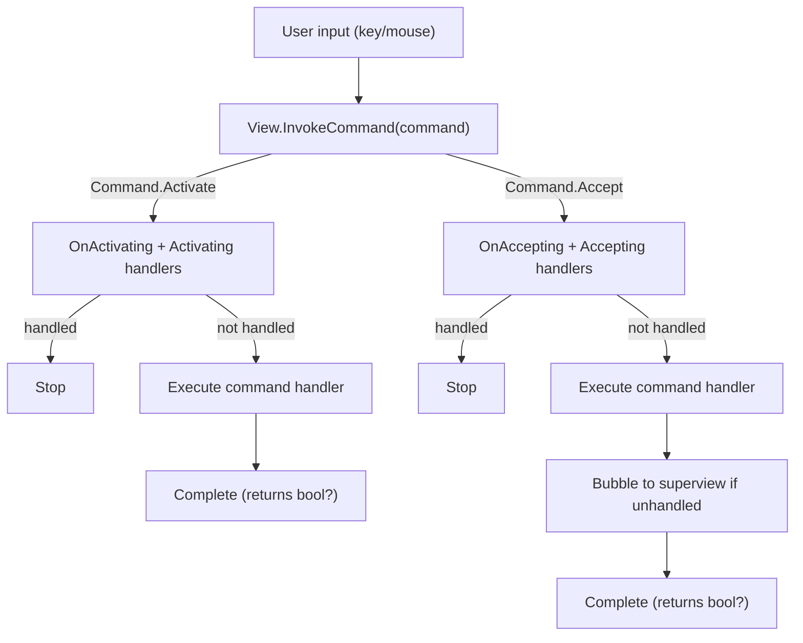

# Deep Dive into Command and View.Command in Terminal.Gui

## See Also

* [Lexicon & Taxonomy](lexicon.md)
* [Cancellable Work Pattern](cancellable-work-pattern.md)
* [Events](events.md)

## Overview

The `Command` system in Terminal.Gui provides a standardized framework for defining and executing actions that views can perform, such as selecting items, accepting input, or navigating content. Implemented primarily through the `View.Command` APIs, this system integrates tightly with input handling (e.g., keyboard and mouse events) and leverages the *Cancellable Work Pattern* to ensure extensibility, cancellation, and decoupling. Central to this system are the `Activating/Activated` and `Accepting/Accepted` events, which encapsulate common user interactions: `Activated` for changing a view’s state or preparing it for interaction (e.g., toggling a checkbox, focusing a menu item), and `Accepted` for confirming an action or state (e.g., executing a menu command, accepting a ListView, submitting a dialog).

This deep dive explores the `Command` and `View.Command` APIs and the default implementations of standardized commands including `Command.Activate`, `Command.Accept`, and `Command.HotKey`. 

This diagram shows the fundamental command invocation flow within a single view, demonstrating the Cancellable Work Pattern with pre-events (e.g., `Activating`, `Accepting`) and the command handler execution.



## Activate/Accept System Summary

| Aspect | `Command.Activate` | `Command.Accept` |
|--------|-------------------|------------------|
| **Semantic Meaning** | "Interact with this view / select an item" - changes view state or prepares for interaction | "Perform the view's primary action" - confirms action or accepts current state |
| **Typical Triggers** | • Spacebar<br>• Single mouse click<br>• Navigation keys (arrows)<br>• Mouse enter (menus) | • Enter key<br>• Double-click |
| **Pre-Virtual Method** | `OnActivating` | `OnAccepting` |
| **Pre-Event Name** | `Activating` | `Accepting` |
| **Post-Virtual Method** | `OnActivated` | `OnAccepted` |
| **Post-Event Name** | `Activated` | `Accepted` |
| **Bubbling** |  |  |

## View Command Behaviors

The following table documents how `View` and each View subclass binds or handles keyboard and mouse events. This provides a comprehensive reference for understanding which commands are bound to specific inputs or whether views handle events directly through method overrides.

| View | Space | Enter | HotKey | Pressed | Released | Clicked | DoubleClicked |
|------|-------|-------|--------|---------|----------|---------|---------------|
| **View** (base) | `Command.Activate` (default) | `Command.Accept` (default) | `Command.HotKey` (default) | Base OnMouseEvent (updates MouseState) | `Command.Activate` (default) | Not bound by default | Not bound by default |
| **Button** | `Command.Accept` | `Command.Accept` | `Command.HotKey` (calls RaiseAccepting) | OnMouseEvent (updates MouseState) | `Command.Activate` (inherited) | Not bound (overridden) | Not bound (overridden) |
| **CheckBox** | `Command.Activate` | `Command.Accept` | `Command.HotKey` | `Command.Activate` | Base OnMouseEvent | `Command.Activate` | `Command.Accept` |
| **ComboBox** | Handled by SubViews | Handled by SubViews | `Command.HotKey` | Handled by SubViews | Handled by SubViews | Handled by SubViews | Handled by SubViews |
| **ListView** | Custom handler (selection) | `Command.Accept` | `Command.HotKey` | Base OnMouseEvent | Base OnMouseEvent | OnMouseEvent (selects item) | `Command.Accept` |
| **TableView** | Custom handler (toggle selection) | `Command.Accept` | `Command.HotKey` | OnMouseEvent (cell selection) | OnMouseEvent (end drag) | OnMouseEvent (cell selection) | `Command.Accept` |
| **TreeView** | `Command.Accept` | `Command.Accept` | `Command.HotKey` | Base OnMouseEvent | Base OnMouseEvent | OnMouseEvent (node selection) | `Command.Accept` |
| **TextField** | OnKeyDown (inserts space) | `Command.Accept` | `Command.HotKey` | OnMouseEvent (set cursor) | OnMouseEvent (end drag) | OnMouseEvent (position cursor) | OnMouseEvent (select word) |
| **TextView** | OnKeyDown (inserts space) | OnKeyDown (inserts newline) | `Command.HotKey` | OnMouseEvent (set cursor) | OnMouseEvent (end drag) | OnMouseEvent (position cursor) | OnMouseEvent (select word) |
| **OptionSelector** | Forwards to SubView | `Command.Accept` | Forwards to SubView HotKey | Handled by SubViews | Handled by SubViews | Handled by SubViews | Handled by SubViews |
| **FlagSelector** | Forwards to SubView | `Command.Accept` | Forwards to SubView HotKey | Handled by SubViews | Handled by SubViews | Handled by SubViews | Handled by SubViews |
| **Menu** | Handled by SubViews | `Command.Accept` | `Command.HotKey` | Handled by SubViews | Handled by SubViews | Handled by SubViews | Handled by SubViews |
| **MenuBar** | Handled by SubViews | `Command.Accept` | `Command.HotKey` | Handled by SubViews | Handled by SubViews | Handled by SubViews | Handled by SubViews |
| **MenuItem** | Base handler | `Command.Accept` | `Command.HotKey` | Base OnMouseEvent | Base OnMouseEvent | `Command.Activate` | `Command.Accept` |
| **Shortcut** | `Command.HotKey` | `Command.HotKey` | `Command.HotKey` | OnMouseEvent (updates MouseState) | OnMouseEvent (updates MouseState) | `Command.HotKey` | `Command.HotKey` |
| **Dialog** | Handled by SubViews | Handled by SubViews | Handled by SubViews | Handled by SubViews | Handled by SubViews | Handled by SubViews | Handled by SubViews |
| **Wizard** | Handled by SubViews | Handled by SubViews | Handled by SubViews | Handled by SubViews | Handled by SubViews | Handled by SubViews | Handled by SubViews |
| **FileDialog** | Handled by SubViews | Handled by SubViews | Handled by SubViews | Handled by SubViews | Handled by SubViews | Handled by SubViews | Handled by SubViews |
| **TabView** | Not bound | Not bound | `Command.HotKey` | Handled by SubViews | Handled by SubViews | Handled by SubViews | Not bound |
| **ScrollBar** | Not bound | Not bound | Not bound | OnMouseEvent (auto-repeat/jump) | OnMouseEvent (auto-repeat) | OnMouseEvent (jump position) | Not bound |
| **HexView** | OnKeyDown (custom) | Not bound | Not bound | OnMouseEvent (position cursor) | Base OnMouseEvent | OnMouseEvent (position cursor) | OnMouseEvent (toggle side) |
| **NumericUpDown** | Handled by SubViews | Handled by SubViews | Handled by SubViews | Handled by SubViews | Handled by SubViews | Handled by SubViews | Handled by SubViews |
| **DatePicker** | Handled by SubViews | Handled by SubViews | Handled by SubViews | Handled by SubViews | Handled by SubViews | Handled by SubViews | Handled by SubViews |
| **ColorPicker** | OnKeyDown (custom) | Not bound | Handled by SubViews | OnMouseEvent (adjust value) | Base OnMouseEvent | OnMouseEvent (adjust value) | `Command.Accept` |
| **ProgressBar** | N/A | N/A | N/A | N/A | N/A | N/A | N/A |
| **SpinnerView** | N/A | N/A | N/A | N/A | N/A | N/A | N/A |
| **Bar** | Handled by SubViews | Handled by SubViews | Handled by SubViews | Handled by SubViews | Handled by SubViews | Handled by SubViews | Handled by SubViews |
| **Label** | Not bound | Not bound | Forwards to next focusable | Not bound | Not bound | Not bound | Not bound |

### Notes on Command Behaviors

#### Table Notation

The table shows how each view handles keyboard and mouse input using one of these approaches:

- **`Command.X`** - Input is bound to a command via KeyBinding or MouseBinding (e.g., `Command.HotKey`, `Command.Activate`, `Command.Accept`)
- **OnKeyDown (custom)** - Input is handled directly by overriding `OnKeyDown` with view-specific logic
- **OnMouseEvent (description)** - Input is handled directly by overriding `OnMouseEvent` with view-specific behavior
- **Base OnMouseEvent** - Input uses the base `View.OnMouseEvent` implementation (updates MouseState)
- **Custom handler** - Input uses a view-specific handler method (not a command)
- **Handled by SubViews** - Composite views delegate input handling to their contained SubViews
- **Forwards to SubView** - Input is forwarded to a specific SubView (e.g., OptionSelector → CheckBox)
- **Not bound** - Input is not handled or bound by this view

#### Key Points

1. **View Base Class**: The first row shows the default behavior provided by the base `View` class. Space and Enter are bound to `Command.Activate` and `Command.Accept` respectively in `SetupCommands()`. Mouse events use the base `OnMouseEvent` implementation which updates `MouseState`. Subclasses typically override these bindings or add MouseBindings for Clicked/DoubleClicked events.

2. **Composite Views** (Dialog, Wizard, FileDialog, DatePicker, NumericUpDown, Bar): These views delegate input handling to their SubViews. The parent view may intercept commands to coordinate actions (e.g., Dialog intercepting `Accept` to set `Result`).

3. **Display-Only Views** (ProgressBar, SpinnerView, Label): These views typically have `CanFocus = false` and do not handle keyboard or mouse input directly.

4. **Command Bindings vs. Event Handlers**: Views with simple, standardized behaviors use **command bindings** (KeyBinding/MouseBinding → Command). Views requiring custom logic (e.g., text editing, cursor positioning, drag selection) override **OnKeyDown** or **OnMouseEvent** directly.

5. **TreeView Special Case**: Both Space and Enter are bound to `Command.Accept`, which invokes the same handler (`ActivateSelectedObjectIfAny`).

6. **Shortcut and Button Unified Handling**: Space, Enter, Clicked, and DoubleClicked all map to `Command.HotKey`, providing consistent activation behavior.

7. **Selector Views** (OptionSelector, FlagSelector): These forward Space and HotKey inputs to the focused CheckBox's handlers, enabling keyboard-driven selection changes.

8. **Text Input Views** (TextField, TextView): These override OnKeyDown to handle Space (inserts space character) and OnMouseEvent for cursor positioning, text selection, and drag operations. Enter is bound to `Command.Accept` in TextField (submit), but handled directly in TextView (inserts newline).

9. **Mouse Event Columns**:
   - **Pressed**: `MouseFlags.LeftButtonPressed` - button initially pressed down
   - **Released**: `MouseFlags.LeftButtonReleased` - button released after press
   - **Clicked**: `MouseFlags.LeftButtonClicked` - synthesized from press+release in same location
   - **DoubleClicked**: `MouseFlags.LeftButtonDoubleClicked` - synthesized from timing of two clicks
   - For detailed information about the mouse event pipeline and how events are synthesized, see the [Mouse Deep Dive](mouse.md).

10. **Implementation Patterns**: To understand how bindings work, see:
    - `Terminal.Gui/ViewBase/Mouse/View.Mouse.cs` - Base mouse handling and MouseBindings
    - `Terminal.Gui/ViewBase/Keyboard/View.Keyboard.cs` - Base keyboard handling and KeyBindings
    - Individual view source files for view-specific overrides and custom handlers

### Key Takeaways

1. **`Activate` = Interaction/Selection** (immediate, local)
   - Changes view state or sets focus
   - Views that implement `IValue` will emit `ValueChanging`/`ValueChanged` events.
   - Views can emit view-specific events for notification (e.g., `CheckedStateChanged`, `SelectedMenuItemChanged`)

2. **`Accept` = Confirmation/Action** (final, hierarchical)
   - Confirms current state or executes primary action
   - `View.DefaultAcceptView` is the subview that have `Command.Accept` invoked on it, if no other sub-view handles `Accept`.
   - Enables dialog/menu close scenarios

## Overview of the Command System

The `Command` system in Terminal.Gui defines a set of standard actions via the `Command` enum (e.g., `Command.Activate`, `Command.Accept`, `Command.HotKey`, `Command.StartOfPage`). These actions are triggered by user inputs (e.g., key presses, mouse clicks) or programmatically, enabling consistent view interactions.

### Key Components
- **Command Enum**: Defines actions like `Activate` (state change or interaction preparation), `Accept` (action confirmation), `HotKey` (hotkey activation), and others (e.g., `StartOfPage` for navigation).
- **Command Handlers**: Views register handlers using `View.AddCommand`, specifying a `CommandImplementation` delegate that returns `bool?` (`null`: no command executed; `false`: executed but not handled; `true`: handled or canceled).
- **Command Routing**: Commands are invoked via `View.InvokeCommand`, executing the handler or raising `CommandNotBound` if no handler exists.
- **Cancellable Work Pattern**: Command execution uses events (e.g., `Activating`, `Accepting`) and virtual methods (e.g., `OnActivating`, `OnAccepting`) for modification or cancellation, with `Handled` indicating processing should stop.

### Role in Terminal.Gui
The `Command` system bridges user input and view behavior, enabling:
- **Consistency**: Standard commands ensure predictable interactions (e.g., `Enter` and `Double-click` trigge `Accept` in buttons, menus, checkboxes).
- **Extensibility**: Custom handlers and events allow behavior customization.
- **Decoupling**: Events reduce reliance on sub-classing, though current propagation mechanisms may require subview-superview coordination.

## Implementation in View.Command

The `View.Command` APIs in the `View` class provide infrastructure for registering, invoking, and routing commands, adhering to the *Cancellable Work Pattern*. `View` provides default implementation of four commands:

* `Command.Activate` - Bound to `Key.Space` and `MouseFlags.LeftButtonReleased` - Raises actviating and if not handled, sets focus to the view and raises activated.
* `Command.HotKey` - Bound to `View.Hotkey` - If `HandlingHotKey` is not handled, invokes `Command.Activate`
* `Command.Accept` - Bound to `Key.Enter` - Raises accepting and if not hanlded, sets focus to the view and raises accepted.
* `Command.NotBound` - If any other command is not handled, raises the command not bound event.

### Command Registration
Views register commands using `View.AddCommand`, associating a `Command` with a `CommandImplementation` delegate. The delegate’s `bool?` return controls processing flow.

### Command Invocation
Commands are invoked via `View.InvokeCommand` or `View.InvokeCommands`, passing an `ICommandContext` for context (e.g., source view, binding details). Unhandled commands trigger `CommandNotBound`.

**Example**:
```csharp
public bool? InvokeCommand(Command command, ICommandContext? ctx)
{
    if (!_commandImplementations.TryGetValue(command, out CommandImplementation? implementation))
    {
        _commandImplementations.TryGetValue(Command.NotBound, out implementation);
    }
    return implementation!(ctx);
}
```

### Command Routing
By default, commands route directly to the target view, and processing stops regardless of whehter the target view handles the invocation or not. `View.CommandsToBubbleUp` enables superviews to tell subviews to bubble a specific set of commands up to the superview. For example if `subView.CommandsToBubbleUp` includes `Command.Activate`, and `subview` does not handle `Command.Activate`, the event will be invoked on `subView.SuperView`. 

## The Activating and Accepting Concepts

The `Activating` and `Accepting` events, along with their corresponding commands (`Command.Activate`, `Command.Accept`), are designed to handle the most common user interactions with views:
- **Activating**: Changing a view’s state or preparing it for further interaction, such as highlighting an item in a list, toggling a checkbox, or focusing a menu item.
- **Accepting**: Confirming an action or state, such as submitting a form, activating a button, or finalizing a selection.

These concepts are opinionated, reflecting Terminal.Gui’s view that most UI interactions can be modeled as either state changes/preparation (selecting) or action confirmations (accepting). Below, we explore each concept, their implementation, use cases, and propagation behavior, using `Handled` to reflect the current implementation.

### Activating
- **Definition**: `Activating` represents a user action that changes a view’s state or prepares it for further interaction, such as selecting an item in a `ListView`, toggling a `CheckBox`, or focusing a `MenuItem`. It is associated with `Command.Activate`, typically triggered by a spacebar press, single mouse click, navigation keys (e.g., arrow keys), or mouse enter (e.g., in menus).
- **Event**: The `Activating` event is raised by `RaiseActivating`, allowing external code to modify or cancel the state change.
- **Virtual Method**: `OnActivating` enables subclasses to preprocess or cancel the action.
- **Implementation**:
  ```csharp
  protected bool? RaiseActivating(ICommandContext? ctx)
  {
      CommandEventArgs args = new () { Context = ctx };
      if (OnActivating(args) || args.Cancel)
      {
          return true;
      }
      Activating?.Invoke(this, args);
      return Activating is null ? null : args.Cancel;
  }
  ```
  - **Default Behavior**: Sets focus if `CanFocus` is true (via `SetupCommands`).
  - **Cancellation**: `args.Cancel` or `OnActivating` returning `true` halts the command.
  - **Context**: `ICommandContext` provides invocation details.

- **Use Cases**:
  - **ListView**: Activating an item (e.g., via arrow keys or mouse click) raises `Activating` to update the highlighted item.
  - **CheckBox**: Toggling the checked state (e.g., via spacebar) raises `Activating` to change the state, as seen in the `AdvanceAndSelect` method:
    ```csharp
    private bool? AdvanceAndSelect(ICommandContext? commandContext)
    {
        bool? cancelled = AdvanceCheckState();
        if (cancelled is true)
        {
            return true;
        }
        if (RaiseActivating(commandContext) is true)
        {
            return true;
        }
        return commandContext?.Command == Command.HotKey ? cancelled : cancelled is false;
    }
    ```
  - **OptionSelector**: Activating an OpitonSelector option raises `Activating` to update the selected option.
  - **Menu** and **MenuBar**: Activating a `MenuItem` (e.g., via mouse enter or arrow keys) sets focus, tracked by `SelectedMenuItem` and raising `SelectedMenuItemChanged`:
    ```csharp
    protected override void OnFocusedChanged(View? previousFocused, View? focused)
    {
        base.OnFocusedChanged(previousFocused, focused);
        SelectedMenuItem = focused as MenuItem;
        RaiseSelectedMenuItemChanged(SelectedMenuItem);
    }
    ```
  - **FlagSelector**: Activating a `CheckBox` subview toggles a flag, updating the `Value` property and raising `ValueChanged`, though it incorrectly triggers `Accepting`:
    ```csharp
    checkbox.Activating += (sender, args) =>
    {
        if (RaiseActivating(args.Context) is true)
        {
            args.Cancel = true;
            return;
        }
        if (RaiseAccepting(args.Context) is true)
        {
            args.Cancel = true;
        }
    };
    ```
  - **Views without State**: For views like `Button`, `Activating` typically sets focus but does not change state, making it less relevant.

- **Propagation**: `Command.Activate` is handled locally by the target view. If the command is unhandled (`null` or `false`), processing stops without propagating to the superview or other views. This is evident in `Menu`, where `SelectedMenuItemChanged` is used for hierarchical coordination, and in `CheckBox` and `FlagSelector`, where state changes are internal.

### Accepting
- **Definition**: `Accepting` represents a user action that confirms or finalizes a view’s state or triggers an action, such as submitting a dialog, activating a button, or confirming a selection in a list. It is associated with `Command.Accept`, typically triggered by the Enter key or double-click.
- **Event**: The `Accepting` event is raised by `RaiseAccepting`, allowing external code to modify or cancel the action.
- **Virtual Method**: `OnAccepting` enables subclasses to preprocess or cancel the action.
- **Implementation**: As shown above in `RaiseAccepting`.
  - **Default Behavior**: Raises `Accepting` and propagates to a default button (if present in the superview with `IsDefault = true`) or the superview if not canceled.
  - **Cancellation**: `args.Cancel` or `OnAccepting` returning `true` halts the command.
  - **Context**: `ICommandContext` provides invocation details.

- **Use Cases**:
  - **Button**: Pressing Enter raises `Accepting` to activate the button (e.g., submit a dialog).
  - **ListView**: Double-clicking or pressing Enter raises `Accepting` to confirm the selected item(s).
  - **TextField**: Pressing Enter raises `Accepting` to submit the input.
  - **Menu** and **MenuBar**: Pressing Enter on a `MenuItem` raises `Accepting` to execute a command or open a submenu, followed by the `Accepted` event to hide the menu or deactivate the menu bar:
    ```csharp
    protected void RaiseAccepted(ICommandContext? ctx)
    {
        CommandEventArgs args = new () { Context = ctx };
        OnAccepted(args);
        Accepted?.Invoke(this, args);
    }
    ```
  - **CheckBox**: Pressing Enter raises `Accepting` to confirm the current `CheckedState` without modifying it, as seen in its command setup:
    ```csharp
    AddCommand(Command.Accept, RaiseAccepting);
    ```
  - **FlagSelector**: Pressing Enter raises `Accepting` to confirm the current `Value`, though its subview `Activating` handler incorrectly triggers `Accepting`, which should be reserved for parent-level confirmation.
  - **Dialog**: `Accepting` on a default button closes the dialog or triggers an action.

- **Propagation**: `Command.Accept` propagates to:
  - A default button (if present in the superview with `IsDefault = true`).
  - The superview, enabling hierarchical handling (e.g., a dialog processes `Accept` if no button handles it).
  - In `Menu`, propagation extends to the `SuperMenuItem` for submenus in popovers, as seen in `OnAccepting`:
    ```csharp
    protected override bool OnAccepting(CommandEventArgs args)
    {
        if (args.Context?.Binding is KeyBinding { Key: { } key } && key == Application.QuitKey)
        {
            return true;
        }
        if (SuperView is null && SuperMenuItem is {})
        {
            return SuperMenuItem?.InvokeCommand(Command.Accept, args.Context) is true;
        }
        return false;
    }
    ```
  - Similarly, `MenuBar` customizes propagation to show popovers:
    ```csharp
    protected override bool OnAccepting(CommandEventArgs args)
    {
        if (Visible && Enabled && args.Context?.Source is MenuBarItemv2 { PopoverMenuOpen: false } sourceMenuBarItem)
        {
            if (!CanFocus)
            {
                Active = true;
                ShowItem(sourceMenuBarItem);
                if (!sourceMenuBarItem.HasFocus)
                {
                    sourceMenuBarItem.SetFocus();
                }
            }
            else
            {
                ShowItem(sourceMenuBarItem);
            }
            return true;
        }
        return false;
    }
    ```
