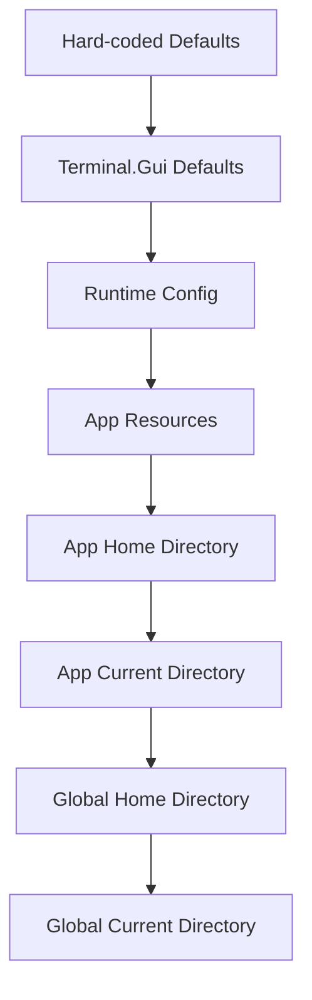

# Configuration Management

Terminal.Gui provides persistent configuration settings via the [`ConfigurationManager`](~/api/Terminal.Gui.ConfigurationManager.yml) class.

## Configuration Lexicon and Taxonomy

| Term | Meaning |
|:-----|:--------|
| **AppSettings** | Application-specific settings stored in the application's resources. |
| **Apply** | Apply the configuration to the application; copies settings from configuration properties to corresponding `static` `[ConfigProperty]` properties. |
| **Attribute** | Defines concrete visual styling for a visual element (Foreground color, Background color, TextStyle). |
| **BackgroundColor** | A property of `Attribute` describing the background text color. |
| **Color** | Base terminal color (supports TrueColor and named values like White, Black, Cyan, etc.). |
| **ConfigProperty** | A property decorated with `[ConfigProperty]` that can be configured via the configuration system. |
| **Configuration** | A collection of settings defining application behavior and appearance. |
| **ConfigurationManager** | System that loads and manages application runtime settings from external sources. |
| **ForegroundColor** | A property of `Attribute` describing the foreground text color. |
| **Load** | Load configuration from given location(s), updating with new values. Loading doesn't apply settings automatically. |
| **Location** | Storage location for configuration (e.g., user's home directory, application directory). |
| **Reset** | Reset configuration to current values or hard-coded defaults. Does not load configuration. |
| **Scope** | Defines the context where configuration applies (Settings, Theme, or AppSettings). |
| **Scheme** | Maps `VisualRole` to `Attribute`, defining visual element appearance (color and style) based on semantic purpose. |
| **Settings** | Runtime options including both system settings and application-specific settings. |
| **Sources** | Set of locations where configuration can be stored (@Terminal.Gui.ConfigLocations enum). |
| **Style** | Property of `Attribute` for font-like hints (bold, italic, underline). |
| **Theme** | Named instance containing specific appearance settings. |
| **ThemeInheritance** | Mechanism where themes can inherit and override settings from other themes. |
| **Themes** | Collection of named Theme definitions bundling visual and layout settings. |
| **VisualRole** | Semantic role/purpose of a visual element (Normal, Focus, HotFocus, Active, Disabled, ReadOnly). |

## Configuration Types and Scopes

Terminal.Gui supports three main configuration scopes:

### SettingsScope
System-level settings that affect Terminal.Gui behavior:
```csharp
[ConfigurationProperty(Scope = typeof(SettingsScope))]
public static bool AlwaysShowScrollBars { get; set; } = false;
```

### ThemeScope
Visual appearance settings that can be themed:
```csharp
[ConfigurationProperty(Scope = typeof(ThemeScope))]
public static ColorScheme Colors { get; set; }
```

### AppSettingsScope (default)
Application-specific settings:
```csharp
[ConfigurationProperty] // AppSettingsScope is default
public static string MyAppSetting { get; set; } = "default";
```

## Configuration Precedence

Configuration values are applied in the following order (later sources override earlier ones):

1. Hard-coded defaults (lowest precedence)
2. Terminal.Gui assembly defaults
3. Runtime configuration
4. App resources
5. App-specific user home directory
6. App-specific current directory
7. Global user home directory
8. Global current directory (highest precedence)



## Configuration Events

The ConfigurationManager provides several events to track configuration changes:

```csharp
// Called after configuration is applied
ConfigurationManager.Applied += (sender, e) => {
    // Handle configuration changes
};

// Called when the active theme changes
ConfigurationManager.ThemeChanged += (sender, e) => {
    // Handle theme changes
};
```

## Theme Configuration

Themes provide a way to bundle visual settings together. Themes can inherit from other themes:

```json
{
  "Themes": [
    "MyCustomTheme": {
      "BasedOn": "Default",
      "Colors": {
        "Normal": {
          "Foreground": "White",
          "Background": "Blue"
        }
      }
    }
  ]
}
```

## Fundamentals

The `ConfigurationManager` class provides a way to store and retrieve configuration settings for an application. The configuration is stored in a JSON file, which can be located in the user's home directory, the current working directory, or as a resource within the application's main assembly.

Settings are defined in JSON format, according to this schema: https://gui-cs.github.io/Terminal.GuiV2Docs/schemas/tui-config-schema.json.

Terminal.Gui library developers can define settings in code and set the default values in the Terminal.Gui assembly's resources (e.g. `Terminal.Gui.Resources.config.json`).

Terminal.Gui application developers can define settings in their apps' code and set the default values in their apps' resources (e.g. `Resources/config.json`) or by setting @Terminal.Gui.Application.RuntimeConfig to string containing JSON.

Users can change settings on a global or per-application basis by providing JSON formatted configuration files. The configuration files can be placed in at .tui folder in the user's home directory (e.g. `C:/Users/username/.tui`, or `/usr/username/.tui`) or the folder where the Terminal.Gui application was launched from (e.g. `./.tui`).

## CM is Disabled by Default

The `ConfigurationManager` class is disabled by default. To enable it, call @Terminal.Gui.ConfigurationManager.Enable() in your application's `Main` method.

```csharp
ConfigurationManager.Enable();
```

If `ConfigurationManager.Enable()` is not called (`ConfigurationManager.IsEnabled` is 'false'), all configuration settings are ignored and ConfigurationManager will effectively be a no-op. All `[ConfigurationProperty]` properties will initially be their hard-coded default values. Calling @Terminal.Gui.ConfigurationManager.Reset will reset all configuration properties back to their hard-coded default values.

Other than that, no other ConfigurationManager APIs will have any effect.

## Loading and Applying Configuration

The `ConfigurationManager` class provides a `Load` method that loads the configuration from the given location. The `Load` method does not apply the settings to the application; that happens when the `Apply` method is called.

When a configuration has been loaded, the @Terminal.Gui.ConfigurationManager.Apply method must be called to apply the settings to the application. This method uses reflection to find all static fields decorated with the `[ConfigurationProperty]` attribute and applies the settings to the corresponding properties.

```csharp
// Load the configuration from just the users home directory.

ConfigurationManager.Load(ConfigLocations.GlobalHome);
ConfigurationManager.Apply();
```

> [!IMPORTANT]
>  Configuration Settings Apply at the Process Level. 
> Configuration settings are applied at the process level, which means that they are applied to all applications that are part of the same process. This is due to the fact that configuration properties are defined as static fields, which are static for the process.

## How Settings are Defined 

Application Developers define settings by decorating static properties with the `[ConfigurationProperty]` attribute.

```csharp
class MyApp
{
    [ConfigurationProperty]
    public static string MySetting { get; set; } = "Default Value";
}
```

Configuration Properties must be `public` or `internal` static properties.

The above example will define a configuration property in the `AppSettings` scope. The name of the property will be `MyApp.MySetting` and will appear in JSON as:

```json
{
    "AppSettings": {
      "MyApp.MySetting": "Default Value"
    }
}
```

`AppSettings` property names must be globally unique. To ensure this, the name of the AppSettings property is the name of the property prefixed with a period and the full name of the class that holds it. In the example above, the AppSettings property is named `MyApp.MySetting`.

Terminal.Gui library developers can use the `SettingsScope` and `ThemeScope` attributes to define settings and themes for the terminal.Gui library.

> [!IMPORTANT] App developers cannot define `SettingScope` or `ThemeScope` properties.

```csharp
    /// <summary>
    ///     Gets or sets whether <see cref="Button"/>s are shown with a shadow effect by default.
    /// </summary>
    [ConfigurationProperty (Scope = typeof (ThemeScope))]
    public static ShadowStyle DefaultShadow { get; set; } = ShadowStyle.None;
```

## Precedence

Settings are applied using the following precedence (higher precedence settings overwrite lower precedence settings):

1. Hard-coded default values in any static property decorated with the `[ConfigurationProperty]` attribute.

2. @Terminal.Gui.ConfigLocations.Default - Default settings in the Terminal.Gui assembly -- Lowest precedence.

3. @Terminal.Gui.ConfigLocations.Runtime - Settings stored in the @Terminal.Gui.ConfigurationManager.RuntimeConfig static property.

4. @Terminal.Gui.ConfigLocations.AppResources - App settings in app resources (`Resources/config.json`).

5. @Terminal.Gui.ConfigLocations.AppHome - App-specific settings in the users's home directory (`~/.tui/appname.config.json`). 

6. @Terminal.Gui.ConfigLocations.AppCurrent - App-specific settings in the directory the app was launched from (`./.tui/appname.config.json`).

7. @Terminal.Gui.ConfigLocations.GlobalHome - Global settings in the the user's home directory (`~/.tui/config.json`).

8. @Terminal.Gui.ConfigLocations.GlobalCurrent - Global settings in the directory the app was launched from (`./.tui/config.json`) --- Hightest precedence.


The [`ConfigurationManager`](~/api/Terminal.Gui.ConfigurationManager.yml) will look for configuration files in the `.tui` folder in the user's home directory (e.g. `C:/Users/username/.tui` or `/usr/username/.tui`), the folder where the Terminal.Gui application was launched from (e.g. `./.tui`), or as a resource within the Terminal.Gui application's main assembly.

Settings that will apply to all applications (global settings) reside in files named `config.json`. Settings that will apply to a specific Terminal.Gui application reside in files named `appname.config.json`, where *appname* is the assembly name of the application (e.g. `UICatalog.config.json`).

# Sample Code

The `UICatalog` application provides an example of how to use the [`ConfigurationManager`](~/api/Terminal.Gui.ConfigurationManager.yml) class to load and save configuration files. The `Configuration Editor` scenario provides an editor that allows users to edit the configuration files. UI Catalog also uses a file system watcher to detect changes to the configuration files to tell [`ConfigurationManager`](~/api/Terminal.Gui.ConfigurationManager.yml) to reload them; allowing users to change settings without having to restart the application.

# What Can Be Configured

The `ConfigurationManager` class provides the following features:

1) **Settings**. Settings are applied to the [`Application`](~/api/Terminal.Gui.Application.yml) class. Settings are accessed via the `Settings` property of [`ConfigurationManager`](~/api/Terminal.Gui.ConfigurationManager.yml). E.g. `Settings["Application.QuitKey"]`
2) **Themes**. Themes are a named collection of settings impacting how applications look. The default theme is named "Default". Two other built-in themes are provided: "Dark", and "Light". Additional themes can be defined in the configuration files. `Settings ["Themes"]` is a dictionary of theme names to theme settings.
3) **AppSettings**. Applications can use the [`ConfigurationManager`](~/api/Terminal.Gui.ConfigurationManager.yml) to store and retrieve application-specific settings.

## Discovering What Can Be Configured

Methods for discovering what can be configured are available in the `ConfigurationManager` class:

- Call @ConfigurationManager.GetConfigurationProperties()
- Search the source code for `[ConfigurationProperty]` 
- View `./Terminal.Gui/Resources/config.json`

## Themes

A Theme is a named collection of settings that impact the visual style of Terminal.Gui applications. The default theme is named "Default". The built-in configuration within the Terminal.Gui library defines two more themes: "Dark", and "Light". Additional themes can be defined in the configuration files. The JSON property `Theme` defines the name of the theme that will be used. If the theme is not found, the default theme will be used.

Themes support defining Schemes (a set of colors and styles that define the appearance of views) as well as various default settings for Views. Both the default color schemes and user-defined color schemes can be configured. See [Schemes](~/api/Terminal.Gui.Schemes.yml) for more information.

Themes support changing the standard set of glyphs used by views (e.g. the default indicator for [Button](~/api/Terminal.Gui.Button.yml)) and line drawing (e.g. [LineCanvas](~/api/Terminal.Gui.LineCanvas.yml)).

The value can be either a decimal number or a string. The string may be:

- A Unicode char (e.g. "☑")
- A hex value in U+ format (e.g. "U+2611")
- A hex value in UTF-16 format (e.g. "\\u2611")

```json
  "Glyphs.RightArrow": "►",
  "Glyphs.LeftArrow": "U+25C4",
  "Glyphs.DownArrow": "\\u25BC",
  "Glyphs.UpArrow": 965010
```

The `UI Catalog` application defines a `UICatalog` Theme. Look at the UI Catalog's `./Resources/config.json` file to see how to define a theme.


## Theme and Scheme Management

Terminal.Gui provides two key managers for handling visual themes and schemes:

### ThemeManager

The ThemeManager provides convenient methods for working with themes:

```csharp
// Get the currently active theme
ThemeScope currentTheme = ThemeManager.GetCurrentTheme();

// Get all available themes
Dictionary<string, ThemeScope> themes = ThemeManager.GetThemes();

// Get list of theme names
ImmutableList<string> themeNames = ThemeManager.GetThemeNames();

// Get/Set current theme name
string currentThemeName = ThemeManager.GetCurrentThemeName();
ThemeManager.Theme = "Dark"; // Switch themes

// Listen for theme changes
ThemeManager.ThemeChanged += (sender, e) => {
    // Handle theme changes
};
```

### SchemeManager

The SchemeManager handles schemes within themes. Each theme contains multiple schemes for different UI contexts:

```csharp
// Get current schemes
Dictionary<string, Scheme> schemes = SchemeManager.GetCurrentSchemes();

// Get list of scheme names
ImmutableList<string> schemeNames = SchemeManager.GetSchemeNames();

// Access specific schemes
Scheme topLevelScheme = SchemeManager.Schemes["TopLevel"];
Scheme dialogScheme = SchemeManager.Schemes["Dialog"];
Scheme menuScheme = SchemeManager.Schemes["Menu"];

// Listen for scheme changes
SchemeManager.CollectionChanged += (sender, e) => {
    // Handle scheme changes
};
```

### Built-in Schemes

The following schemes are available by default:

- **TopLevel**: Used for the application's top-level windows
- **Base**: Default scheme for most views
- **Dialog**: Used for dialogs and message boxes
- **Menu**: Used for menus and status bars
- **Error**: Used for error messages and dialogs

Each scheme defines colors and attributes for different view states (Normal, Focus, HotNormal, HotFocus, Disabled).


# Key Bindings

> [!WARNING]
>  Configuration Manager support for key bindings is not yet implemented.

Key bindings are defined in the `KeyBindings` property of the configuration file. The value is an array of objects, each object defining a key binding. The key binding object has the following properties:

- `Key`: The key to bind to. The format is a string describing the key (e.g. "q", "Q,  "Ctrl+Q"). Function keys are specified as "F1", "F2", etc. 

# Configuration File Schema

Settings are defined in JSON format, according to the schema found here:

https://gui-cs.github.io/Terminal.Gui/schemas/tui-config-schema.json

## Schema

[!code-json[tui-config-schema.json](../schemas/tui-config-schema.json)]

# The Default Config File

To illustrate the syntax, the below is the `config.json` file found in `Terminal.Gui.dll`:

[!code-json[config.json](../../Terminal.Gui/Resources/config.json)]

## Application Settings

Terminal.Gui provides several top-level application settings:

```json
{
  "Key.Separator": "+",
  "Application.ArrangeKey": "Ctrl+F5",
  "Application.Force16Colors": false,
  "Application.IsMouseDisabled": false,
  "Application.NextTabGroupKey": "F6",
  "Application.NextTabKey": "Tab",
  "Application.PrevTabGroupKey": "Shift+F6",
  "Application.PrevTabKey": "Shift+Tab",
  "Application.QuitKey": "Esc"
}
```

## View-Specific Settings

Settings that control specific view behaviors:

```json
{
  "PopoverMenu.DefaultKey": "Shift+F10",
  "FileDialog.MaxSearchResults": 10000,
  "FileDialogStyle.DefaultUseColors": false,
  "FileDialogStyle.DefaultUseUnicodeCharacters": false
}
```

## Configuration Management

### Loading Configuration

The ConfigurationManager searches for configuration files in this order:

1. Terminal.Gui assembly resources
2. Application resources
3. `.tui` folder in application directory
4. `.tui` folder in user's home directory

```csharp
// Enable configuration with specific locations
ConfigurationManager.Enable();
ConfigurationManager.Locations = ConfigLocations.Global | ConfigLocations.User;
ConfigurationManager.Load();
ConfigurationManager.Apply();
```

### Configuration Events

```csharp
// Configuration applied event
ConfigurationManager.Applied += (s, e) => {
    // Handle configuration changes
};

// Configuration loading event
ConfigurationManager.Loading += (s, e) => {
    Console.WriteLine($"Loading from: {e.Location}");
};
```

### Error Handling

```json
{
  "ConfigurationManager.ThrowOnJsonErrors": false
}
```

Set to `true` to throw exceptions on JSON parsing errors instead of silent failures.

### Configuration Properties

Define configurable properties using the ConfigurationProperty attribute:

```csharp
public class MyView : View {
    [ConfigurationProperty]
    public static int DefaultWidth { get; set; } = 20;

    [ConfigurationProperty(Scope = typeof(ThemeScope))]
    public static ColorScheme Colors { get; set; }

    [ConfigurationProperty(Scope = typeof(SettingsScope))]
    public static bool AlwaysShowScrollBars { get; set; }
}
```

### AOT Support

When using AOT compilation:

```csharp
[JsonSourceGenerationOptions(WriteIndented = true)]
[JsonSerializable(typeof(Configuration))]
internal partial class ConfigurationContext : JsonSerializerContext { }

// Enable with AOT support
ConfigurationManager.Enable(options => {
    options.JsonSerializerContext = ConfigurationContext.Default;
});
```

## Best Practices

1. **Configuration Organization**
   - Group related settings
   - Use meaningful property names
   - Provide default values
   - Document configuration requirements

2. **Performance**
   - Minimize configuration file size
   - Cache configuration values when needed
   - Use appropriate ConfigLocations

3. **Security**
   - Validate configuration inputs
   - Don't store sensitive data
   - Use appropriate file permissions
   - Handle missing/invalid configurations gracefully

4. **Maintenance**
   - Version configuration schemas
   - Document breaking changes
   - Include configuration in backups
   - Provide migration guides

For complete schema details and examples, refer to:
- Schema: https://gui-cs.github.io/Terminal.GuiV2Docs/schemas/tui-config-schema.json
- Default configuration: Terminal.Gui/Resources/config.json
