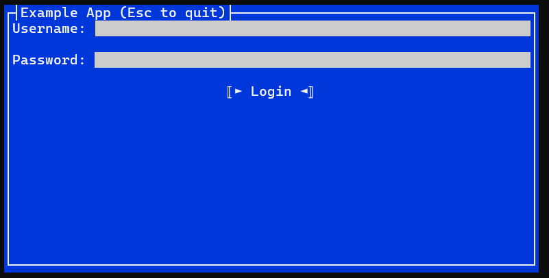

# Getting Started

Paste these commands into your favorite terminal on Windows, Mac, or Linux. This will install the [Terminal.Gui.Templates](https://github.com/gui-cs/Terminal.Gui.templates), create a new "Hello World" TUI app, and run it.

(Press `Esc` to exit the app)

```ps1
dotnet new --install Terminal.Gui.templates
dotnet new tui -n myproj
cd myproj
dotnet run
```

## Adding Terminal.Gui to a Project

To install Terminal.Gui from [Nuget](https://www.nuget.org/packages/Terminal.Gui) into a .NET Core project, use the `dotnet` CLI tool with this command.

```ps1
dotnet add package Terminal.Gui
```

## Using the Templates

Use the [Terminal.Gui.Templates](https://github.com/gui-cs/Terminal.Gui.templates).

## Sample Usage in C#

The following example shows a basic Terminal.Gui application in C# (this is `./Example/Example.cs`):

[!code-csharp[Program.cs](../../Example/Example.cs)]

When run the application looks as follows:



## Building the Library and Running the Examples

* Windows, Mac, and Linux - Build and run using the .NET SDK command line tools (`dotnet build` in the root directory). Run `UICatalog` with `dotnet run --project UICatalog`.
* Windows - Open `Terminal.sln` with Visual Studio 202x.

