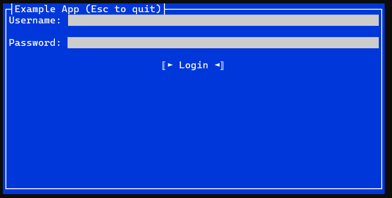

# Getting Started

Paste these commands into your favorite terminal on Windows, Mac, or Linux. This will install the [Terminal.Gui.Templates](https://github.com/gui-cs/Terminal.Gui.templates), create a new "Hello World" TUI app, and run it.

(Press `Esc` to exit the app)

```ps1
dotnet new install Terminal.Gui.Templates@2.0.*
dotnet new tui-simple -n myproj
cd myproj
dotnet run
```

## Adding Terminal.Gui to a Project

To install Terminal.Gui from [Nuget](https://www.nuget.org/packages/Terminal.Gui) into a .NET Core project, use the `dotnet` CLI tool with this command.

```ps1
dotnet add package Terminal.Gui
```

## Using the Templates

Use the [Terminal.Gui.Templates](https://github.com/gui-cs/Terminal.Gui.templates):

```ps1
dotnet new install Terminal.Gui.Templates@2.0.*
```

## Sample Usage in C#

The following example shows a basic Terminal.Gui application using the modern instance-based model:

```csharp
using Terminal.Gui.App;
using Terminal.Gui.ViewBase;
using Terminal.Gui.Views;

using IApplication app = Application.Create ();
app.Init ();

using Window window = new () { Title = "Hello World (Esc to quit)" };
Label label = new ()
{
    Text = "Hello, Terminal.Gui v2!",
    X = Pos.Center (),
    Y = Pos.Center ()
};
window.Add (label);

app.Run (window);
```

### Key aspects of the modern model:

- Use [Application.Create()](xref:Terminal.Gui.App.Application.Create*) to create an <xref:Terminal.Gui.App.IApplication> instance
- The application initializes automatically when you call `Run<T>()`
- Use `app.Run<ExampleWindow>()` to run a window that implements <xref:Terminal.Gui.App.IRunnable>
- Call `app.Dispose()` to clean up resources and restore the terminal
- Event handling uses <xref:Terminal.Gui.ViewBase.View.Accepting> event instead of legacy `Accept` event
- Set `e.Handled = true` in event handlers to prevent further processing

When run the application looks as follows:



## Building the Library and Running the Examples

* Windows, Mac, and Linux - Build and run using the .NET SDK command line tools (`dotnet build` in the root directory). Run `UICatalog` with `dotnet run --project Examples/UICatalog/UICatalog.csproj`.
* Additional examples are available in [gui-cs/Examples](https://github.com/gui-cs/Examples).
* Windows - Open `Terminal.sln` with Visual Studio 202x.
