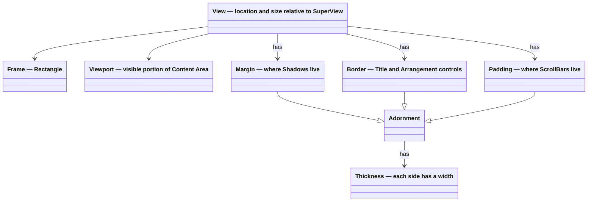

# Layout

Terminal.Gui provides a rich system for how [View](View.md) objects are laid out relative to each other. The layout system also defines how coordinates are specified.

See [View Deep Dive](View.md), [Arrangement Deep Dive](arrangement.md), [Scrolling Deep Dive](scrolling.md), and [Drawing Deep Dive](drawing.md) for more.

## Table of Contents

- [Lexicon & Taxonomy](#lexicon--taxonomy)
- [Arrangement Modes](#arrangement-modes)
- [Composition](#composition)
- [The Content Area](#the-content-area)
- [The Viewport](#the-viewport)
- [Layout Engine](#layout-engine)
  - [Pos](#pos)
  - [Dim](#dim)
- [How To](#how-to)
  - [Stretch a View Between Fixed Elements](#stretch-a-view-between-fixed-elements)
  - [Align Multiple Views (Like Dialog Buttons)](#align-multiple-views-like-dialog-buttons)
  - [Center with Auto-Sizing and Constraints (Like Dialog)](#center-with-auto-sizing-and-constraints-like-dialog)

---

## Lexicon & Taxonomy

[!INCLUDE [Layout Lexicon](~/includes/layout-lexicon.md)]

## Arrangement Modes

See [Arrangement Deep Dive](arrangement.md) for more.

## Composition

[!INCLUDE [View Composition](~/includes/view-composition.md)]

## The Content Area

**Content Area** refers to the rectangle with a location of `0,0` with the size returned by <xref:Terminal.Gui.View.GetContentSize>. 

The content area is the area where the view's content is drawn. Content can be any combination of the <xref:Terminal.Gui.View.Text> property, `SubViews`, and other content drawn by the View. The <xref:Terminal.Gui.View.GetContentSize> method gets the size of the content area of the view. 

 The Content Area size tracks the size of the <xref:Terminal.Gui.View.Viewport> by default. If the content size is set via <xref:Terminal.Gui.View.SetContentSize>, the content area is the provided size. If the content size is larger than the <xref:Terminal.Gui.View.Viewport>, scrolling is enabled. 

## The Viewport

The <xref:Terminal.Gui.View.Viewport> is a rectangle describing the portion of the **Content Area** that is visible to the user. It is a "portal" into the content. The `Viewport.Location` is relative to the top-left corner of the inner rectangle of `View.Padding`. If `Viewport.Size` is the same as `View.GetContentSize()`, `Viewport.Location` will be `0,0`. 

To enable scrolling call `View.SetContentSize()` and then set `Viewport.Location` to positive values. Making `Viewport.Location` positive moves the Viewport down and to the right in the content. 

See the [Scrolling Deep Dive](scrolling.md) for details on how to enable scrolling.

### Viewport Settings

The <xref:Terminal.Gui.View.ViewportSettings> property controls how the Viewport is constrained using <xref:Terminal.Gui.ViewBase.ViewportSettingsFlags>. By default, `ViewportSettings` is `None`, which provides sensible constraints for typical scrolling scenarios.

#### Default Behavior (No Flags Set)

With no flags set, the Viewport is constrained as follows:

- **No negative scrolling**: `Viewport.X` and `Viewport.Y` cannot go below `0`. The user cannot scroll above or to the left of the content origin.
- **Content fills the viewport**: The Viewport is clamped so that `Viewport.X + Viewport.Width <= ContentSize.Width` and `Viewport.Y + Viewport.Height <= ContentSize.Height`. This prevents blank space from appearing when scrolling - the content always fills the visible area.
- **Last row/column always visible**: Even if trying to scroll past the end of content, at least the last row and last column remain visible.

#### Flag Categories

The flags are organized into categories:

**Negative Location Flags** - Allow scrolling before the content origin (0,0):
- `AllowNegativeX` - Permits `Viewport.X < 0` (scroll left of content)
- `AllowNegativeY` - Permits `Viewport.Y < 0` (scroll above content)
- `AllowNegativeLocation` - Combines both X and Y

**Greater Than Content Flags** - Allow scrolling past the last row/column:
- `AllowXGreaterThanContentWidth` - Permits `Viewport.X >= ContentSize.Width`  
- `AllowYGreaterThanContentHeight` - Permits `Viewport.Y >= ContentSize.Height`
- `AllowLocationGreaterThanContentSize` - Combines both X and Y

**Blank Space Flags** - Allow blank space to appear when scrolling:
- `AllowXPlusWidthGreaterThanContentWidth` - Permits `Viewport.X + Viewport.Width > ContentSize.Width` (blank space on right)
- `AllowYPlusHeightGreaterThanContentHeight` - Permits `Viewport.Y + Viewport.Height > ContentSize.Height` (blank space on bottom)
- `AllowLocationPlusSizeGreaterThanContentSize` - Combines both X and Y

**Conditional Negative Flags** - Allow negative scrolling only when viewport is larger than content:
- `AllowNegativeXWhenWidthGreaterThanContentWidth` - Useful for centering content smaller than the view
- `AllowNegativeYWhenHeightGreaterThanContentHeight` - Useful for centering content smaller than the view
- `AllowNegativeLocationWhenSizeGreaterThanContentSize` - Combines both X and Y

**Drawing Flags** - Control clipping and clearing behavior:
- `ClipContentOnly` - Clips drawing to the visible content area instead of the entire Viewport
- `ClearContentOnly` - Clears only the visible content area (requires `ClipContentOnly`)
- `Transparent` - The view does not clear its background when drawing
- `TransparentMouse` - Mouse events pass through areas not occupied by SubViews

**ScrollBar Flags** - Enable built-in scrollbars:
- `HasVerticalScrollBar` - Enables the built-in <xref:Terminal.Gui.View.VerticalScrollBar> with <xref:Terminal.Gui.ScrollBarVisibilityMode.Auto> behavior (automatically shown when content exceeds viewport)
- `HasHorizontalScrollBar` - Enables the built-in <xref:Terminal.Gui.View.HorizontalScrollBar> with <xref:Terminal.Gui.ScrollBarVisibilityMode.Auto> behavior (automatically shown when content exceeds viewport)
- `HasScrollBars` - Combines both vertical and horizontal scrollbar flags

## Layout Engine

Terminal.Gui provides a rich system for how views are laid out relative to each other. The position of a view is set by setting the `X` and `Y` properties, which are of time <xref:Terminal.Gui.Pos>. The size is set via `Width` and `Height`, which are of type <xref:Terminal.Gui.Dim>.

The layout system uses virtual properties for categorization without type checking: `ReferencesOtherViews()`, `DependsOnSuperViewContentSize`, `CanContributeToAutoSizing`, `GetMinimumContribution()`, `IsFixed`, and `RequiresTargetLayout`. This enables extensibility.

```cs
var label1 = new Label () { X = 1, Y = 2, Width = 3, Height = 4, Title = "Absolute")

var label2 = new Label () {
    Title = "Computed",
    X = Pos.Right (otherView),
    Y = Pos.Center (),
    Width = Dim.Fill (),
    Height = Dim.Percent (50)
};
```

### <xref:Terminal.Gui.Pos>

<xref:Terminal.Gui.Pos> is the type of `View.X` and `View.Y` and supports the following sub-types:

* Absolute position, by passing an integer - <xref:Terminal.Gui.Pos.Absolute>.
* Percentage of the parent's view size - <xref:Terminal.Gui.Pos.Percent>(System.Int32)
* Anchored from the end of the dimension - <xref:Terminal.Gui.Pos.AnchorEnd>(System.Int32)
* Centered, using <xref:Terminal.Gui.Pos.Center>
* The <xref:Terminal.Gui.Pos.Left>, <xref:Terminal.Gui.Pos.Right>, <xref:Terminal.Gui.Pos.Top>, and <xref:Terminal.Gui.Pos.Bottom> tracks the position of another view.
* Aligned (left, right, center, etc...) with other views - <xref:Terminal.Gui.Pos.Align>
* An arbitrary function - <xref:Terminal.Gui.Pos.Func>

All `Pos` coordinates are relative to the SuperView's content area.

`Pos` values can be combined using addition or subtraction:

```cs
// Set the X coordinate to 10 characters left from the center
view.X = Pos.Center () - 10;
view.Y = Pos.Percent (20);

anotherView.X = AnchorEnd (10);
anotherView.Width = 9;

myView.X = Pos.X (view);
myView.Y = Pos.Bottom (anotherView) + 5;
```
### <xref:Terminal.Gui.Dim>

<xref:Terminal.Gui.Dim> is the type of `View.Width` and `View.Height` and supports the following sub-types:

* Automatic size based on the View's content (either SubViews or Text) - <xref:Terminal.Gui.Dim.Auto> - See [Dim.Auto Deep Dive](dimauto.md).
* Absolute size, by passing an integer - <xref:Terminal.Gui.Dim.Absolute>(System.Int32).
* Percentage of the SuperView's Content Area  - <xref:Terminal.Gui.Dim.Percent>(System.Int32).
* Fill to the end of the SuperView's Content Area - <xref:Terminal.Gui.Dim.Fill>. **Note:** `Dim.Fill` does not contribute to a SuperView's <xref:Terminal.Gui.Dim.Auto> sizing unless `minimumContentDim` is specified. See [Dim.Auto Deep Dive](dimauto.md) for details.
* Reference the Width or Height of another view - <xref:Terminal.Gui.Dim.Width>(Terminal.Gui.View), <xref:Terminal.Gui.Dim.Height>(Terminal.Gui.View).
* An arbitrary function - <xref:Terminal.Gui.Dim.Func>(System.Func{System.Int32}).

All `Dim` dimensions are relative to the SuperView's content area.

Like, `Pos`, objects of type `Dim` can be combined using addition or subtraction, like this:

```cs
// Set the Width to be 10 characters less than filling 
// the remaining portion of the screen
view.Width = Dim.Fill () - 10;

view.Height = Dim.Percent(20) - 1;

anotherView.Height = Dim.Height (view) + 1;
```



## How To

This section provides solutions to common layout scenarios.

### Stretch a View Between Fixed Elements

**Scenario:** A label on the left, a text field that stretches to fill available space, and a button anchored to the right:

```
[label][    stretching text field    ][button]
```

```cs
Label label = new () { Text = "_Name:" };
Button btn = new () { Text = "_OK", X = Pos.AnchorEnd () };
TextField textField = new ()
{
    X = Pos.Right (label) + 1,
    Width = Dim.Func (() => btn.Frame.X - label.Frame.Width - 1)
};
superView.Add (label, textField, btn);
```

### Align Multiple Views (Like Dialog Buttons)

**Scenario:** Align buttons horizontally using <xref:Terminal.Gui.Pos.Align>, as `Dialog` does:

```cs
Button cancelBtn = new ()
{
    Text = "_Cancel",
    X = Pos.Align (Alignment.End)
};
Button okBtn = new ()
{
    Text = "_OK",
    X = Pos.Align (Alignment.End)
};
superView.Add (cancelBtn, okBtn);
```

The `Pos.Align` method supports different alignments (`Start`, `Center`, `End`, `Fill`) and can add spacing between items via `AlignmentModes`.

### Center with Auto-Sizing and Constraints (Like Dialog)

**Scenario:** A centered view that auto-sizes to its content, with minimum and maximum constraints that account for adornments (Border, Margin, Padding). This is how `Dialog` positions and sizes itself:

```cs
Window popup = new ()
{
    X = Pos.Center (),
    Y = Pos.Center (),
    Width = Dim.Auto (
        minimumContentDim: 20,  // Minimum width
        maximumContentDim: Dim.Percent (100) - Dim.Func (_ => popup.GetAdornmentsThickness ().Horizontal)),
    Height = Dim.Auto (
        minimumContentDim: 5,   // Minimum height
        maximumContentDim: Dim.Percent (100) - Dim.Func (_ => popup.GetAdornmentsThickness ().Vertical))
};
```

The key insight is `maximumContentDim` subtracts the adornments thickness from 100% to ensure the view (including its Border, Margin, and Padding) never exceeds the SuperView's bounds.

