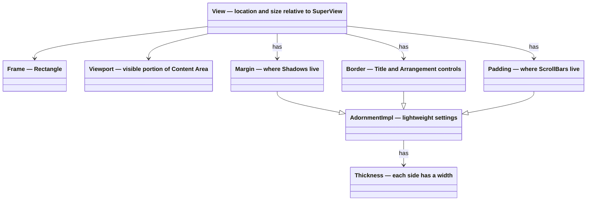

# Layout

Terminal.Gui layout is declarative and responsive. To define layout, describe how a [View](View.md) should relate to its `SuperView`, its content, and sibling views. To inspect the resolved result, read the final `Frame` after layout runs, including after terminal resizes.

To apply a mental model similar to responsive web or React-style layouts, declare relationships such as "center this", "fill the remaining space", "stay 1 cell to the right of that view", or "use 50% of the available width", and let the layout engine resolve the actual coordinates.

See [View Deep Dive](View.md), [Arrangement Deep Dive](arrangement.md), [Scrolling Deep Dive](scrolling.md), and [Drawing Deep Dive](drawing.md) for more.

## Table of Contents

- [Lexicon & Taxonomy](#lexicon--taxonomy)
- [Arrangement Modes](#arrangement-modes)
- [Composition](#composition)
- [The Content Area](#the-content-area)
- [The Viewport](#the-viewport)
- [Responsive Mental Model](#responsive-mental-model)
- [Layout Engine](#layout-engine)
  - [Pos](#pos)
  - [Dim](#dim)
- [How To](#how-to)
  - [Stretch a View Between Fixed Elements](#stretch-a-view-between-fixed-elements)
  - [Align Multiple Views (Like Dialog Buttons)](#align-multiple-views-like-dialog-buttons)
  - [Center with Auto-Sizing and Constraints (Like Dialog)](#center-with-auto-sizing-and-constraints-like-dialog)

---

## Lexicon & Taxonomy

[!INCLUDE [Layout Lexicon](~/includes/layout-lexicon.md)]

## Arrangement Modes

See [Arrangement Deep Dive](arrangement.md) for more.

## Composition

[!INCLUDE [View Composition](~/includes/view-composition.md)]

## The Content Area

**Content Area** refers to the rectangle with a location of `0,0` with the size returned by `GetContentSize()`. 

The content area is the area where the view's content is drawn. Content can be any combination of the `Text` property, `SubViews`, and other content drawn by the View. The `GetContentSize()` method gets the size of the content area of the view. 

 The Content Area size tracks the size of the `Viewport` by default. If the content size is set via `SetContentSize()`, the content area is the provided size. If the content size is larger than the `Viewport`, scrolling is enabled. 

## The Viewport

The `Viewport` is a rectangle describing the portion of the **Content Area** that is visible to the user. It is a "portal" into the content. The `Viewport.Location` is relative to the top-left corner of the inner rectangle of `View.Padding`. If `Viewport.Size` is the same as `View.GetContentSize()`, `Viewport.Location` will be `0,0`. 

To enable scrolling call `View.SetContentSize()` and then set `Viewport.Location` to positive values. Making `Viewport.Location` positive moves the Viewport down and to the right in the content. 

See the [Scrolling Deep Dive](scrolling.md) for details on how to enable scrolling.

### Viewport Settings

The `ViewportSettings` property controls how the Viewport is constrained using <xref:Terminal.Gui.ViewBase.ViewportSettingsFlags>. By default, `ViewportSettings` is `None`, which provides sensible constraints for typical scrolling scenarios.

#### Default Behavior (No Flags Set)

With no flags set, the Viewport is constrained as follows:

- **No negative scrolling**: `Viewport.X` and `Viewport.Y` cannot go below `0`. The user cannot scroll above or to the left of the content origin.
- **Content fills the viewport**: The Viewport is clamped so that `Viewport.X + Viewport.Width <= ContentSize.Width` and `Viewport.Y + Viewport.Height <= ContentSize.Height`. This prevents blank space from appearing when scrolling - the content always fills the visible area.
- **Last row/column always visible**: Even if trying to scroll past the end of content, at least the last row and last column remain visible.

#### Flag Categories

The flags are organized into categories:

**Negative Location Flags** - Allow scrolling before the content origin (0,0):
- `AllowNegativeX` - Permits `Viewport.X < 0` (scroll left of content)
- `AllowNegativeY` - Permits `Viewport.Y < 0` (scroll above content)
- `AllowNegativeLocation` - Combines both X and Y

**Greater Than Content Flags** - Allow scrolling past the last row/column:
- `AllowXGreaterThanContentWidth` - Permits `Viewport.X >= ContentSize.Width`  
- `AllowYGreaterThanContentHeight` - Permits `Viewport.Y >= ContentSize.Height`
- `AllowLocationGreaterThanContentSize` - Combines both X and Y

**Blank Space Flags** - Allow blank space to appear when scrolling:
- `AllowXPlusWidthGreaterThanContentWidth` - Permits `Viewport.X + Viewport.Width > ContentSize.Width` (blank space on right)
- `AllowYPlusHeightGreaterThanContentHeight` - Permits `Viewport.Y + Viewport.Height > ContentSize.Height` (blank space on bottom)
- `AllowLocationPlusSizeGreaterThanContentSize` - Combines both X and Y

**Conditional Negative Flags** - Allow negative scrolling only when viewport is larger than content:
- `AllowNegativeXWhenWidthGreaterThanContentWidth` - Useful for centering content smaller than the view
- `AllowNegativeYWhenHeightGreaterThanContentHeight` - Useful for centering content smaller than the view
- `AllowNegativeLocationWhenSizeGreaterThanContentSize` - Combines both X and Y

**Drawing Flags** - Control clipping and clearing behavior:
- `ClipContentOnly` - Clips drawing to the visible content area instead of the entire Viewport
- `ClearContentOnly` - Clears only the visible content area (requires `ClipContentOnly`)
- `Transparent` - The view does not clear its background when drawing
- `TransparentMouse` - Mouse events pass through areas not occupied by SubViews

**ScrollBar Flags** - Enable built-in scrollbars:
- `HasVerticalScrollBar` - Enables the built-in `VerticalScrollBar` with <xref:Terminal.Gui.Views.ScrollBarVisibilityMode>.Auto behavior (automatically shown when content exceeds viewport)
- `HasHorizontalScrollBar` - Enables the built-in `HorizontalScrollBar` with <xref:Terminal.Gui.Views.ScrollBarVisibilityMode>.Auto behavior (automatically shown when content exceeds viewport)
- `HasScrollBars` - Combines both vertical and horizontal scrollbar flags

## Responsive Mental Model

To reason about Terminal.Gui layout, think of it as a small responsive layout language for TUIs:

- `X` and `Y` answer **where should this view start?**
- `Width` and `Height` answer **how much space should it take?**
- `Pos` expresses location relationships.
- `Dim` expresses size relationships.
- `Frame` is the resolved result after layout runs.

To build adaptive UIs, work with `Pos` and `Dim`, not `Frame`.

Common patterns include:

- Pinning to an edge with `Pos.AnchorEnd ()`
- Centering with `Pos.Center ()`
- Following another view with `Pos.Right (otherView)` or `Pos.Bottom (otherView)`
- Taking a percentage of the available space with `Dim.Percent (...)`
- Filling leftover space with `Dim.Fill ()` or `Dim.Fill (to: otherView)`
- Growing to content with `Dim.Auto ()`

When the terminal size changes, or when the size of a `SuperView` or referenced view changes, layout runs again and these relationships are resolved into a new `Frame`. This is what makes Terminal.Gui layouts responsive.

## Layout Engine

The primary layout API is:

- `X` and `Y` for position, using <xref:Terminal.Gui.ViewBase.Pos>
- `Width` and `Height` for size, using <xref:Terminal.Gui.ViewBase.Dim>

These values are relative to the `SuperView`'s content area, not the screen.

```cs
Label nameLabel = new () { Text = "Name:" };
Button okButton = new () { Text = "OK", X = Pos.AnchorEnd () };
TextField nameField = new ()
{
    X = Pos.Right (nameLabel) + 1,
    Y = Pos.Top (nameLabel),
    Width = Dim.Fill (to: okButton)
};
```

In this example:

- `nameLabel` keeps its content-based width
- `okButton` stays anchored to the end of the line
- `nameField` stretches and shrinks between them

If the terminal or `SuperView` grows or shrinks, the same declarations are re-evaluated and the final `Frame` values change automatically.

For advanced scenarios and custom layout primitives, the layout system also exposes virtual categorization hooks such as `ReferencesOtherViews()`, `DependsOnSuperViewContentSize`, `CanContributeToAutoSizing`, `GetMinimumContribution()`, `IsFixed`, and `RequiresTargetLayout`.

```cs
Label absoluteLabel = new () { X = 1, Y = 2, Width = 12, Height = 1, Text = "Absolute" };

Label responsiveLabel = new ()
{
    Text = "Responsive",
    X = Pos.Right (otherView),
    Y = Pos.Center (),
    Width = Dim.Fill (),
    Height = Dim.Percent (50)
};
```

### Pos

<xref:Terminal.Gui.ViewBase.Pos> is the type of `View.X` and `View.Y`. To make a view's position respond to available space or other views instead of using a fixed coordinate, use it.

* Absolute position, by passing an integer - `Pos.Absolute ()`
* Percentage of the `SuperView` size - `Pos.Percent ()`
* Anchored from the end of the dimension - `Pos.AnchorEnd ()`
* Centered - `Pos.Center ()`
* Tracking another view - `Pos.Left ()`, `Pos.Right ()`, `Pos.Top ()`, `Pos.Bottom ()`
* Aligning as a group - `Pos.Align ()`
* Computing from a function - `Pos.Func ()`

All <xref:Terminal.Gui.ViewBase.Pos> coordinates are relative to the SuperView's content area.

<xref:Terminal.Gui.ViewBase.Pos> values can be combined using addition or subtraction, making it easy to express offsets in a responsive layout:

```cs
// Set the X coordinate to 10 characters left from the center
view.X = Pos.Center () - 10;
view.Y = Pos.Percent (20);

anotherView.X = Pos.AnchorEnd (10);
anotherView.Width = 9;

myView.X = Pos.X (view);
myView.Y = Pos.Bottom (anotherView) + 5;
```
### Dim

<xref:Terminal.Gui.ViewBase.Dim> is the type of `View.Width` and `View.Height`. To make size respond to content, terminal size, or sibling views instead of using a fixed number of cells, use it.

* Automatic size based on the view's content - `Dim.Auto ()` - See [Dim.Auto Deep Dive](dimauto.md)
* Absolute size, by passing an integer - `Dim.Absolute ()`
* Percentage of the `SuperView` content area - `Dim.Percent ()`
* Fill the remaining space - `Dim.Fill ()`
* Fill up to another view - `Dim.Fill (to: otherView)`
* Track another view's size - `Dim.Width ()`, `Dim.Height ()`
* Compute from a function - `Dim.Func ()`

`Dim.Fill ()` is especially useful for responsive forms and panes. **Note:** `Dim.Fill` does not contribute to a `SuperView`'s `Dim.Auto ()` sizing unless `minimumContentDim` is specified. See [Dim.Auto Deep Dive](dimauto.md) for details.

All <xref:Terminal.Gui.ViewBase.Dim> dimensions are relative to the SuperView's content area.

Like <xref:Terminal.Gui.ViewBase.Pos>, objects of type <xref:Terminal.Gui.ViewBase.Dim> can be combined using addition or subtraction:

```cs
// Set the Width to be 10 characters less than filling 
// the remaining portion of the screen
view.Width = Dim.Fill () - 10;

view.Height = Dim.Percent (20) - 1;

anotherView.Height = Dim.Height (view) + 1;
```



## How To

To solve common layout scenarios, use this section.

### Stretch a View Between Fixed Elements

**Scenario:** A label on the left, a text field that stretches to fill available space, and a button anchored to the right. This is a classic responsive form row:

```
[label][    stretching text field    ][button]
```

```cs
Label label = new () { Text = "_Name:" };
Button btn = new () { Text = "_OK", X = Pos.AnchorEnd () };
TextField textField = new ()
{
    X = Pos.Right (label) + 1,
    Width = Dim.Fill (to: btn)
};
superView.Add (label, textField, btn);
```

The text field expands and contracts automatically as the available width changes.
Here `to: btn` names the `Dim.Fill` parameter that tells the text field where its fill should stop.

### Align Multiple Views (Like Dialog Buttons)

**Scenario:** Align buttons horizontally using `Pos.Align()`, as <xref:Terminal.Gui.Views.Dialog> does:

```cs
Button cancelBtn = new ()
{
    Text = "_Cancel",
    X = Pos.Align (Alignment.End)
};
Button okBtn = new ()
{
    Text = "_OK",
    X = Pos.Align (Alignment.End)
};
superView.Add (cancelBtn, okBtn);
```

The `Pos.Align` method supports different alignments (`Start`, `Center`, `End`, `Fill`) and can add spacing between items via `AlignmentModes`.

### Center with Auto-Sizing and Constraints (Like Dialog)

**Scenario:** A centered view that auto-sizes to its content, with minimum and maximum constraints that account for adornments (<xref:Terminal.Gui.ViewBase.Border>, <xref:Terminal.Gui.ViewBase.Margin>, <xref:Terminal.Gui.ViewBase.Padding>). This is how <xref:Terminal.Gui.Views.Dialog> positions and sizes itself:

```cs
Window popup = new ()
{
    X = Pos.Center (),
    Y = Pos.Center (),
    Width = Dim.Auto (
        minimumContentDim: 20,  // Minimum width
        maximumContentDim: Dim.Percent (100) - Dim.Func (_ => popup.GetAdornmentsThickness ().Horizontal)),
    Height = Dim.Auto (
        minimumContentDim: 5,   // Minimum height
        maximumContentDim: Dim.Percent (100) - Dim.Func (_ => popup.GetAdornmentsThickness ().Vertical))
};
```

The key insight is `maximumContentDim` subtracts the adornments thickness from 100% to ensure the view (including its <xref:Terminal.Gui.ViewBase.Border>, <xref:Terminal.Gui.ViewBase.Margin>, and <xref:Terminal.Gui.ViewBase.Padding>) never exceeds the SuperView's bounds.
