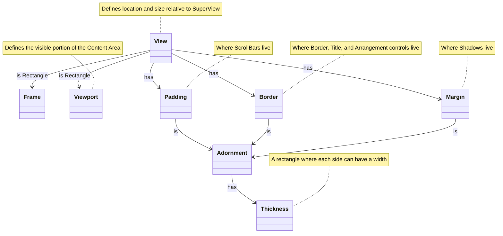

# Layout

Terminal.Gui provides a rich system for how [View](View.md) objects are laid out relative to each other. The layout system also defines how coordinates are specified.

See [View Deep Dive](View.md), [Arrangement Deep Dive](arrangement.md), [Scrolling Deep Dive](scrolling.md), and [Drawing Deep Dive](drawing.md) for more.

## Lexicon & Taxonomy

### Coordinates

* **Screen-Relative** - Describes the dimensions and characteristics of the underlying terminal. Currently Terminal.Gui only supports applications that run "full-screen", meaning they fill the entire terminal when running. As the user resizes their terminal, the @Terminal.Gui.App.Application.Screen changes size and the application will be resized to fit. *Screen-Relative* means an origin (`0, 0`) at the top-left corner of the terminal. @Terminal.Gui.Drivers.ConsoleDriver implementations operate exclusively on *Screen-Relative* coordinates.

* **Application-Relative** - The dimensions and characteristics of the application. Because only full-screen apps are currently supported, @Terminal.Gui.App.Application is effectively the same as `Screen` from a layout perspective. *Application-Relative* currently means an origin (`0, 0`) at the top-left corner of the terminal. @Terminal.Gui.App.Application.Top  is a `View` with a top-left corner fixed at the *Application.Relative* coordinate of (`0, 0`) and is the size of `Screen`.

* **Frame-Relative**  - The @Terminal.Gui.ViewBase.View.Frame property of a `View` is a rectangle that describes the current location and size of the view relative to the `Superview`'s content area. *Frame-Relative* means a coordinate is relative to the top-left corner of the View in question. @Terminal.Gui.ViewBase.View.FrameToScreen* and @Terminal.Gui.ViewBase.View.ScreenToFrame* are helper methods for translating a *Frame-Relative* coordinate to a *Screen-Relative* coordinate and vice-versa.

* **Content-Relative** - A rectangle, with an origin of (`0, 0`) and size, defined by @Terminal.Gui.ViewBase.View.GetContentSize*, where the View's content exists. *Content-Relative* means a coordinate is relative to the top-left corner of the content, which is always (`0,0`). @Terminal.Gui.ViewBase.View.ContentToScreen* and @Terminal.Gui.ViewBase.View.ScreenToContent* are helper methods for translating a *Content-Relative* coordinate to a *Screen-Relative* coordinate and vice-versa.

* **Viewport-Relative** - A *Content-Relative* rectangle representing the subset of the View's content that is visible to the user: @Terminal.Gui.ViewBase.View.Viewport. 

    If @Terminal.Gui.ViewBase.View.GetContentSize* is larger than the @Terminal.Gui.ViewBase.View.Viewport, scrolling is enabled. 
    
    *Viewport-Relative* means a coordinate that is bound by (`0,0`) and the size of the inner-rectangle of the View's `Padding`. The View drawing primitives (e.g. `View.Move`) take *Viewport-Relative* coordinates; `Move (0, 0)` means the `Cell` in the top-left corner of the inner rectangle of `Padding`. `View.ViewportToScreen ()` and `View.ScreenToViewport ()` are helper methods for translating a *Viewport-Relative* coordinate to a *Screen-Relative* coordinate and vice-versa. To convert a *Viewport-Relative* coordinate to a *Content-Relative* coordinate, simply subtract `Viewport.X` and/or `Viewport.Y` from the *Content-Relative* coordinate. To convert a *Viewport-Relative* coordinate to a *Frame-Relative* coordinate, subtract the point returned by @Terminal.Gui.ViewBase.View.GetViewportOffsetFromFrame.

### View Composition

* `Content Area` - Describes the View's total content. The location of the content is always `(0, 0)` and the size is set by @Terminal.Gui.ViewBase.View.SetContentSize* and defaults to the size of the `Viewport`. If the content size is larger than the `Viewport`, scrolling is enabled. See also @Terminal.Gui.ViewBase.View.ViewportSettings.

* @Terminal.Gui.ViewBase.View.Frame - A `Rectangle` that defines the location and size of the @Terminal.Gui.ViewBase.View. The coordinates are relative to the SuperView of the View (or, in the case of `Application.Top`, the console size). The Frame's location and size are controlled by @Terminal.Gui.ViewBase.View.X, @Terminal.Gui.ViewBase.View.Y, @Terminal.Gui.ViewBase.View.Width, and @Terminal.Gui.ViewBase.View.Height.

  All aspects of the View's composition are defined by the Frame. 

* @Terminal.Gui.Drawing.Thickness - A smart `record struct` describing a rectangle where each of the four sides can have a width. Valid width values are >= 0. The inner area of a Thickness is the sum of the widths of the four sides minus the size of the rectangle.

* @Terminal.Gui.ViewBase.Adornment - The `Thickness`es that separate the `Frame` from the `Viewport`. There are three Adornments, `Margin`, `Padding`, and `Border`. Adornments are not part of the View's content and are not clipped by the View's `ClipArea`. 

  * @Terminal.Gui.ViewBase.View.Margin - The outermost `Adornment`. The outside of the margin is a rectangle the same size as the `Frame`. By default `Margin` is `{0,0,0,0}`. When made thicker, Margins are visually transparent and transparent to mouse events by default. These defaults can be changed via @Terminal.Gui.ViewBase.View.ViewportSettings.

    Enabling @Terminal.Gui.ViewBase.Margin.ShadowStyle will change the `Thickness` of the `Margin` to include a 3D shadow.

    `Margin` can be used instead of (or with) `Dim.Pos` to provide spacing between a View and another View. 

    Eg. 
    ```cs
    view.X = Pos.Right (otherView) + 1;
    view.Y = Pos.Bottom (otherView) + 1;
    ```
    is equivalent to 
    ```cs
    otherView.Margin.Thickness = new Thickness (0, 0, 1, 1);
    view.X = Pos.Right (otherView);
    view.Y = Pos.Bottom (otherView);
    ```

  * @Terminal.Gui.ViewBase.View.Border - The `Adornment` that resides in the inside of the `Margin`. The Border is where a visual border (drawn using line-drawing glyphs) and the @Terminal.Gui.ViewBase.View.Title are drawn, and where the user can interact with the mouse/keyboard to adjust the Views' [Arrangement](arrangement.md). 

    The Border expands inward; in other words if `Border.Thickness.Top == 2` the border & title will take up the first row and the second row will be filled with spaces. 

  * @Terminal.Gui.ViewBase.View.Padding  - The `Adornment` resides in the inside of the `Border` and outside of the `Viewport`. `Padding` is `{0, 0, 0, 0}` by default. Padding is not part of the View's content and is not clipped by the View's `Clip`. 

    When, enabled, scroll bars reside within `Padding`. See @Terminal.Gui.ViewBase.View.ViewportSettings and @Terminal.Gui.ViewBase.View.HorizontalScrollBar for more.

* @Terminal.Gui.ViewBase.View.Viewport - The `Rectangle` that describes the portion of the View's `Content Area` that is currently visible to the user. If size of the `Content Area`is larger than the `Viewport`, scrolling is enabled and the `Viewport` location determines which portion of the content is visible. 
    
    Positive values for the location indicate the visible area is offset into (down-and-right) the View's virtual `ContentArea`. This enables scrolling down and to the right (e.g. in a `ListView`).

    Negative values for the location indicate the visible area is offset above (up-and-left) the View's virtual `ContentArea`. This enables scrolling up and to the left (e.g. in an image viewer that supports zoom where the image stays centered).

    For example, if the `Viewport` is set to `(5, 5, 10, 10)` and the content size is `(20, 20)`, the content at `(5, 5)` through `(14, 14)` will be visible.



## Arrangement Modes

See [Arrangement Deep Dive](arrangement.md) for more.

* *Tile*, *Tiled*, *Tiling* - Refer to a form of Views that are visually arranged such that they abut each other and do not overlap. In a Tiled view arrangement, Z-ordering only comes into play when a developer intentionally causes views to be aligned such that they overlap. Borders that are drawn between the SubViews can optionally support resizing the SubViews (negating the need for `TileView`).

* *Overlap*, *Overlapped*, *Overlapping* - Refers to a form [Layout](layout.md) where SubViews of a View are visually arranged such that their Frames overlap. In Overlap view arrangements there is a Z-axis (Z-order) in addition to the X and Y dimension. The Z-order indicates which Views are shown above other views.

## The Content Area

**Content Area** refers to the rectangle with a location of `0,0` with the size returned by @Terminal.Gui.ViewBase.View.GetContentSize*. 

The content area is the area where the view's content is drawn. Content can be any combination of the @Terminal.Gui.ViewBase.View.Text property, `SubViews`, and other content drawn by the View. The @Terminal.Gui.ViewBase.View.GetContentSize* method gets the size of the content area of the view. 

 The Content Area size tracks the size of the @Terminal.Gui.ViewBase.View.Viewport by default. If the content size is set via @Terminal.Gui.ViewBase.View.SetContentSize*, the content area is the provided size. If the content size is larger than the @Terminal.Gui.ViewBase.View.Viewport, scrolling is enabled. 

## The Viewport

The @Terminal.Gui.ViewBase.View.Viewport is a rectangle describing the portion of the **Content Area** that is visible to the user. It is a "portal" into the content. The `Viewport.Location` is relative to the top-left corner of the inner rectangle of `View.Padding`. If `Viewport.Size` is the same as `View.GetContentSize()`, `Viewport.Location` will be `0,0`. 

To enable scrolling call `View.SetContentSize()` and then set `Viewport.Location` to positive values. Making `Viewport.Location` positive moves the Viewport down and to the right in the content. 

See the [Scrolling Deep Dive](scrolling.md) for details on how to enable scrolling.

The @Terminal.Gui.ViewBase.View.ViewportSettings property controls how the Viewport is constrained. By default, the `ViewportSettings` is set to `ViewportSettings.None`. To enable the viewport to be moved up-and-to-the-left of the content, use `ViewportSettings.AllowNegativeX` and or `ViewportSettings.AllowNegativeY`. 

The default `ViewportSettings` also constrains the Viewport to the size of the content, ensuring the right-most column or bottom-most row of the content will always be visible (in v1 the equivalent concept was `ScrollBarView.AlwaysKeepContentInViewport`). To allow the Viewport to be smaller than the content, set `ViewportSettings.AllowXGreaterThanContentWidth` and/or `ViewportSettings.AllowXGreaterThanContentHeight`.

## Layout Engine

Terminal.Gui provides a rich system for how views are laid out relative to each other. The position of a view is set by setting the `X` and `Y` properties, which are of time @Terminal.Gui.ViewBase.Pos. The size is set via `Width` and `Height`, which are of type @Terminal.Gui.ViewBase.Dim.

```cs
var label1 = new Label () { X = 1, Y = 2, Width = 3, Height = 4, Title = "Absolute")

var label2 = new Label () {
    Title = "Computed",
    X = Pos.Right (otherView),
    Y = Pos.Center (),
    Width = Dim.Fill (),
    Height = Dim.Percent (50)
};
```

### @Terminal.Gui.ViewBase.Pos

@Terminal.Gui.ViewBase.Pos is the type of `View.X` and `View.Y` and supports the following sub-types:

* Absolute position, by passing an integer - @Terminal.Gui.ViewBase.Pos.Absolute*.
* Percentage of the parent's view size - @Terminal.Gui.ViewBase.Pos.Percent(System.Int32)
* Anchored from the end of the dimension - @Terminal.Gui.ViewBase.Pos.AnchorEnd(System.Int32)
* Centered, using @Terminal.Gui.ViewBase.Pos.Center*
* The @Terminal.Gui.ViewBase.Pos.Left*, @Terminal.Gui.ViewBase.Pos.Right*, @Terminal.Gui.ViewBase.Pos.Top*, and @Terminal.Gui.ViewBase.Pos.Bottom* tracks the position of another view.
* Aligned (left, right, center, etc...) with other views - @Terminal.Gui.ViewBase.Pos.Align*
* An arbitrary function - @Terminal.Gui.ViewBase.Pos.Func*

All `Pos` coordinates are relative to the SuperView's content area.

`Pos` values can be combined using addition or subtraction:

```cs
// Set the X coordinate to 10 characters left from the center
view.X = Pos.Center () - 10;
view.Y = Pos.Percent (20);

anotherView.X = AnchorEnd (10);
anotherView.Width = 9;

myView.X = Pos.X (view);
myView.Y = Pos.Bottom (anotherView) + 5;
```
### @Terminal.Gui.ViewBase.Dim

@Terminal.Gui.ViewBase.Dim is the type of `View.Width` and `View.Height` and supports the following sub-types:

* Automatic size based on the View's content (either SubViews or Text) - @Terminal.Gui.ViewBase.Dim.Auto* - See [Dim.Auto Deep Dive](dimauto.md).
* Absolute size, by passing an integer - @Terminal.Gui.ViewBase.Dim.Absolute(System.Int32).
* Percentage of the SuperView's Content Area  - @Terminal.Gui.ViewBase.Dim.Percent(System.Int32).
* Fill to the end of the SuperView's Content Area - @Terminal.Gui.ViewBase.Dim.Fill*.
* Reference the Width or Height of another view - @Terminal.Gui.ViewBase.Dim.Width(Terminal.Gui.ViewBase.View), @Terminal.Gui.ViewBase.Dim.Height(Terminal.Gui.ViewBase.View).
* An arbitrary function - @Terminal.Gui.ViewBase.Dim.Func(System.Func{System.Int32}).

All `Dim` dimensions are relative to the SuperView's content area.

Like, `Pos`, objects of type `Dim` can be combined using addition or subtraction, like this:

```cs
// Set the Width to be 10 characters less than filling 
// the remaining portion of the screen
view.Width = Dim.Fill () - 10;

view.Height = Dim.Percent(20) - 1;

anotherView.Height = Dim.Height (view) + 1;
```
