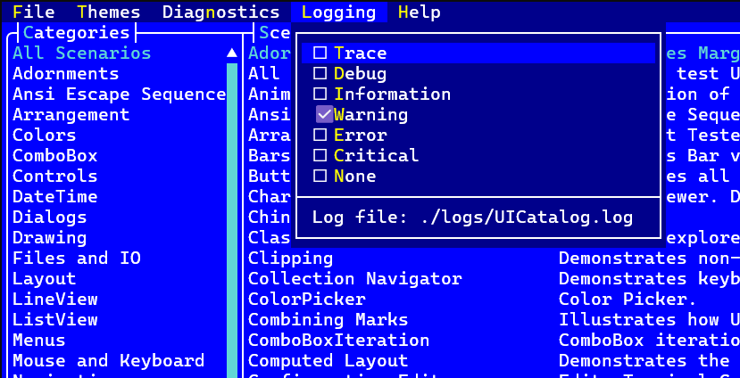

# Logging

Terminal.Gui provides comprehensive logging of library internals via the @Terminal.Gui.App.Logging class. Logging helps diagnose issues with terminals, keyboard layouts, drivers, and platform-specific behavior.

> [!IMPORTANT]
> **Do not use console loggers** - they interfere with Terminal.Gui's screen output. Use file, debug output, or network-based sinks instead.

## Quick Start

Set the global logger at application startup:

```csharp
using Microsoft.Extensions.Logging;
using Terminal.Gui;

// Create any ILogger (file-based recommended)
Logging.Logger = myFileLogger;

// Now all Terminal.Gui internals log to your logger
Application.Init();
Application.Run<MyWindow>();
Application.Shutdown();
```

## API Overview

The @Terminal.Gui.App.Logging class provides:

| Member | Description |
|--------|-------------|
| `Logger` | Gets/sets the global `ILogger` instance (default: `NullLogger`) |
| `PushLogger(ILogger)` | Pushes a scoped logger for the current async context; returns `IDisposable` |
| `Trace(message)` | Logs verbose diagnostic information |
| `Debug(message)` | Logs debugging information |
| `Information(message)` | Logs general operational messages |
| `Warning(message)` | Logs unusual conditions |
| `Error(message)` | Logs error conditions |
| `Critical(message)` | Logs fatal/critical failures |

All log methods automatically include the calling class and method name.

## Global vs Scoped Logging

### Global Logger (Default)

Set `Logging.Logger` once at startup. All Terminal.Gui code uses this logger:

```csharp
Logging.Logger = CreateFileLogger();
// All logging goes here until changed
```

### Scoped Logger (Advanced)

Use `PushLogger()` to temporarily redirect logs for the current async context. This is useful for:
- **Unit tests** - capture logs per-test without interference
- **Scenarios** - isolate logs for specific operations
- **Diagnostics** - capture logs for a specific code path

```csharp
// Logs go to global logger
Logging.Information("Before scope");

using (Logging.PushLogger(myTestLogger))
{
    // Logs go to myTestLogger
    Logging.Information("Inside scope");
    
    await SomeAsyncOperation(); // Still goes to myTestLogger
}

// Logs go back to global logger
Logging.Information("After scope");
```

Scoped loggers:
- Flow across `await` boundaries (uses `AsyncLocal<T>`)
- Can be nested (inner scope restores outer scope on dispose)
- Fall back to global logger when no scope is active

## Example: Serilog File Logger

Add Serilog packages:

```bash
dotnet add package Serilog
dotnet add package Serilog.Sinks.File
dotnet add package Serilog.Extensions.Logging 
```

Configure at startup:

```csharp
using Microsoft.Extensions.Logging;
using Serilog;
using Terminal.Gui;

Logging.Logger = CreateLogger();
Application.Init();
// ... run your app
Application.Shutdown();

static ILogger CreateLogger()
{
    Log.Logger = new LoggerConfiguration()
        .MinimumLevel.Verbose()
        .WriteTo.File("logs/terminalGui.txt", rollingInterval: RollingInterval.Day)
        .CreateLogger();

    using ILoggerFactory factory = LoggerFactory.Create(builder =>
        builder.AddSerilog(dispose: true)
               .SetMinimumLevel(LogLevel.Trace));

    return factory.CreateLogger("Terminal.Gui");
}
```

Example output:

```
2025-02-15 13:36:48.635 +00:00 [INF] Main Loop Coordinator booting...
2025-02-15 13:36:48.663 +00:00 [INF] Creating NetOutput
2025-02-15 13:36:48.668 +00:00 [INF] Creating NetInput
2025-02-15 13:36:49.145 +00:00 [INF] Run 'MainWindow(){X=0,Y=0,Width=0,Height=0}'
2025-02-15 13:36:49.167 +00:00 [INF] Console size changes to {Width=120, Height=30}
2025-02-15 13:36:54.151 +00:00 [INF] RequestStop ''
2025-02-15 13:36:54.225 +00:00 [INF] Input loop exited cleanly
```

## Example: Unit Test Logging

Use `TestLogging` helper to capture Terminal.Gui logs in xUnit test output:

```csharp
using Terminal.Gui;
using Terminal.Gui.Tests;
using Xunit;
using Xunit.Abstractions;

public class MyTests
{
    private readonly ITestOutputHelper _output;

    public MyTests(ITestOutputHelper output) => _output = output;

    [Fact]
    public void MyTest()
    {
        // Default: only Warning and Error appear in test output
        using (TestLogging.BindTo(_output))
        {
            Application.Init();
            // ... test code - only warnings/errors logged
            Application.Shutdown();
        }
    }

    [Fact]
    public void MyTest_Debugging()
    {
        // Verbose: all log levels for debugging a specific test
        using (TestLogging.Verbose(_output))
        {
            Application.Init();
            // ... test code - all logs appear
            Application.Shutdown();
        }
    }
}
```

### TestLogging API

| Method | Description |
|--------|-------------|
| `TestLogging.BindTo(output)` | Default - only Warning and above |
| `TestLogging.BindTo(output, LogLevel.Debug)` | Custom minimum level |
| `TestLogging.Verbose(output)` | All levels (Trace and above) |

### Direct PushLogger Usage

For custom logging behavior, use `Logging.PushLogger()` directly:

```csharp
using Microsoft.Extensions.Logging;

// Custom logger implementation
public class XUnitLogger(ITestOutputHelper output, LogLevel minLevel = LogLevel.Warning) : ILogger
{
    public IDisposable? BeginScope<TState>(TState state) where TState : notnull => null;
    public bool IsEnabled(LogLevel logLevel) => logLevel >= minLevel;
    
    public void Log<TState>(LogLevel logLevel, EventId eventId, TState state, 
        Exception? exception, Func<TState, Exception?, string> formatter)
    {
        if (!IsEnabled(logLevel)) return;
        try { output.WriteLine($"[{logLevel}] {formatter(state, exception)}"); }
        catch (InvalidOperationException) { /* Test completed */ }
    }
}

// Usage
using (Logging.PushLogger(new XUnitLogger(_output, LogLevel.Debug)))
{
    // Logs at Debug and above appear in test output
}
```

## UICatalog

UICatalog includes built-in logging UI. Access via the **Logging** menu to:
- View logs in real-time
- Change log level at runtime
- Toggle Command, Mouse, and Keyboard tracing
- See scenario-specific logs



## View Event Tracing

Terminal.Gui includes a unified tracing system for debugging event flow through the view hierarchy. Three categories can be enabled independently:

| Category | Property | What It Traces |
|----------|----------|----------------|
| Command | `Trace.CommandEnabled` | Command routing (InvokeCommand, bubbling, dispatch) |
| Mouse | `Trace.MouseEnabled` | Mouse events (clicks, drags, wheel) |
| Keyboard | `Trace.KeyboardEnabled` | Keyboard events (key down, key up) |

### Enabling Tracing

**Via code:**

```csharp
Trace.CommandEnabled = true;   // Command routing
Trace.MouseEnabled = true;     // Mouse events  
Trace.KeyboardEnabled = true;  // Keyboard events
```

When tracing is enabled, output automatically goes to `Logging.Debug` via the `LoggingBackend`.

**Via configuration:**

```json
{
  "Trace.CommandEnabled": true,
  "Trace.MouseEnabled": false,
  "Trace.KeyboardEnabled": true
}
```

**Via UICatalog:** Toggle in **Logging** menu → **Command Trace** / **Mouse Trace** / **Keyboard Trace**

### Custom Trace Backends

For testing or custom logging, use `Trace.Backend`:

```csharp
// Capture traces for assertions
var backend = new Trace.ListBackend();
Trace.Backend = backend;
Trace.CommandEnabled = true;

// ... run code ...

// Inspect captured traces
foreach (var entry in backend.Entries)
{
    Console.WriteLine($"{entry.Category}: {entry.ViewId} - {entry.Phase}");
}
```

See [Command Deep Dive - Command Route Tracing](command.md#command-route-tracing) for detailed command tracing information.

## Metrics

Monitor performance with `dotnet-counters`:

```bash
dotnet tool install dotnet-counters --global
dotnet-counters monitor -n YourProcessName --counters Terminal.Gui
```

Available metrics:
- **Drain Input (ms)** - Time to read input stream
- **Invokes & Timers (ms)** - Main loop callback execution time
- **Iteration (ms)** - Full main loop iteration time
- **Redraws** - Screen refresh count (high values indicate performance issues)
