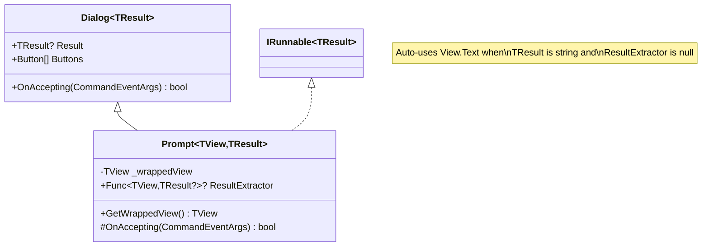

# Prompt - Generic Input Dialogs

`Prompt<TView, TResult>` enables any View to be shown in a modal dialog with Ok/Cancel buttons and typed result extraction. This provides a flexible, type-safe way to prompt users for input using any Terminal.Gui view.

## Key Features

- **Any View**: Wrap any view (TextField, DatePicker, ColorPicker, ListView, etc.) in a dialog
- **Type-Safe Results**: Generic `TResult` parameter provides compile-time type safety
- **Auto-Text Fallback**: When `TResult` is `string`, automatically uses `View.Text` if no extractor provided
- **Fluent API**: Extension methods on `IRunnable` and `IApplication` for convenient usage
- **Cross-Language**: Optimized APIs for both C# and PowerShell/scripting scenarios
- **Customizable**: Full control via `beginInitHandler` callback

## Architecture



## Basic Usage

### C# - Typed Result Extraction

```csharp
// From within a Window or other Runnable
DateTime? date = this.Prompt<DatePicker, DateTime> (
                                                    resultExtractor: dp => dp.Date,
                                                    beginInitHandler: prompt =>
                                                                      {
                                                                          prompt.Title = "Select Date";
                                                                          prompt.GetWrappedView ().Date = DateTime.Now;
                                                                      });

if (date is { } selectedDate)
{
    MessageBox.Query ("Success", $"You selected: {selectedDate:yyyy-MM-dd}", Strings.btnOk);
}
```

### C# - Auto-Text Extraction

When `TResult` is `string`, you can omit the `resultExtractor`:

```csharp
// Auto-uses ColorPicker.Text (returns color name/value)
string? colorText = mainWindow.Prompt<ColorPicker, string> (
                                                            beginInitHandler: prompt =>
                                                                              {
                                                                                  prompt.Title = "Pick a Color";
                                                                                  prompt.GetWrappedView ().SelectedColor = Color.Blue;
                                                                              });

if (colorText is { })
{
    MessageBox.Query ("Color", $"You selected: {colorText}", Strings.btnOk);
}
```

### PowerShell - Simple Text Result

```powershell
# Create and configure view
$textField = [TextField]::new()
$textField.Text = "Enter your name"

# Returns view.Text or null
$result = $app.Prompt($textField)

if ($result) {
    Write-Output "User entered: $result"
}
```

### PowerShell - Typed Result (Advanced)

```powershell
# For non-text results, use the generic method
$datePicker = [DatePicker]::new()
$datePicker.Date = [DateTime]::Now

$result = $mainWindow.Prompt[DatePicker,DateTime](
    $datePicker,
    [Func[DatePicker,DateTime]] { param($dp) return $dp.Date })

if ($result) {
    Write-Output $result.ToString("yyyy-MM-dd")
}
```

## Extension Methods

### IRunnable.Prompt (C# - Full Control)

```csharp
public static TResult? Prompt<TView, TResult> (
    this IRunnable host,
    TView? view = null,
    Func<TView, TResult?>? resultExtractor = null,
    TResult? input = default,
    Action<Prompt<TView, TResult>>? beginInitHandler = null)
    where TView : View, new()
```

**Parameters:**
- `view`: View instance to wrap, or `null` to auto-create
- `resultExtractor`: Function to extract result from view, or `null` for auto-Text (when `TResult` is `string`)
- `input`: Initial value (reserved for future `IValue<T>` pattern)
- `beginInitHandler`: Callback to customize dialog before display

**Returns:** `TResult?` - extracted result or `null` if canceled

**Auto-Text Fallback:** If `resultExtractor` is `null` and `TResult` is `string`, automatically returns `view.Text`.

### IApplication.Prompt (PowerShell - Simple)

```csharp
public static string? Prompt<TView> (
    this IApplication app,
    TView view)
    where TView : View, new()
```

**Parameters:**
- `view`: View instance to display

**Returns:** `string?` - `view.Text` or `null` if canceled

**Note:** For views where `.Text` is not meaningful (e.g., ListView with multi-select), use the generic `IRunnable.Prompt` method with a custom result extractor.

## Usage Patterns

### Pattern 1: Pre-Create View

Most common pattern - create and configure view, then prompt:

```csharp
ColorPicker colorPicker = new ()
{
    SelectedColor = Color.Red,
    Style = new () { ShowColorName = true, ShowTextFields = true }
};

Color? result = mainWindow.Prompt<ColorPicker, Color> (
                                                       view: colorPicker,
                                                       resultExtractor: cp => cp.SelectedColor,
                                                       beginInitHandler: prompt => prompt.Title = "Pick Color");
```

### Pattern 2: Auto-Create View

Let Prompt create the view, customize via handler:

```csharp
DateTime? date = mainWindow.Prompt<DatePicker, DateTime> (
                                                          resultExtractor: dp => dp.Date,
                                                          beginInitHandler: prompt =>
                                                                            {
                                                                                prompt.Title = "Select Date";
                                                                                prompt.GetWrappedView ().Date = DateTime.Now;
                                                                                prompt.GetWrappedView ().Format = "yyyy-MM-dd";
                                                                            });
```

### Pattern 3: Auto-Text for String Results

When you want the string representation:

```csharp
// Get date as formatted string instead of DateTime
string? dateText = mainWindow.Prompt<DatePicker, string> (
                                                          beginInitHandler: prompt =>
                                                                            {
                                                                                prompt.Title = "Select Date";
                                                                                prompt.GetWrappedView ().Date = DateTime.Now;
                                                                                prompt.GetWrappedView ().Format = "MM/dd/yyyy";
                                                                            });
```

### Pattern 4: Direct Construction (Maximum Control)

Create `Prompt` directly when you need full control:

```csharp
TextField textField = new () { Width = Dim.Fill () };

using Prompt<TextField, string> prompt = new (textField)
{
    Title = "Enter Name",
    ResultExtractor = tf => tf.Text
};

// Customize via events
prompt.Initialized += (s, e) =>
                      {
                          prompt.BorderStyle = LineStyle.Rounded;
                          prompt.Buttons [0].Text = "Cancel";
                          prompt.Buttons [1].Text = "Submit";
                      };

string? result = app.Run (prompt);
```

## View.Text Support

Many views provide meaningful `.Text` implementations that enable automatic text extraction:

| View | Text Behavior |
|------|---------------|
| `TextField` | User input text |
| `TextView` | Multiline text content |
| `DatePicker` | Formatted date string (e.g., "1/15/2026") |
| `ColorPicker` | Color name or representation (e.g., "Red", "Color [A=255, R=255, G=0, B=0]") |
| `Label` | Label text |
| `Button` | Button text |

**Views where .Text is not meaningful:**
- `ListView` (especially with multi-select) - use custom `resultExtractor`
- `TreeView` - use custom `resultExtractor`
- Custom views without `.Text` override - use custom `resultExtractor`

## Customization

### Customizing the Dialog

Use `beginInitHandler` to customize dialog properties:

```csharp
Color? result = mainWindow.Prompt<ColorPicker, Color> (
                                                       resultExtractor: cp => cp.SelectedColor,
                                                       beginInitHandler: prompt =>
                                                                         {
                                                                             // Dialog properties
                                                                             prompt.Title = "Choose Color";
                                                                             prompt.BorderStyle = LineStyle.Rounded;
                                                                             prompt.Width = Dim.Percent (60);
                                                                             prompt.Height = Dim.Percent (50);

                                                                             // Wrapped view properties
                                                                             prompt.GetWrappedView ().SelectedColor = Color.Blue;
                                                                             prompt.GetWrappedView ().Width = Dim.Fill ();
                                                                         });
```

### Customizing Buttons

Buttons are added in constructor. Customize via `Initialized` event:

```csharp
DateTime? date = mainWindow.Prompt<DatePicker, DateTime> (
                                                          resultExtractor: dp => dp.Date,
                                                          beginInitHandler: prompt =>
                                                                            {
                                                                                prompt.Title = "Select Date";

                                                                                prompt.Initialized += (s, e) =>
                                                                                                      {
                                                                                                          // Buttons[0] is Cancel, Buttons[1] is Ok
                                                                                                          prompt.Buttons [0].Text = "Nope";
                                                                                                          prompt.Buttons [1].Text = "Yep";
                                                                                                      };
                                                                            });
```

## Result Extraction Logic

The `OnAccepting` method uses this logic:

```csharp
protected override bool OnAccepting (CommandEventArgs args)
{
    if (base.OnAccepting (args)) return true;

    if (ResultExtractor is { })
    {
        // 1. Use explicit extractor if provided
        Result = ResultExtractor (GetWrappedView ());
    }
    else if (typeof(TResult) == typeof(string))
    {
        // 2. Auto-fallback to .Text when TResult is string
        Result = (TResult?)(object?)GetWrappedView ().Text;
    }
    // 3. Otherwise Result remains null

    return false;
}
```

**Priority:**
1. **Explicit `ResultExtractor`** - always used if provided
2. **Auto `.Text` extraction** - when `TResult` is `string` and no extractor
3. **null** - when no extractor and `TResult` is not `string`

## PowerShell Considerations

### Simple Text Input

For simple text input, the `IApplication.Prompt` method is ideal:

```powershell
$textField = [TextField]::new()
$textField.Text = "Default value"
$result = $app.Prompt($textField)  # Returns string? from view.Text
```

### Typed Results

For non-text results, PowerShell users have two options:

**Option 1: Use generic IRunnable method** (requires Func delegate):

```powershell
$result = $mainWindow.Prompt[DatePicker,DateTime](
    $datePicker,
    [Func[DatePicker,DateTime]] { param($dp) return $dp.Date })
```

**Option 2: Create Prompt directly** (more verbose but clearer):

```powershell
$prompt = [Prompt[DatePicker,DateTime]]::new($datePicker)
$prompt.Title = "Select Date"
$prompt.ResultExtractor = [Func[DatePicker,DateTime]] {
    param($dp)
    return $dp.Date
}
$app.Run($prompt)
$result = $prompt.Result
```

## Null Handling

**Always use nullable result types** to distinguish cancellation from valid results:

```csharp
// GOOD - nullable type
DateTime? date = mainWindow.Prompt<DatePicker, DateTime?> (...);

if (date is null)
{
    // User canceled
}
else
{
    // User accepted with value
}

// BAD - non-nullable value type
DateTime date = mainWindow.Prompt<DatePicker, DateTime> (...);
// Returns default(DateTime) on cancel - can't distinguish from actual default value!
```

## The IValue\<T\> Interface

Views that implement `IValue<T>` provide automatic result extraction without requiring an explicit `resultExtractor`. This is the recommended pattern for views that have a primary value.

### Interface Definition

```csharp
public interface IValue<TValue>
{
    TValue? Value { get; set; }
    event EventHandler<ValueChangingEventArgs<TValue?>>? ValueChanging;
    event EventHandler<ValueChangedEventArgs<TValue?>>? ValueChanged;
}
```

The interface follows the Cancellable Work Pattern (CWP):
- `ValueChanging` fires before the value changes; set `Handled = true` to cancel
- `ValueChanged` fires after the value has changed

### Automatic Result Extraction

When the wrapped view implements `IValue<TResult>`, `Prompt` automatically extracts the result:

```csharp
// No resultExtractor needed - AttributePicker implements IValue<Attribute?>
Attribute? attr = mainWindow.Prompt<AttributePicker, Attribute?> (
    beginInitHandler: prompt =>
    {
        prompt.Title = "Select Text Attribute";
        prompt.GetWrappedView ().Value = new Attribute (Color.White, Color.Blue);
    });
```

### Implementing IValue\<T\> in Custom Views

To make your custom view work seamlessly with `Prompt`, implement `IValue<T>` using `CWPPropertyHelper.ChangeProperty`:

```csharp
public class MyRatingView : View, IValue<int?>
{
    private int? _value;

    public int? Value
    {
        get => _value;
        set => CWPPropertyHelper.ChangeProperty (
            this,
            ref _value,
            value,
            OnValueChanging,
            ValueChanging,
            newValue =>
            {
                _value = newValue;
                UpdateStarDisplay ();
            },
            OnValueChanged,
            ValueChanged,
            out _);
    }

    public event EventHandler<ValueChangingEventArgs<int?>>? ValueChanging;
    public event EventHandler<ValueChangedEventArgs<int?>>? ValueChanged;

    protected virtual bool OnValueChanging (ValueChangingEventArgs<int?> args) => false;
    protected virtual void OnValueChanged (ValueChangedEventArgs<int?> args) { }
}
```

Now your view works with `Prompt` without a custom extractor:

```csharp
int? rating = mainWindow.Prompt<MyRatingView, int?> (
    beginInitHandler: prompt => prompt.Title = "Rate this item");
```

## Example: AttributePicker

`AttributePicker` is a composite view that demonstrates the `IValue<T>` pattern. It allows users to select a complete `Attribute` (foreground color, background color, and text style).

### Basic Usage

```csharp
// Simple - IValue<Attribute?> provides automatic extraction
Attribute? result = mainWindow.Prompt<AttributePicker, Attribute?> (
    beginInitHandler: prompt =>
    {
        prompt.Title = "Choose Text Style";
        prompt.GetWrappedView ().SampleText = "Preview your selection";
    });

if (result.HasValue)
{
    myTextView.SetAttribute (result.Value);
}
```

### With Initial Value and Validation

```csharp
AttributePicker picker = new ()
{
    Value = existingAttribute,
    SampleText = "Sample Text Preview"
};

// Validate changes
picker.ValueChanging += (_, e) =>
{
    // Prevent identical foreground/background
    if (e.NewValue?.Foreground == e.NewValue?.Background)
    {
        e.Handled = true;
    }
};

Attribute? result = mainWindow.Prompt<AttributePicker, Attribute?> (
    view: picker,
    beginInitHandler: prompt => prompt.Title = "Edit Attribute");
```

## Future Enhancements

### Hosted Modal Positioning (Planned)

The `host` parameter in `IRunnable.Prompt` captures the hosting relationship. Future versions will use this for relative positioning:

```csharp
// Future: Dialog positioned relative to mainWindow, not just centered on screen
DateTime? date = mainWindow.Prompt<DatePicker, DateTime> (...);
```

## See Also

- [Dialog](xref:Terminal.Gui.Dialog) - Base class for modal dialogs
- [Runnable](xref:Terminal.Gui.Runnable) - Session management and lifecycle
- [Application Architecture](application.md) - Understanding the IApplication pattern
- [View](View.md) - Base View class and Text property
- [IValue\<T\>](xref:Terminal.Gui.IValue`1) - Interface for views with typed values
- [AttributePicker](xref:Terminal.Gui.Views.AttributePicker) - Example IValue implementation
- [Cancellable Work Pattern](cancellable-work-pattern.md) - CWP event pattern used by IValue
