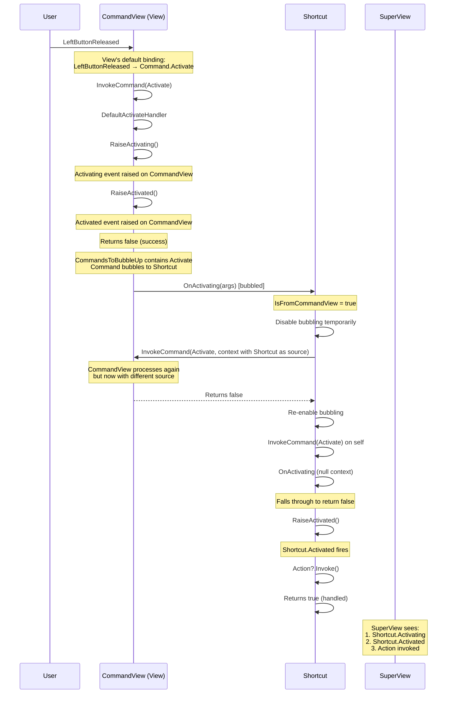
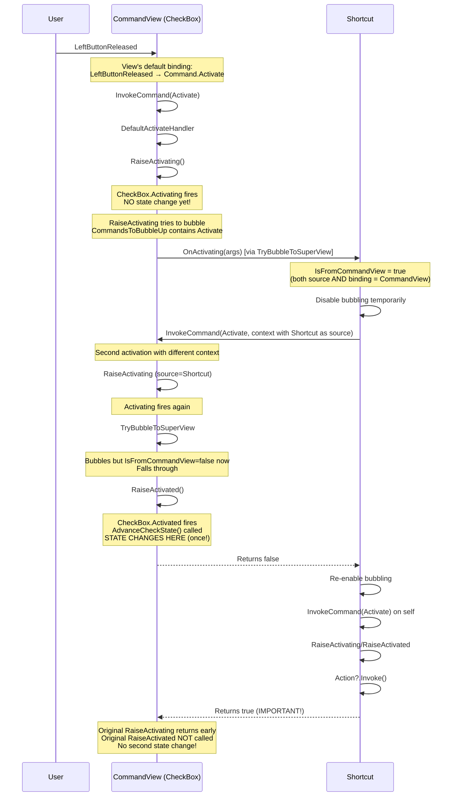
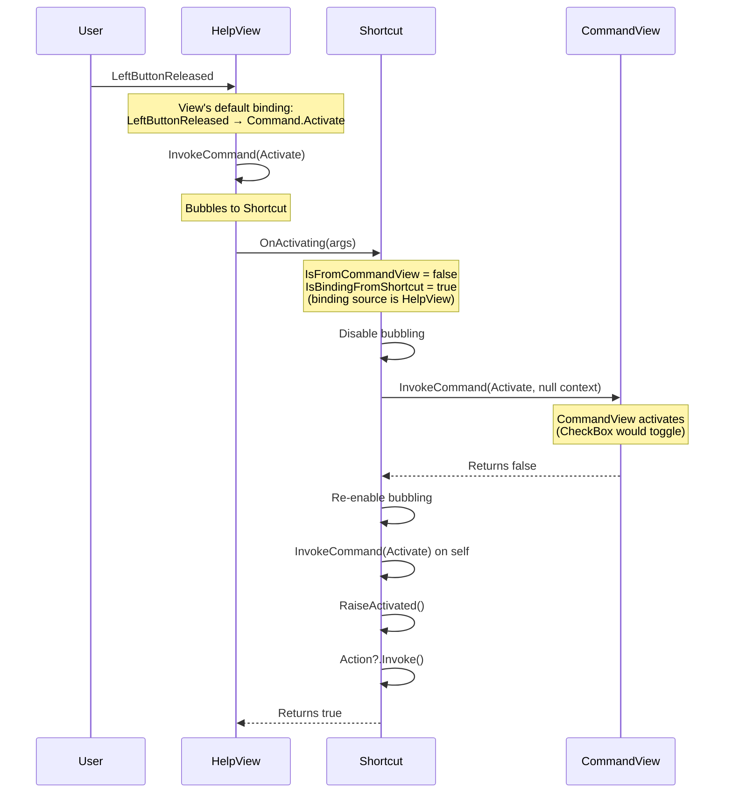
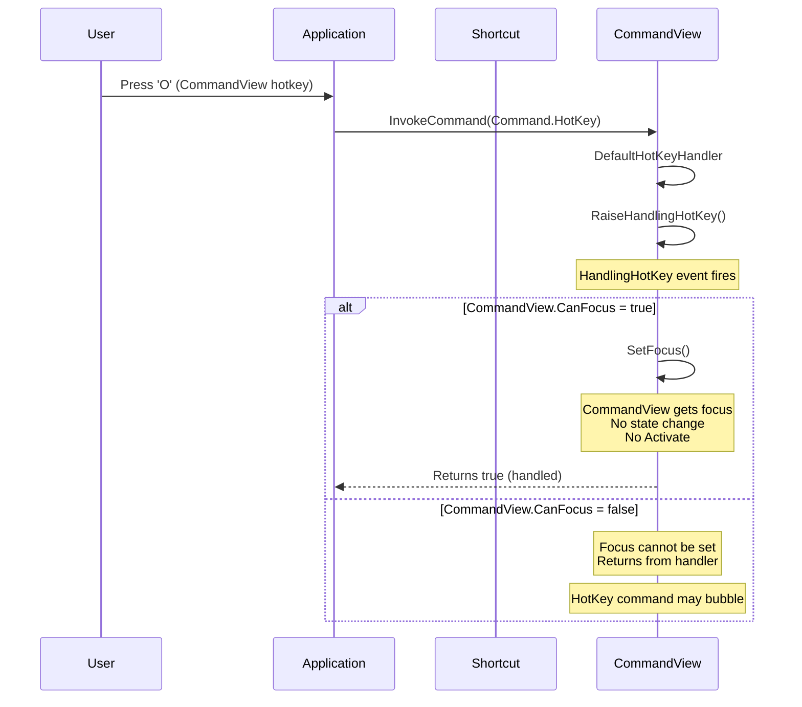
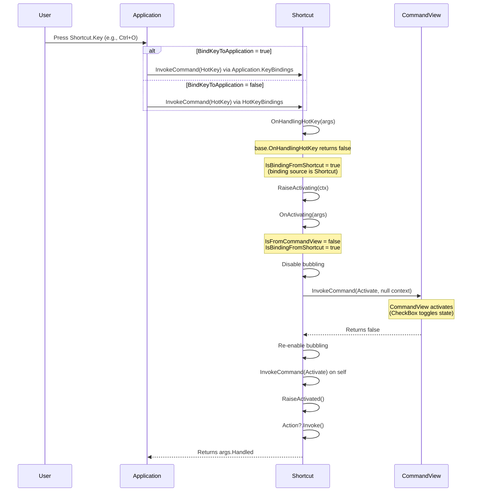
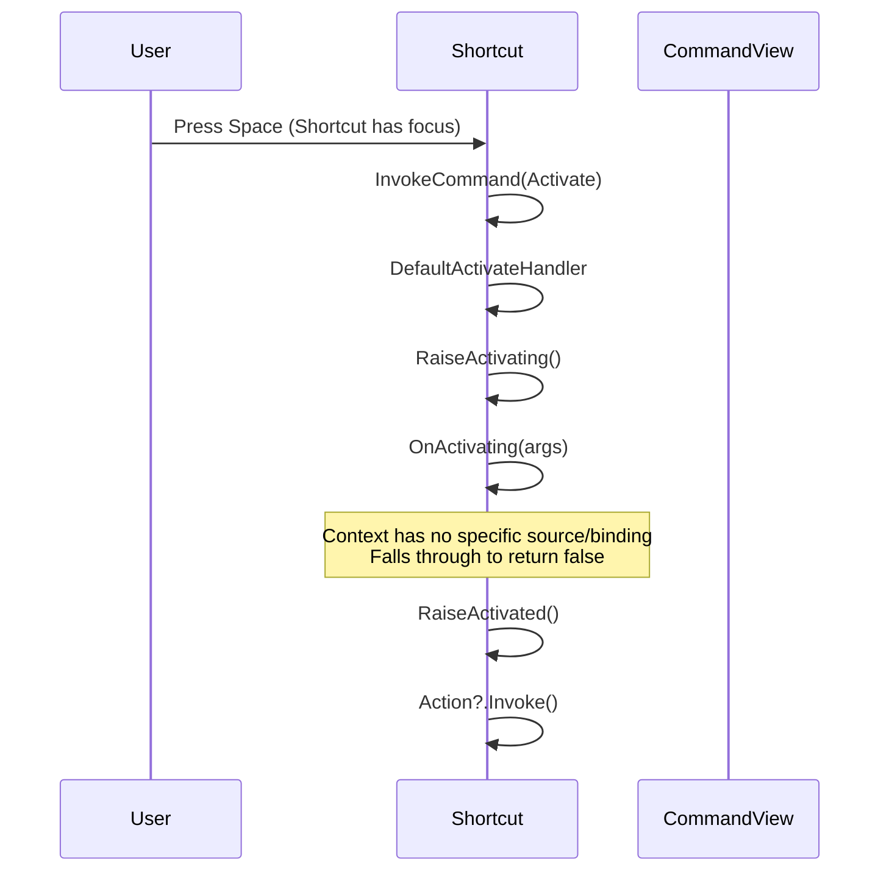
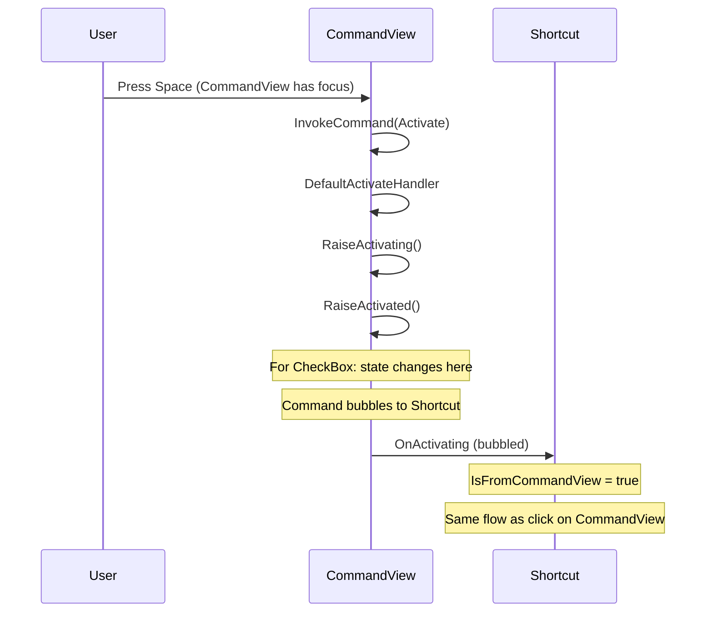
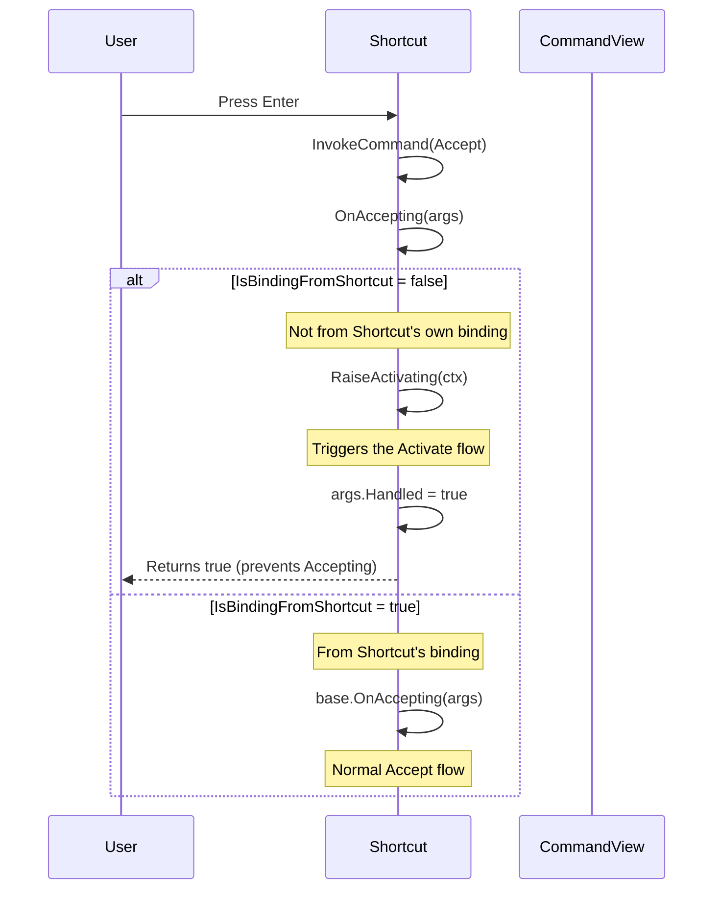

# Deep Dive into Shortcut

## See Also

* [Command Deep Dive](command.md)
* [Cancellable Work Pattern](cancellable-work-pattern.md)
* [Events](events.md)
* [Mouse Deep Dive](mouse.md)

## Overview

The `Shortcut` class displays a command, help text, and a key binding in a unified control. It is designed for use in `Bar` controls such as menus, toolbars, and status bars. When the key specified by `Key` is pressed, or when the user interacts via mouse or keyboard, the shortcut invokes the appropriate commands.

`Shortcut` is composed of three subviews:
- **CommandView**: Displays the command text and responds to user interaction (default: a plain `View`, but can be set to `CheckBox`, `Button`, etc.)
- **HelpView**: Displays help text in the middle
- **KeyView**: Displays the key binding text on the right

```
┌─────────────────────────────────────────────────┐
│ [CommandView]    [HelpView]         [KeyView]   │
│  _Open File      Opens a file       Ctrl+O      │
└─────────────────────────────────────────────────┘
```

## Key Concepts

### CommandsToBubbleUp

`Shortcut` sets `CommandsToBubbleUp = [Command.Activate, Command.Accept]` in its constructor. This means when a SubView (like `CommandView`) invokes these commands, they bubble up to the `Shortcut` for handling.

### Command Forwarding Logic

`Shortcut` uses two key helper methods to determine how to handle commands:

1. **`IsFromCommandView(ctx)`**: Returns `true` when both the command source AND binding source are the `CommandView`. This indicates the user directly interacted with the CommandView (clicked on it or pressed its hotkey).

2. **`IsBindingFromShortcut(args)`**: Returns `true` when the binding source is the Shortcut itself, HelpView, or KeyView. This indicates the user interacted with the Shortcut outside of the CommandView.

### Return Value Semantics

Throughout this document, command handler return values follow these semantics:
- `true`: Command was handled/cancelled - stop processing
- `false`: Command executed successfully - continue (allow bubbling)
- `null`: No handler found

## Command Flow Summary

| Trigger | Source | Flow |
|---------|--------|------|
| Click on CommandView | CommandView | `CommandView.Activate` → bubbles to `Shortcut.OnActivating` (IsFromCommandView=true) → forwards back to CommandView → raises Shortcut events |
| Click on HelpView/KeyView/Shortcut | Shortcut | `Shortcut.Activate` → `OnActivating` (IsBindingFromShortcut=true) → forwards to CommandView → raises events |
| CommandView HotKey | CommandView | `CommandView.HotKey` → DefaultHotKeyHandler sets focus → if CanFocus, done; else bubbles |
| Shortcut HotKey | Shortcut | `Shortcut.HotKey` → `OnHandlingHotKey` → `RaiseActivating` → full flow |
| Space | View | `Command.Activate` → same as click |
| Enter | View | `Command.Accept` → `OnAccepting` → `RaiseActivating` (if not from Shortcut binding) |

## Detailed Call Flows

### Mouse Interactions

#### Click on CommandView (Default View)

When the user clicks on the CommandView (which is a plain `View` by default):



**Events visible to SuperView:**
- `Shortcut.Activating` - raised during the forwarding flow
- `Shortcut.Activated` - raised in `OnActivated`
- `Action` - invoked in `OnActivated`

**If SuperView subscribes to `CommandView.Activating/Activated`:**
- `CommandView.Activating` - raised during the initial CommandView processing
- `CommandView.Activated` - raised during the initial CommandView processing

#### Click on CommandView (CheckBox)

When the CommandView is a `CheckBox`, the flow shows how Shortcut prevents double-toggling by returning `true` from `OnActivating`:



**Key Design Point:** By returning `true` from `OnActivating`, Shortcut cancels the original CheckBox's `RaiseActivated` call. The state change only happens in the **forwarded** invocation, preventing double-toggling.

**Events visible to SuperView:**
- `Shortcut.Activating` - raised during the flow
- `Shortcut.Activated` - raised in `OnActivated`
- `Action` - invoked

**If SuperView subscribes to CheckBox directly:**
- `CheckBox.Activating` - fires TWICE (original + forwarded)
- `CheckBox.Activated` - fires ONCE (only in forwarded call)
- `CheckBox.CheckedStateChanging` - fires once (state about to change)
- `CheckBox.CheckedStateChanged` - fires once (state changed)

> **Important**: The CheckBox state changes in `OnActivated` via `AdvanceCheckState()`. Shortcut's return of `true` prevents the original activation from reaching `RaiseActivated`, ensuring the state only changes once.

#### Click on HelpView or KeyView

Clicking on the HelpView or KeyView triggers `Command.Activate` on that view, which bubbles to `Shortcut`:



The same flow applies for KeyView - clicking anywhere on the Shortcut (except CommandView) activates the Shortcut and forwards to CommandView.

#### Click Directly on Shortcut Background

If the mouse click is on the Shortcut itself (not on any subview), the binding source will be the Shortcut, triggering the `IsBindingFromShortcut` path.

### Keyboard Interactions

#### CommandView HotKey

When the user presses the CommandView's hotkey (e.g., the underlined character in "_Open"):



**Key Point**: The default `HotKey` handler only sets focus via `RaiseHandlingHotKey`. It does NOT invoke `Command.Activate`. This is different from clicking!

**Events visible:**
- `CommandView.HandlingHotKey` - always fires
- NO `Activating`/`Activated` events unless the HotKey command bubbles and Shortcut handles it

#### Shortcut Key (Bound to HotKey)

When the user presses the Shortcut's `Key` (e.g., Ctrl+O), it's bound to `Command.HotKey`:



**Events visible to SuperView:**
- `Shortcut.HandlingHotKey` - fires first
- `Shortcut.Activating` - fires during `RaiseActivating`
- `Shortcut.Activated` - fires in `OnActivated`
- `Action` - invoked

**If SuperView subscribes to CommandView:**
- `CommandView.Activating` - fires when forwarded
- `CommandView.Activated` - fires when forwarded

#### Space Key

Space is bound to `Command.Activate` by default in `View`:



If Space is pressed while CommandView has focus (and CanFocus=true):



#### Enter Key

Enter is bound to `Command.Accept` by default:



**Key Point**: When Enter is pressed, `OnAccepting` typically redirects to `RaiseActivating` (unless the binding is specifically from the Shortcut), which triggers the same activation flow. This means Enter and Space behave similarly in most cases.

### Focus Considerations

#### When CommandView.CanFocus = false (Default)

By default, the CommandView is a plain `View` with `CanFocus = false`:

- Clicking on CommandView: Shortcut handles the activation
- CommandView hotkey: May not work as expected (no focus to set)
- Space/Enter on Shortcut: Shortcut handles activation

#### When CommandView.CanFocus = true (e.g., CheckBox)

When CommandView is a focusable control like CheckBox:

- Clicking on CommandView: CommandView gets focus, then activates
- CommandView hotkey: CommandView gets focus (but doesn't activate!)
- Space on focused CommandView: CommandView activates, then bubbles to Shortcut
- Tab navigation: Can navigate INTO the CommandView

### Complete Event Reference

#### Events on Shortcut

| Event | When Fired | Notes |
|-------|------------|-------|
| `Activating` | During activation flow | Can be cancelled |
| `Activated` | After successful activation | In `OnActivated` |
| `Accepting` | When Accept command invoked | Usually redirects to Activating |
| `Accepted` | In `OnAccepted` | Invokes `Action` |
| `HandlingHotKey` | When Shortcut.Key pressed | Before activation |

#### Events on CommandView (if subscribed directly)

| Event | When Fired | Notes |
|-------|------------|-------|
| `Activating` | When CommandView activates | Before state change |
| `Activated` | After CommandView activates | State changes here for CheckBox |
| `HandlingHotKey` | When CommandView hotkey pressed | Only sets focus |

#### CheckBox-Specific Events (when CommandView is CheckBox)

| Event | When Fired | Notes |
|-------|------------|-------|
| `CheckedStateChanging` | Before state toggle | Can be cancelled |
| `CheckedStateChanged` | After state toggle | State has changed |

## Action Property

The `Action` property is invoked in two places:

1. **`OnActivated`**: Called when `Command.Activate` completes successfully
2. **`OnAccepted`**: Called when `Command.Accept` completes

This means `Action` may be invoked through either path, providing flexibility in how the Shortcut is triggered.

## Example: SuperView Event Subscription

```csharp
Shortcut shortcut = new ()
{
    Key = Key.F1,
    Title = "_Help",
    HelpText = "Show help",
    Action = () => ShowHelp ()
};

// Subscribe to Shortcut events
shortcut.Activating += (sender, args) =>
{
    // Called before activation completes
    // Set args.Cancel = true to prevent
};

shortcut.Activated += (sender, args) =>
{
    // Called after activation - Action already invoked
};

// For CheckBox CommandView, subscribe to state changes
CheckBox cb = new () { Text = "_Toggle" };
shortcut.CommandView = cb;

cb.CheckedStateChanged += (sender, args) =>
{
    // Called when checkbox state changes
    // This fires DURING the Activated phase
    bool isChecked = args.CurrentValue == CheckState.Checked;
};
```

## MouseHighlightStates and Event Routing

The path taken through `OnActivating` depends on the Shortcut's `MouseHighlightStates` setting:

### With `MouseHighlightStates = MouseState.In` (Default)

When the Shortcut highlights on mouse hover (the default), it intercepts mouse events for its entire area:

- Clicks anywhere on the Shortcut (including CommandView area) are attributed to the **Shortcut**
- `Source` and `Binding.Source` are both the Shortcut
- **Path taken:** `IsBindingFromShortcut` → forwards to CommandView

### With `MouseHighlightStates = MouseState.None`

When mouse highlighting is disabled, subviews receive mouse events directly:

- Clicks on CommandView are attributed to the **CommandView**
- `Source` and `Binding.Source` are both the CommandView
- **Path taken:** `IsFromCommandView` → forwards to CommandView with modified source

### Both Paths Produce the Same Result

Regardless of which path is taken, the result is the same:
1. CommandView receives `Command.Activate` once
2. State changes once (e.g., CheckBox toggles)
3. Shortcut's events fire (`Activating`, `Activated`)
4. `Action` is invoked

The dual-path design ensures consistent behavior whether the Shortcut or its CommandView receives the initial mouse event.

## Design Rationale

### Why Forward to CommandView?

The forwarding pattern ensures that:

1. **CheckBox state changes**: When clicking anywhere on the Shortcut, the CheckBox toggles
2. **Consistent behavior**: All interaction paths (click, hotkey, space, enter) produce the same result
3. **Event bubbling**: SuperViews see consistent events regardless of how the Shortcut was activated

### Why Disable Bubbling During Forward?

When forwarding `Command.Activate` to CommandView, bubbling is temporarily disabled to prevent infinite loops:

```csharp
CommandsToBubbleUp = [];
CommandView.InvokeCommand (Command.Activate, context);
CommandsToBubbleUp = [Command.Activate];
```

Without this, the command would bubble back to Shortcut, causing infinite recursion.

### HotKey vs. Activate

The distinction is important:

- **HotKey**: Sets focus, doesn't change state
- **Activate**: Changes state (e.g., toggles CheckBox)

This is why pressing the CommandView's hotkey doesn't toggle a CheckBox, but clicking does.

## How To

### Handle Activation Differently Based on Source

You may want to implement different behavior depending on whether the user activated the `CommandView` directly (e.g., clicked on it) or activated other parts of the `Shortcut` (e.g., pressed the hotkey or clicked elsewhere). Use `args.Context.TryGetSource()` in the `Activating` event handler to determine the activation source.

**Use Case:** A color picker where clicking the picker opens a dialog, but pressing the shortcut key cycles through colors.

```csharp
ColorPicker16 bgColor = new () { Id = "bgColorCP", BoxHeight = 1, BoxWidth = 1 };

Shortcut bgColorShortcut = new ()
{
    Id = "bgColor",
    Key = Key.F9,
    HelpText = "Cycles BG Color",
    CommandView = bgColor
};

bgColorShortcut.Activating += (s, args) =>
{
    // Check if activation came from the CommandView itself
    if (args.Context.TryGetSource (out View? ctxSource) && ctxSource == bgColorShortcut.CommandView)
    {
        // User clicked directly on the ColorPicker16
        // Mark as handled to allow the ColorPicker16's normal behavior (open dialog)
        args.Handled = true;
    }
    else
    {
        // User pressed F9 or clicked elsewhere on the Shortcut
        // Cycle through colors instead
        if (bgColor.SelectedColor == ColorName16.White)
        {
            bgColor.SelectedColor = ColorName16.Black;

            return;
        }

        bgColor.SelectedColor++;
    }
};

// Handle the color change
bgColor.ValueChanged += (sendingView, args) =>
{
    // Update the application's color scheme when color changes
    _app!.TopRunnableView!.SetScheme (
        new Scheme (_app.TopRunnableView.GetScheme ())
        {
            Normal = new Attribute (
                _app.TopRunnableView.GetAttributeForRole (VisualRole.Normal).Foreground,
                args.NewValue,
                _app.TopRunnableView.GetAttributeForRole (VisualRole.Normal).Style
            )
        }
    );
};
```

**Key Points:**

- `args.Context.TryGetSource (out View? ctxSource)` retrieves the view that initiated the activation
- Compare `ctxSource` with `bgColorShortcut.CommandView` to determine if activation came from the CommandView
- When activation is from the CommandView, set `args.Handled = true` to prevent further processing and allow the CommandView's default behavior
- When activation is from elsewhere (hotkey, other clicks), implement custom logic (e.g., cycling values)
