# Terminology Proposal - Visual Diagrams

This document provides visual diagrams to illustrate the proposed terminology changes for Terminal.Gui's `Application.Top` and related APIs.

## Current vs Proposed Terminology

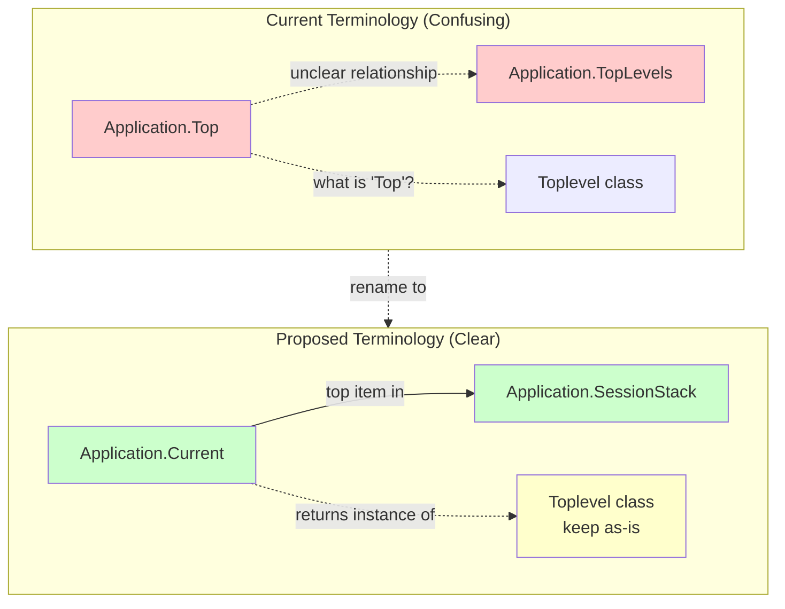

## Application.Current - Stack Relationship

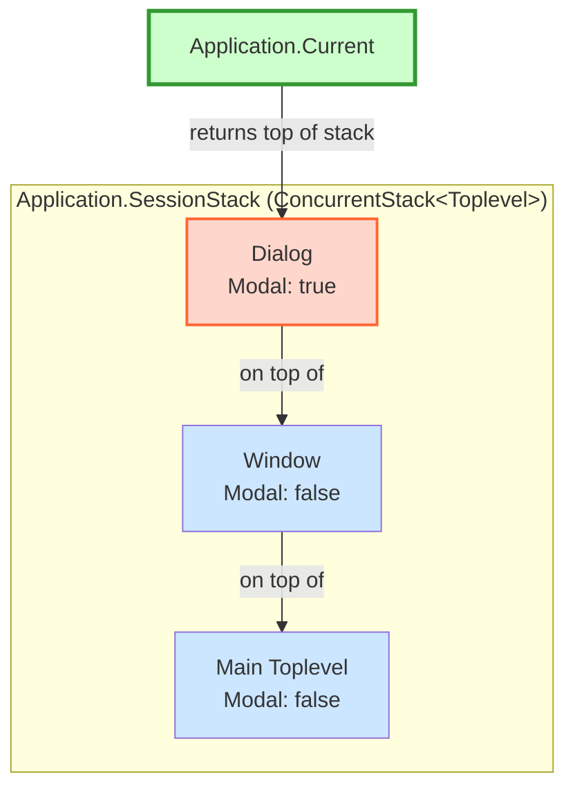

## Before: Confusing Naming Pattern

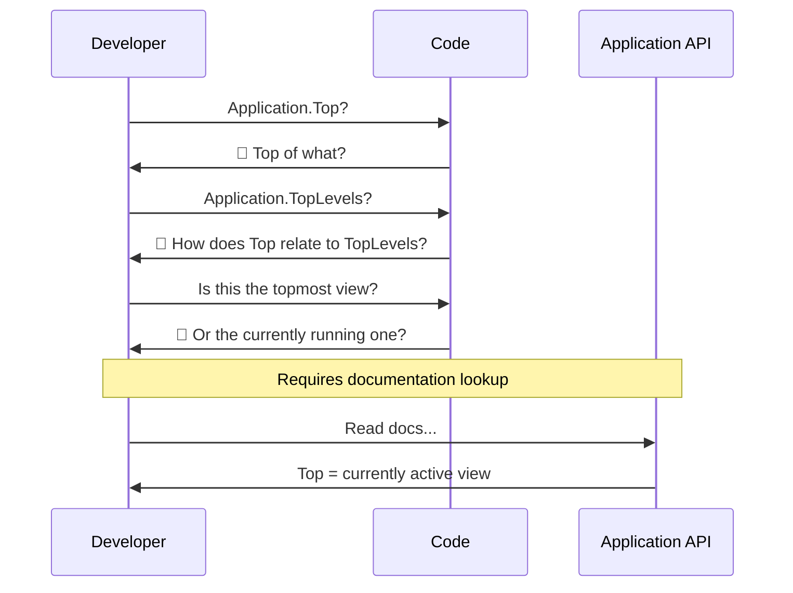

## After: Self-Documenting Pattern

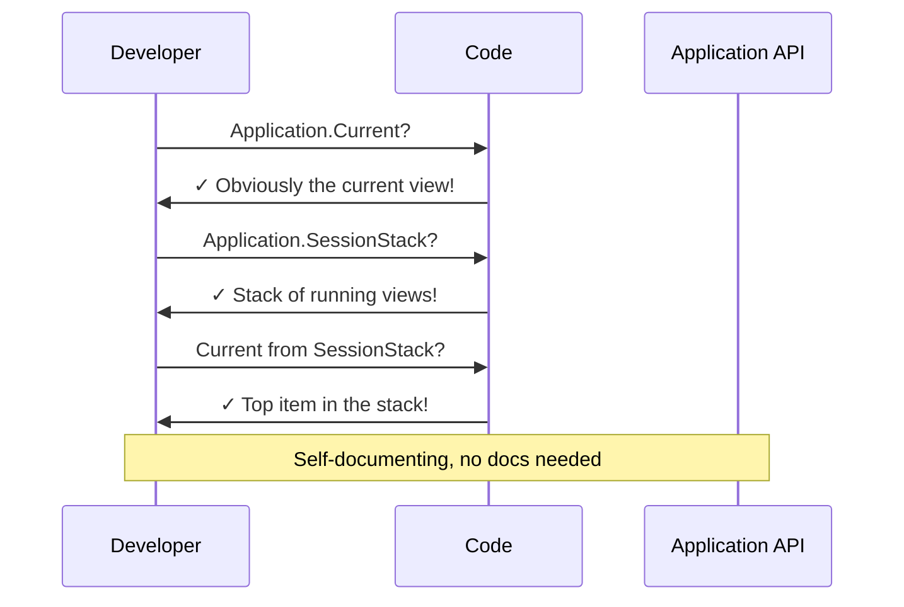

## .NET Pattern Consistency

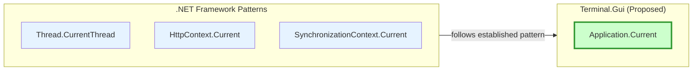

## View Hierarchy and Run Stack

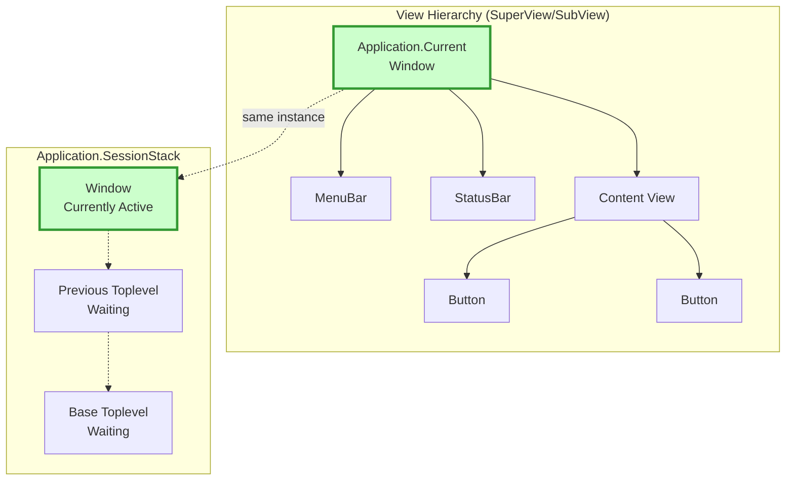

## Usage Example Flow

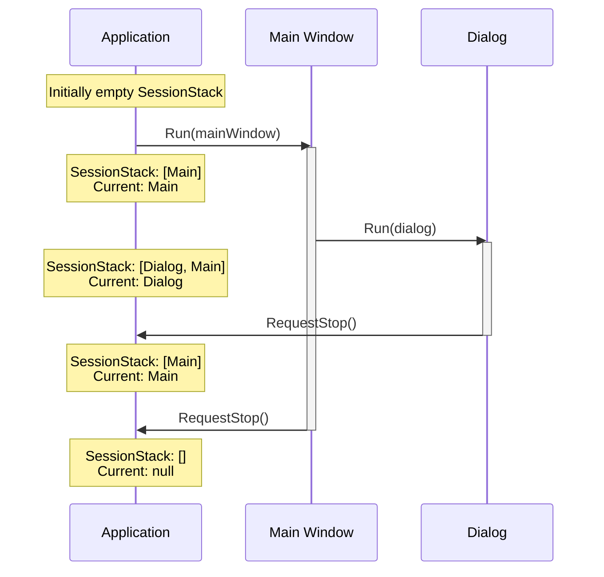

## Terminology Evolution Path

```mermaid
graph LR
    subgraph Current["v2 Current State"]
        C1[Application.Top]
        C2[Application.TopLevels]
        C3[Toplevel class]
    end
    
    subgraph Phase1["Phase 1: Add New APIs"]
        P1[Application.Current]
        P2[Application.SessionStack]
        P3[Toplevel class]
        P1O["Application.Top<br/>[Obsolete]"]
        P2O["Application.TopLevels<br/>[Obsolete]"]
    end
    
    subgraph Phase2["Phase 2-4: Migration"]
        M1[Application.Current]
        M2[Application.SessionStack]
        M3[Toplevel class]
        M1O["Application.Top<br/>[Obsolete Warning]"]
        M2O["Application.TopLevels<br/>[Obsolete Warning]"]
    end
    
    subgraph Future["Phase 5: Future State"]
        F1[Application.Current]
        F2[Application.SessionStack]
        F3["IRunnable interface"]
        F4["Toplevel : IRunnable"]
    end
    
    Current --> Phase1
    Phase1 --> Phase2
    Phase2 --> Future
    
    style P1 fill:#ccffcc
    style P2 fill:#ccffcc
    style M1 fill:#ccffcc
    style M2 fill:#ccffcc
    style F1 fill:#ccffcc
    style F2 fill:#ccffcc
    style F3 fill:#ffffcc
    style P1O fill:#ffcccc
    style P2O fill:#ffcccc
    style M1O fill:#ffcccc
    style M2O fill:#ffcccc
```

## Comparison: Code Clarity

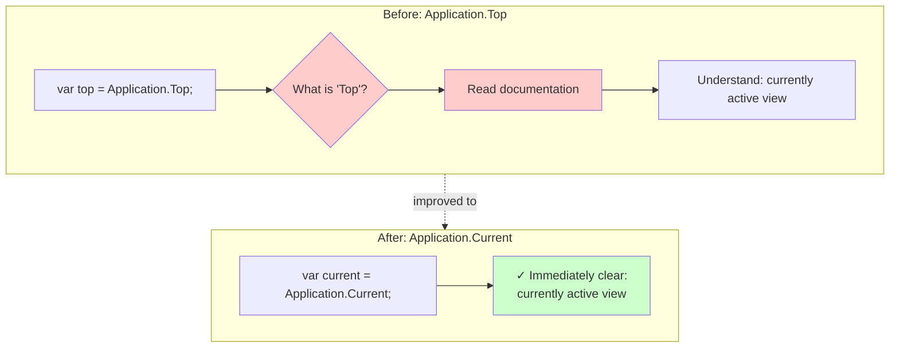

## Migration Phases Overview

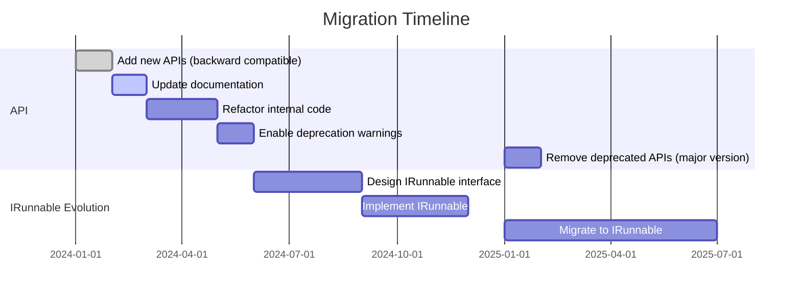

## Key Benefits Visualization

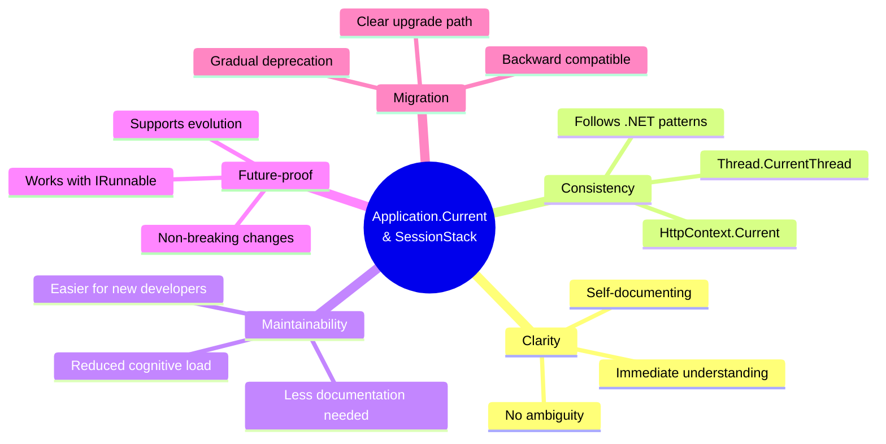

## Summary

These diagrams illustrate:

1. **Clear Relationships**: The new terminology makes the relationship between `Current` and `SessionStack` obvious
2. **Self-Documenting**: Names that immediately convey their purpose without documentation
3. **.NET Alignment**: Consistency with established .NET framework patterns
4. **Migration Safety**: Backward-compatible approach with clear phases
5. **Future-Proof**: Supports evolution toward `IRunnable` interface

The proposed terminology (`Application.Current` and `Application.SessionStack`) provides immediate clarity while maintaining compatibility and supporting future architectural improvements.

---

**See also:**
- [terminology-proposal.md](terminology-proposal.md) - Complete detailed proposal
- [terminology-proposal-summary.md](terminology-proposal-summary.md) - Quick reference
- [terminology-before-after.md](terminology-before-after.md) - Code comparison examples
- [terminology-index.md](terminology-index.md) - Navigation guide
