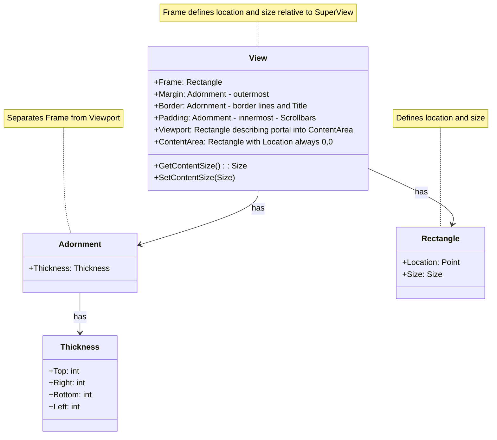

# View Composition Diagram



## View Composition Layers

```mermaid
flowchart TD
    ContentArea[Content Area (0,0)]
    C1[Content at (0,0)]
    C2[Content at (5,5)]
    C3[Content at (10,10)]
    
    Frame[Frame]
    Margin[Margin]
    Border[Border]
    Padding[Padding]
    Viewport[Viewport (5,5)]
    V1[Visible Content]

    ContentArea --> C1
    ContentArea --> C2
    ContentArea --> C3
    
    Frame --> Margin
    Margin --> Border
    Border --> Padding
    Padding --> Viewport
    Viewport --> V1
    
    Viewport -.-> ContentArea

    style Frame fill:#f0f0f0,stroke:#666,stroke-width:1px
    style Margin fill:#e8e8e8,stroke:#666,stroke-width:1px
    style Border fill:#e0e0e0,stroke:#666,stroke-width:1px
    style Padding fill:#d8d8d8,stroke:#666,stroke-width:1px
    style Viewport fill:#d0d0d0,stroke:#666,stroke-width:1px
    style ContentArea fill:#c8c8c8,stroke:#666,stroke-width:1px
    style C1 fill:#c8c8c8,stroke:none
    style C2 fill:#c8c8c8,stroke:none
    style C3 fill:#c8c8c8,stroke:none
    style V1 fill:#d0d0d0,stroke:none
```

The diagram above shows the structure of a View's composition:

1. **Frame**: The outermost rectangle defining the View's location and size
2. **Margin**: Separates the View from other SubViews
3. **Border**: Contains visual border and title
4. **Padding**: Offsets the Viewport from the Border
5. **Viewport**: The visible portion of the Content Area
6. **Content Area**: Where the View's content is drawn (shown larger than Viewport to illustrate scrolling)

Each layer is defined by a Thickness that specifies the width of each side (top, right, bottom, left). The Content Area is shown as a separate container that the Viewport "looks into" - this illustrates how scrolling works. In this example, the Viewport is positioned at (5,5) relative to the Content Area, showing how scrolling works. 