<!-- 
This file is automatically generated from the API documentation and the OutputView tool.
GIFs are recorded using tuirec (https://github.com/gui-cs/tuirec).
Run: cd docfx && ./scripts/generate-views-doc.ps1
-->
# Terminal Gui's Built-in Views

*Terminal.Gui* provides the following set of built-in views and controls for building terminal user interfaces:

## [AttributePicker](xref:Terminal.Gui.Views.AttributePicker)

Allows the user to pick an <xref:Terminal.Gui.Drawing.Attribute> by selecting foreground and background colors, and text styles.

## [Bar](xref:Terminal.Gui.Views.Bar)

A container for <xref:Terminal.Gui.Views.Shortcut> items that arranges them horizontally or vertically. Serves as the base class for <xref:Terminal.Gui.Views.Menu>, <xref:Terminal.Gui.Views.MenuBar>, and <xref:Terminal.Gui.Views.StatusBar>.

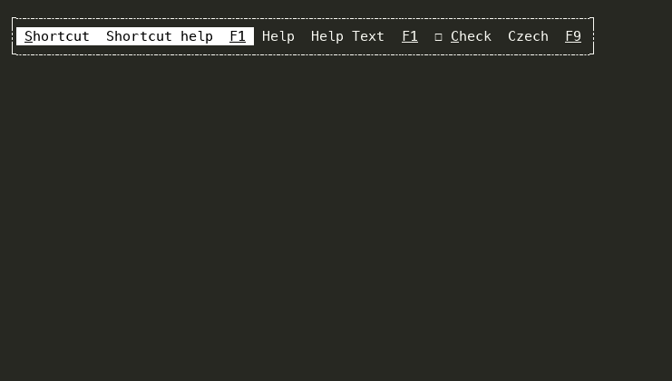

## [Button](xref:Terminal.Gui.Views.Button)

Raises the <xref:Terminal.Gui.ViewBase.View.Accepting> and <xref:Terminal.Gui.ViewBase.View.Accepted> events when the user presses <xref:Terminal.Gui.ViewBase.View.HotKey>, `Enter`, or `Space` or clicks with the mouse.

## [CharMap](xref:Terminal.Gui.Views.CharMap)

A scrollable map of the Unicode codepoints.

## [CheckBox](xref:Terminal.Gui.Views.CheckBox)

Shows a checkbox that can be cycled between two or three states.

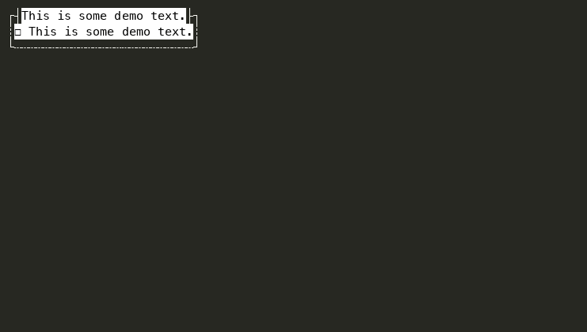

## [Code](xref:Terminal.Gui.Views.Code)

A read-only view that renders syntax-highlighted source code.

## [ColorPicker](xref:Terminal.Gui.Views.ColorPicker)

Color Picker supporting RGB, HSL, and HSV color models. Supports choosing colors with sliders and color names from the <xref:Terminal.Gui.Drawing.IColorNameResolver>.

## [ColorPicker16](xref:Terminal.Gui.Views.ColorPicker16)

A simple color picker that supports the legacy 16 ANSI colors.

## [DateEditor](xref:Terminal.Gui.Views.DateEditor)

Provides date editing functionality using <xref:Terminal.Gui.Views.TextValidateField> with culture-aware formatting.

## [DatePicker](xref:Terminal.Gui.Views.DatePicker)

Lets the user pick a date from a visual calendar.

## [Dialog\<T\>](xref:Terminal.Gui.Views.Dialog`1)

A generic modal dialog window with buttons across the bottom. Derive from this class to create dialogs that return custom result types.

## [Dialog](xref:Terminal.Gui.Views.Dialog)

A modal dialog window with buttons across the bottom. When a button is pressed, <xref:Terminal.Gui.App.IRunnable%601.Result> is set to the button's index (0-based).

## [DropDownList\<T\>](xref:Terminal.Gui.Views.DropDownList`1)

A type-safe dropdown control for selecting a single value from an enum. Provides the same interface as <xref:Terminal.Gui.Views.OptionSelector%601> but rendered as a compact dropdown list.

## [DropDownList](xref:Terminal.Gui.Views.DropDownList)

A dropdown/combo-box control that combines a <xref:Terminal.Gui.Views.TextField> with a popover <xref:Terminal.Gui.Views.ListView> for selecting from a list of items.

## [FileDialog](xref:Terminal.Gui.Views.FileDialog)

The base-class for <xref:Terminal.Gui.Views.OpenDialog> and <xref:Terminal.Gui.Views.SaveDialog>

## [FlagSelector\<T\>](xref:Terminal.Gui.Views.FlagSelector`1)

Provides a user interface for displaying and selecting non-mutually-exclusive flags in a type-safe way. <xref:Terminal.Gui.Views.FlagSelector> provides a non-type-safe version. `TFlagsEnum` must be a valid enum type with the '[Flags]' attribute.

## [FlagSelector](xref:Terminal.Gui.Views.FlagSelector)

Provides a user interface for displaying and selecting non-mutually-exclusive flags from a provided dictionary. <xref:Terminal.Gui.Views.FlagSelector%601> provides a type-safe version where a `[Flags]` enum can be provided.

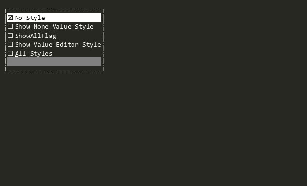

## [FrameView](xref:Terminal.Gui.Views.FrameView)

A non-overlapped container for other views with a border and optional title.

## [GraphView](xref:Terminal.Gui.Views.GraphView)

Displays graphs (bar, scatter, etc.) with flexible labels, scaling, and scrolling.

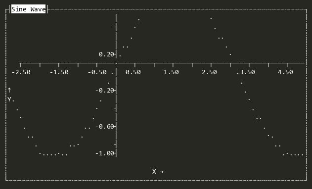

## [HexView](xref:Terminal.Gui.Views.HexView)

Provides a hex editor with the left side showing the hex values of the bytes in a `Stream` and the right side showing the contents (filtered to printable Unicode glyphs).

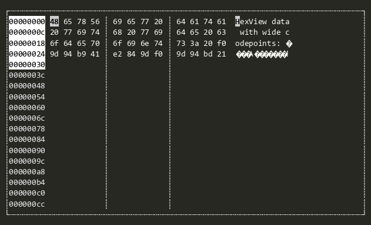

## [ImageView](xref:Terminal.Gui.Views.ImageView)

Displays an image represented as a 2D array of <xref:Terminal.Gui.Drawing.Color> pixels. Supports two rendering modes: cell-based (one colored space per pixel, works everywhere) and sixel-based (when the terminal supports it).

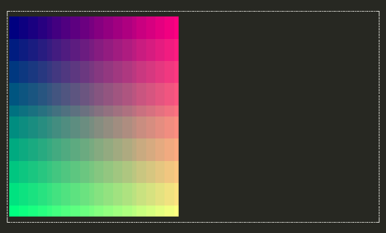

## [Label](xref:Terminal.Gui.Views.Label)

Displays text that describes the View next in the <xref:Terminal.Gui.ViewBase.View.SubViews>. When the user presses a hotkey that matches the <xref:Terminal.Gui.ViewBase.View.HotKey> of the Label, the next <xref:Terminal.Gui.ViewBase.View> in <xref:Terminal.Gui.ViewBase.View.SubViews> will be activated.

## [LegendAnnotation](xref:Terminal.Gui.Views.LegendAnnotation)

Used by <xref:Terminal.Gui.Views.GraphView> to render symbol definitions in a graph, e.g. colors and their meanings

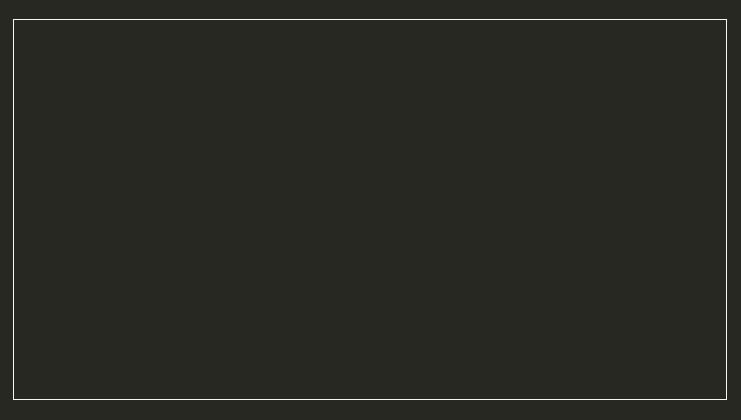

## [Line](xref:Terminal.Gui.Views.Line)

Draws a single line using the <xref:Terminal.Gui.Drawing.LineStyle> specified by <xref:Terminal.Gui.Views.Line.Style>.

## [LinearMultiSelector\<T\>](xref:Terminal.Gui.Views.LinearMultiSelector`1)

A linear range view that allows selection of zero or more options from a typed list.

## [LinearMultiSelector](xref:Terminal.Gui.Views.LinearMultiSelector)

Convenience non-generic <xref:Terminal.Gui.Views.LinearMultiSelector%601> closed over <xref:System.String>. Allows designer scenarios (e.g. `AllViewsTester`) and reflection-based instantiation to discover and create the view without supplying a type argument.

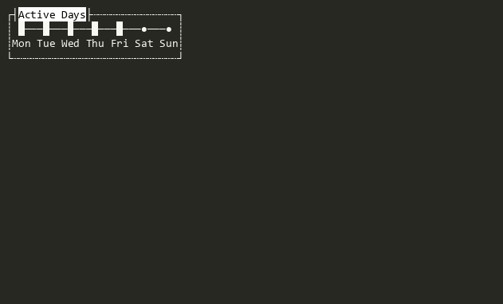

## [LinearRange\<T\>](xref:Terminal.Gui.Views.LinearRange`1)

A linear range view representing a contiguous range of options. The current value is a <xref:Terminal.Gui.Views.LinearRangeSpan%601> whose <xref:Terminal.Gui.Views.LinearRangeSpan%601.Kind> is one of <xref:Terminal.Gui.Views.LinearRangeSpanKind.None>, <xref:Terminal.Gui.Views.LinearRangeSpanKind.LeftBounded>, <xref:Terminal.Gui.Views.LinearRangeSpanKind.RightBounded>, or <xref:Terminal.Gui.Views.LinearRangeSpanKind.Closed>.

## [LinearRange](xref:Terminal.Gui.Views.LinearRange)

Convenience non-generic <xref:Terminal.Gui.Views.LinearRange%601> closed over <xref:System.String>. Allows designer scenarios (e.g. `AllViewsTester`) and reflection-based instantiation to discover and create the view without supplying a type argument.

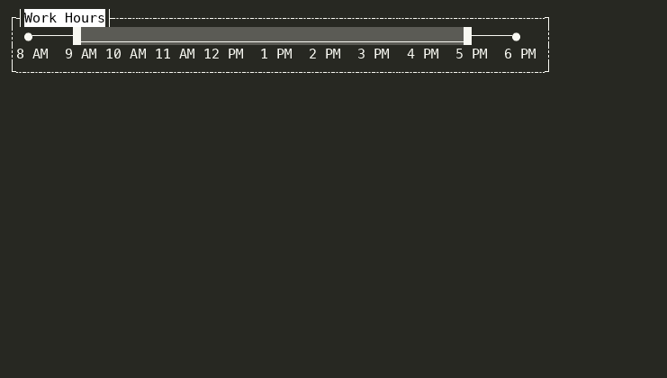

## [LinearRangeViewBase\<T\>](xref:Terminal.Gui.Views.LinearRangeViewBase`2)

Abstract base for linear range views (<xref:Terminal.Gui.Views.LinearSelector%601>, <xref:Terminal.Gui.Views.LinearMultiSelector%601>, <xref:Terminal.Gui.Views.LinearRange%601>) that present a list of typed options navigable by keyboard or mouse, and expose the current selection as a strongly-typed value via <xref:Terminal.Gui.ViewBase.IValue%601>.

## [LinearSelector\<T\>](xref:Terminal.Gui.Views.LinearSelector`1)

A linear range view that allows selection of a single option from a typed list of options.

## [LinearSelector](xref:Terminal.Gui.Views.LinearSelector)

Convenience non-generic <xref:Terminal.Gui.Views.LinearSelector%601> closed over <xref:System.String>. Allows designer scenarios (e.g. `AllViewsTester`) and reflection-based instantiation to discover and create the view without supplying a type argument.

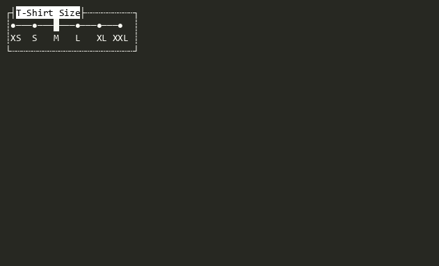

## [Link](xref:Terminal.Gui.Views.Link)

Displays a clickable hyperlink with optional display text and a target URL.

## [ListView\<T\>](xref:Terminal.Gui.Views.ListView`1)

Provides a scrollable list of data where each item can be activated to perform an action, with a strongly-typed <xref:Terminal.Gui.Views.ListView%601.Value> property that returns the selected object of type <code class="typeparamref">T</code> from the underlying <xref:System.Collections.ObjectModel.ObservableCollection%601>.

## [ListView](xref:Terminal.Gui.Views.ListView)

Provides a scrollable list of data where each item can be activated to perform an action.

## [Markdown](xref:Terminal.Gui.Views.Markdown)

A read-only view that renders Markdown-formatted text with styled headings, lists, links, code blocks, and more.

## [MarkdownCodeBlock](xref:Terminal.Gui.Views.MarkdownCodeBlock)

A read-only view that renders a single Markdown fenced code block with a dimmed background and an optional copy button.

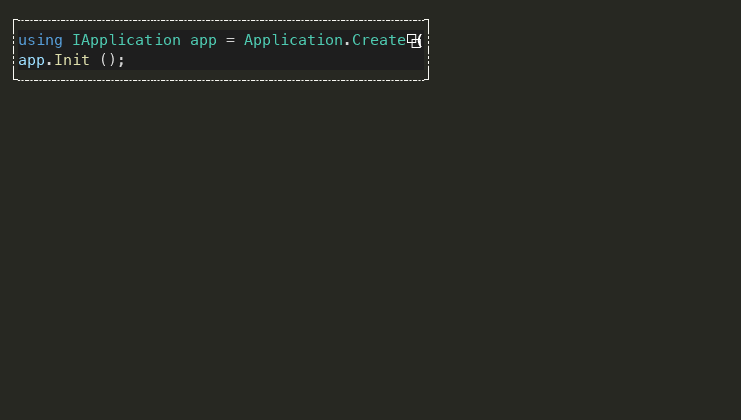

## [MarkdownTable](xref:Terminal.Gui.Views.MarkdownTable)

A read-only view that renders a single Markdown table with box-drawing borders via <xref:Terminal.Gui.Drawing.LineCanvas> and styled header/body text with inline Markdown formatting.

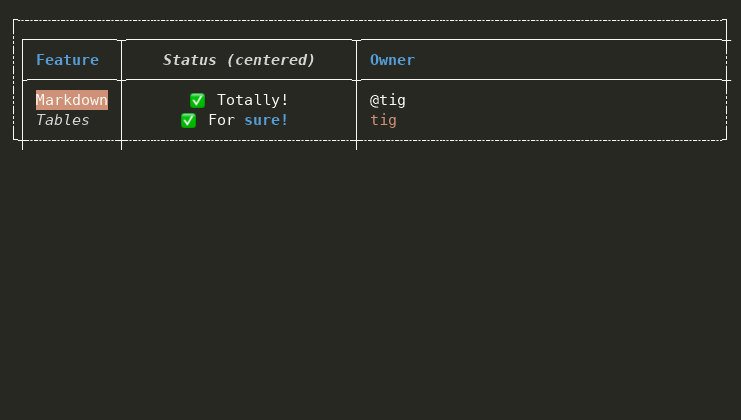

## [Menu](xref:Terminal.Gui.Views.Menu)

A vertically-oriented <xref:Terminal.Gui.Views.Bar> that contains <xref:Terminal.Gui.Views.MenuItem> items, supporting cascading sub-menus, selection tracking, and the <xref:Terminal.Gui.ViewBase.IValue%601> pattern.

## [MenuBar](xref:Terminal.Gui.Views.MenuBar)

A horizontal <xref:Terminal.Gui.Views.Menu> that contains <xref:Terminal.Gui.Views.MenuBarItem> items. Each <xref:Terminal.Gui.Views.MenuBarItem> owns a <xref:Terminal.Gui.Views.PopoverMenu> that is displayed as a drop-down when the item is selected. Typically placed at the top of a window or view.

## [MenuBarItem](xref:Terminal.Gui.Views.MenuBarItem)

A <xref:Terminal.Gui.Views.MenuItem>-derived item for use in a <xref:Terminal.Gui.Views.MenuBar>. Each <xref:Terminal.Gui.Views.MenuBarItem> holds either a <xref:Terminal.Gui.Views.MenuBarItem.PopoverMenu> (modal, default) or an inline <xref:Terminal.Gui.Views.MenuItem.SubMenu> (non-modal) that is displayed as a drop-down menu when the item is selected. The behavior is controlled by the <xref:Terminal.Gui.Views.MenuBarItem.UsePopoverMenu> property.

## [MenuItem](xref:Terminal.Gui.Views.MenuItem)

A <xref:Terminal.Gui.Views.Shortcut>-derived item for use in a <xref:Terminal.Gui.Views.Menu>. Displays a command, help text, and key binding and supports nested <xref:Terminal.Gui.Views.MenuItem.SubMenu>s for cascading menu hierarchies.

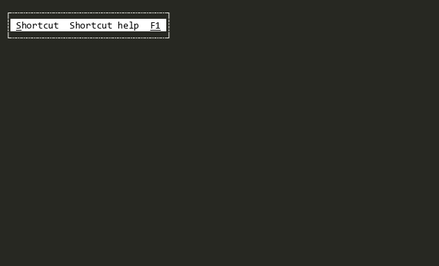

## [NumericUpDown\<T\>](xref:Terminal.Gui.Views.NumericUpDown`1)

Enables the user to increase or decrease a value with the mouse or keyboard in type-safe way.

## [NumericUpDown](xref:Terminal.Gui.Views.NumericUpDown)

Enables the user to increase or decrease an int by clicking on the up or down buttons.

## [OpenDialog](xref:Terminal.Gui.Views.OpenDialog)

Provides an interactive <xref:Terminal.Gui.Views.Dialog> for selecting files or directories for opening

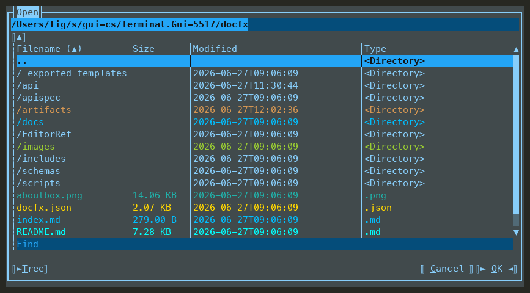

## [OptionSelector\<T\>](xref:Terminal.Gui.Views.OptionSelector`1)

Provides a user interface for displaying and selecting a single item from a list of options in a type-safe way. Each option is represented by a checkbox, but only one can be selected at a time. <xref:Terminal.Gui.Views.OptionSelector> provides a non-type-safe version.

## [OptionSelector](xref:Terminal.Gui.Views.OptionSelector)

Provides a user interface for displaying and selecting a single item from a list of options. Each option is represented by a checkbox, but only one can be selected at a time. <xref:Terminal.Gui.Views.OptionSelector%601> provides a type-safe version where a enum can be provided.

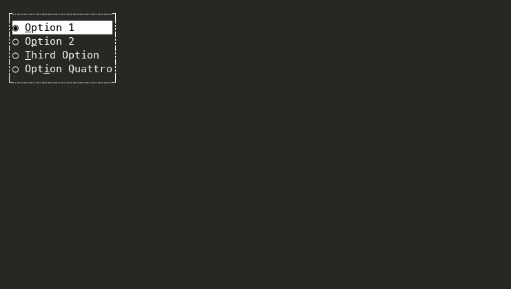

## [PopoverMenu](xref:Terminal.Gui.Views.PopoverMenu)

A <xref:Terminal.Gui.App.IPopover>-derived view that provides a cascading menu. Can be used as a context menu or a drop-down menu as part of <xref:Terminal.Gui.Views.MenuBar>.

## [ProgressBar](xref:Terminal.Gui.Views.ProgressBar)

A Progress Bar view that can indicate progress of an activity visually.

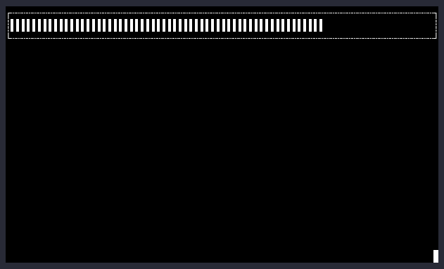

## [Prompt\<T\>](xref:Terminal.Gui.Views.Prompt`2)

A dialog that wraps any <xref:Terminal.Gui.ViewBase.View> with Ok/Cancel buttons, extracting a typed result when the user accepts.

## [Runnable\<T\>](xref:Terminal.Gui.Views.Runnable`1)

Base implementation of <xref:Terminal.Gui.App.IRunnable%601> for views that can be run as blocking sessions.

## [Runnable](xref:Terminal.Gui.Views.Runnable)

Base implementation of <xref:Terminal.Gui.App.IRunnable> for views that can be run as blocking sessions without returning a result.

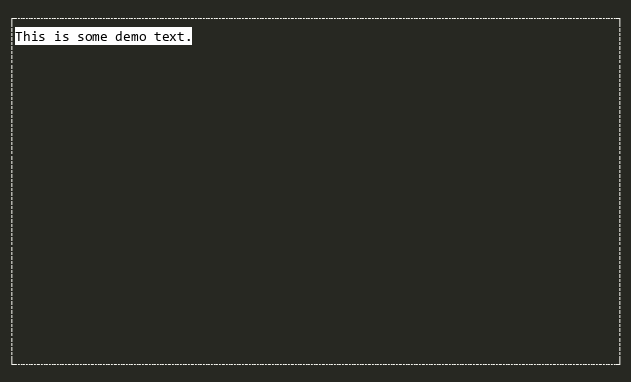

## [RunnableWrapper\<T\>](xref:Terminal.Gui.Views.RunnableWrapper`2)

Wraps any <xref:Terminal.Gui.ViewBase.View> to make it runnable with a typed result without adding dialog buttons.

## [SaveDialog](xref:Terminal.Gui.Views.SaveDialog)

Provides an interactive <xref:Terminal.Gui.Views.Dialog> for selecting files or directories for saving

## [ScrollBar](xref:Terminal.Gui.Views.ScrollBar)

Indicates the size of scrollable content and controls the position of the visible content, either vertically or horizontally. Two <xref:Terminal.Gui.Views.Button>s are provided, one to scroll up or left and one to scroll down or right. Between the buttons is a <xref:Terminal.Gui.Views.ScrollSlider> that can be dragged to control the position of the visible content. The ScrollSlier is sized to show the proportion of the scrollable content to the size of the <xref:Terminal.Gui.ViewBase.View.Viewport>.

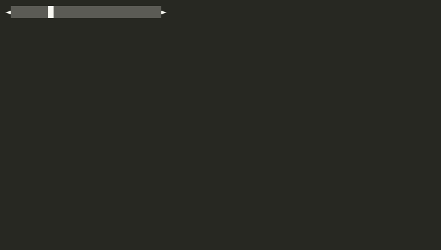

## [ScrollButton](xref:Terminal.Gui.Views.ScrollButton)

A <xref:Terminal.Gui.Views.Button> used to scroll content forward or backward. It enables mouse hold-repeat for continuous scrolling when the mouse button is held down. The button displays an arrow glyph determined by the combination of <xref:Terminal.Gui.Views.ScrollButton.Direction> and <xref:Terminal.Gui.Views.ScrollButton.Orientation>: <table><thead><tr><th class="term">Orientation</th><th class="term">Direction</th><th class="term">Glyph</th></tr></thead><tbody><tr><td class="term">Horizontal</td><td class="term">Backward</td><td class="term"> <xref:Terminal.Gui.Drawing.Glyphs.LeftArrow> </td></tr><tr><td class="term">Horizontal</td><td class="term">Forward</td><td class="term"> <xref:Terminal.Gui.Drawing.Glyphs.RightArrow> </td></tr><tr><td class="term">Vertical</td><td class="term">Backward</td><td class="term"> <xref:Terminal.Gui.Drawing.Glyphs.UpArrow> </td></tr><tr><td class="term">Vertical</td><td class="term">Forward</td><td class="term"> <xref:Terminal.Gui.Drawing.Glyphs.DownArrow> </td></tr></tbody></table>

## [ScrollSlider](xref:Terminal.Gui.Views.ScrollSlider)

Represents the proportion of the visible content to the Viewport in a <xref:Terminal.Gui.Views.ScrollBar>. Can be dragged with the mouse, constrained by the size of the Viewport of it's superview. Can be oriented either vertically or horizontally.

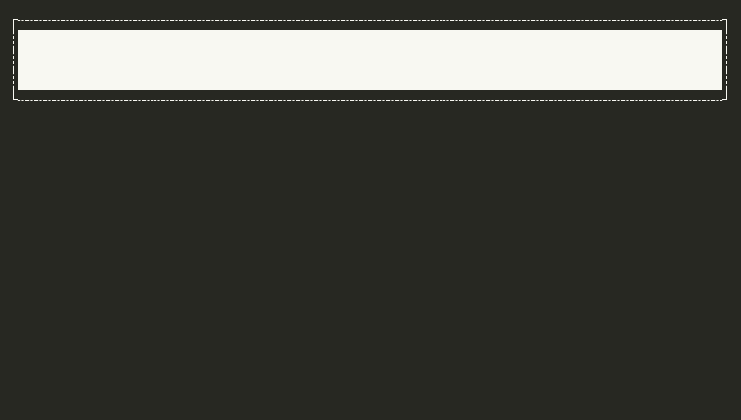

## [SelectorBase](xref:Terminal.Gui.Views.SelectorBase)

The abstract base class for <xref:Terminal.Gui.Views.OptionSelector%601> and <xref:Terminal.Gui.Views.FlagSelector%601>.

## [Shortcut](xref:Terminal.Gui.Views.Shortcut)

Displays a command, help text, and a key binding. Serves as the foundational building block for <xref:Terminal.Gui.Views.Bar>, <xref:Terminal.Gui.Views.Menu>, <xref:Terminal.Gui.Views.MenuBar>, and <xref:Terminal.Gui.Views.StatusBar>.

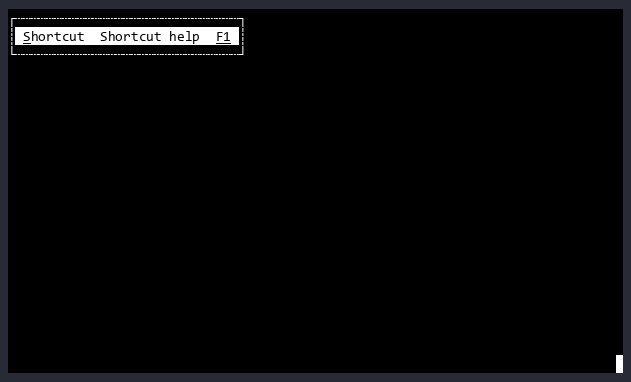

## [SpinnerView](xref:Terminal.Gui.Views.SpinnerView)

Displays a spinning glyph or combinations of glyphs to indicate progress or activity

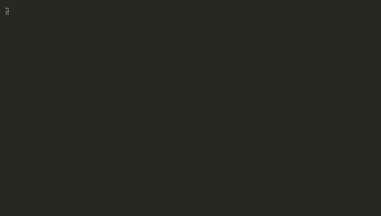

## [StatusBar](xref:Terminal.Gui.Views.StatusBar)

A status bar is a <xref:Terminal.Gui.ViewBase.View> that snaps to the bottom of the Viewport displaying set of <xref:Terminal.Gui.Views.Shortcut>s. The <xref:Terminal.Gui.Views.StatusBar> should be context-sensitive. This means, if the main menu and an open text editor are visible, the items probably shown will be ~F1~ Help ~F2~ Save ~F3~ Load. While a dialog to ask a file to load is executed, the remaining commands will probably be ~F1~ Help. So for each context must be a new instance of a status bar.

## [TableView](xref:Terminal.Gui.Views.TableView)

Displays and enables infinite scrolling through tabular data based on a <xref:Terminal.Gui.Views.ITableSource>. See the TableView Deep Dive for more.

## [Tabs](xref:Terminal.Gui.Views.Tabs)

A tabbed container <xref:Terminal.Gui.ViewBase.View> that renders each SubView as a selectable tab with a header drawn by <xref:Terminal.Gui.ViewBase.Border>. The currently focused SubView is the selected (front-most) tab.

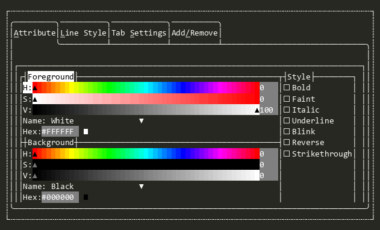

## [TextField](xref:Terminal.Gui.Views.TextField)

Single-line text editor.

## [TextValidateField](xref:Terminal.Gui.Views.TextValidateField)

Masked text editor that validates input through a <xref:Terminal.Gui.Views.ITextValidateProvider>.

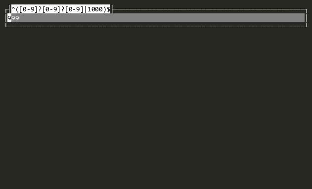

## [TextView](xref:Terminal.Gui.Views.TextView)

Fully featured multi-line text editor.

## [TimeEditor](xref:Terminal.Gui.Views.TimeEditor)

Provides time editing functionality using <xref:Terminal.Gui.Views.TextValidateField> with culture-aware formatting.

## [TreeView\<T\>](xref:Terminal.Gui.Views.TreeView`1)

Hierarchical tree view with expandable branches. Branch objects are dynamically determined when expanded using a user defined <xref:Terminal.Gui.Views.ITreeBuilder%601>. See TreeView Deep Dive for more information.

## [TreeView](xref:Terminal.Gui.Views.TreeView)

Convenience implementation of generic <xref:Terminal.Gui.Views.TreeView%601> for any tree were all nodes implement <xref:Terminal.Gui.Views.ITreeNode>. See TreeView Deep Dive for more information.

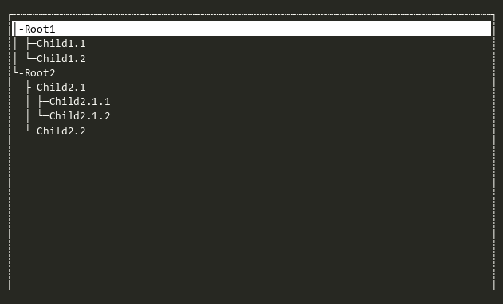

## [Window](xref:Terminal.Gui.Views.Window)

An overlapped container for other views with a border and optional title.

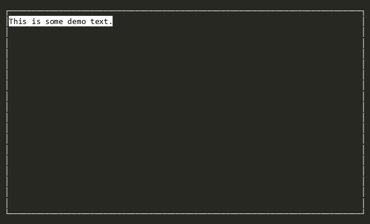

## [Wizard](xref:Terminal.Gui.Views.Wizard)

A multi-step dialog for collecting related data across sequential steps.

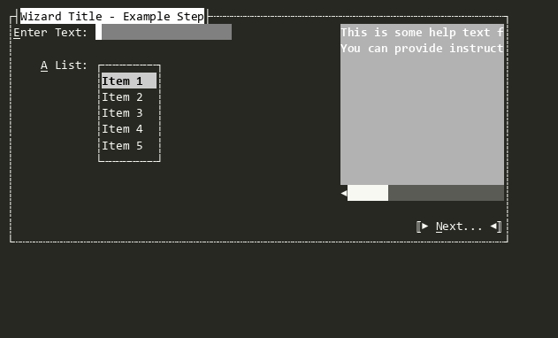

## [WizardStep](xref:Terminal.Gui.Views.WizardStep)

A single step in a <xref:Terminal.Gui.Views.Wizard>. Can contain arbitrary <xref:Terminal.Gui.ViewBase.View>s and display help text in the right <xref:Terminal.Gui.ViewBase.Padding>.

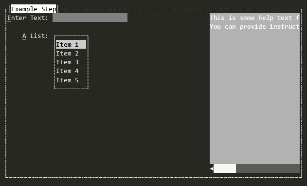

